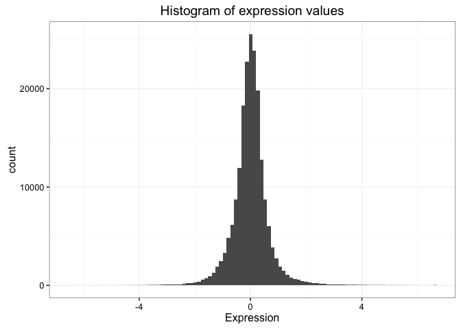

# Data Frames


There are _lots_ of different basic data structures in R. If you take any kind of longer introduction to R you'll probably learn about arrays, lists, matrices, etc. Let's skip straight to the data structure you'll probably use most -- the **data frame**. We use data frames to store heterogeneous tabular data in R: tabular, meaning that individuals or observations are typically represented in rows, while variables or features are represented as columns; heterogeneous, meaning that columns/features/variables can be different classes (on variable, e.g. age, can be numeric, while another, e.g., cause of death, can be text). 

## Our data

<!-- There are some built-in data frames that ship with R that you'll often see people referencing in help forums or other places to demonstrate some functionality. The `mtcars` data frame has data extracted from the 1974 _Motor Trend_ magazine giving statistics about design and performance for 32 different vehicles. You can just type `mtcars` to look at the whole dataset. -->

The data we're going to look at is cleaned up version of a gene expression dataset from [Brauer et al. Coordination of Growth Rate, Cell Cycle, Stress Response, and Metabolic Activity in Yeast (2008) _Mol Biol Cell_ 19:352-367](http://www.ncbi.nlm.nih.gov/pubmed/17959824). This data is from a gene expression microarray, and in this paper the authors are examining the relationship between growth rate and gene expression in yeast cultures limited by one of six different nutrients (glucose, leucine, ammonium, sulfate, phosphate, uracil). If you give yeast a rich media loaded with nutrients except restrict the supply of a _single_ nutrient, you can control the growth rate to any rate you choose. By starving yeast of specific nutrients you can find genes that: 

1. **Raise or lower their expression in response to growth rate**. Growth-rate dependent expression patterns can tell us a lot about cell cycle control, and how the cell responds to stress. The authors found that expression of >25% of all yeast genes is linearly correlated with growth rate, independent of the limiting nutrient. They also found that the subset of negatively growth-correlated genes is enriched for peroxisomal functions, and positively correlated genes mainly encode ribosomal functions. 
2. **Respond differently when different nutrients are being limited**. If you see particular genes that respond very differently when a nutrient is sharply restricted, these genes might be involved in the transport or metabolism of that specific nutrient.

You can download the cleaned up version of the data at [bioconnector.org/data](http://bioconnector.org/data). The file is called **brauer2007_tidy.csv**. Later on we'll actually start with the original raw data (minimally processed) and manipulate it so that we can make it more amenable for analysis. 

## Reading in data

### dplyr and readr

There are some built-in functions for reading in data in text files. These functions are _read-dot-something_ -- for example, `read.csv()` reads in comma-delimited text data; `read.delim()` reads in tab-delimited text, etc. We're going to read in data a little bit differently here using the [readr](https://github.com/hadley/readr) package. When you load the readr package, you'll have access to very similar looking functions, named _read-underscore-something_ -- e.g., `read_csv()`. You have to have the readr package installed to access these functions. Compared to the base functions, they're _much_ faster, they're good at guessing the types of data in the columns, they don't do some of the other silly things that the base functions do. We're going to use another package later on called [dplyr](https://cran.r-project.org/web/packages/dplyr/index.html), and if you have the dplyr package loaded as well, and you read in the data with readr, the data will display nicely. 

First let's load those packages.


```r
library(readr)
library(dplyr)
```

If you see a warning that looks like this: `Error in library(packageName) : there is no package called 'packageName'`, then you don't have the package installed correctly. See the [setup page](setup-r.html). 

### `read_csv()`

Now, let's actually load the data. You can get help for the import function with `?read_csv`. When we load data we assign it to a variable just like any other, and we can choose a name for that data. Since we're going to be referring to this data a lot, let's give it a short easy name to type. I'm going to call it `ydat`. Once we've loaded it we can type the name of the object itself (`ydat`) to see it printed to the screen. 


```r
ydat <- read_csv(file="data/brauer2007_tidy.csv")
ydat
```

```
## Source: local data frame [198,430 x 7]
## 
##    symbol systematic_name nutrient  rate expression
##     (chr)           (chr)    (chr) (dbl)      (dbl)
## 1    SFB2         YNL049C  Glucose  0.05      -0.24
## 2      NA         YNL095C  Glucose  0.05       0.28
## 3    QRI7         YDL104C  Glucose  0.05      -0.02
## 4    CFT2         YLR115W  Glucose  0.05      -0.33
## 5    SSO2         YMR183C  Glucose  0.05       0.05
## 6    PSP2         YML017W  Glucose  0.05      -0.69
## 7    RIB2         YOL066C  Glucose  0.05      -0.55
## 8   VMA13         YPR036W  Glucose  0.05      -0.75
## 9    EDC3         YEL015W  Glucose  0.05      -0.24
## 10   VPS5         YOR069W  Glucose  0.05      -0.16
## ..    ...             ...      ...   ...        ...
## Variables not shown: bp (chr), mf (chr)
```

Take a look at that output. The nice thing about loading dplyr and reading in data with readr is that data frames are displayed in a much more friendly way. This dataset has nearly 200,000 rows and 7 columns. When you import data this way and try to display the object in the console, instead of trying to display all 200,000 rows, you'll only see about 10 by default. Also, if you have so many columns that the data would wrap off the edge of your screen, those columns will not be displayed, but you'll see at the bottom of the output which, if any, columns were hidden from view. If you want to see the whole dataset, there are two ways to do this. First, you can click on the name of the data.frame in the **Environment** panel in RStudio. Or you could use the `View()` function (_with a capital V_).


```r
View(ydat)
```

## Inspecting data.frame objects

There are several built-in functions that are useful for working with data frames.

* Content:
    * `head()`: shows the first few rows
    * `tail()`: shows the last few rows
* Size:
    * `dim()`: returns a 2-element vector with the number of rows in the first element, and the number of columns as the second element (the dimensions of the object)
    * `nrow()`: returns the number of rows
    * `ncol()`: returns the number of columns
* Summary:
    * `colnames()` (or just `names()`): returns the column names
    * `str()`: structure of the object and information about the class, length and content of each column
    * `summary()`: works differently depending on what kind of object you pass to it. Passing a data frame to the `summary()` function prints out useful summary statistics about numeric column (min, max, median, mean, etc.)


```r
head(ydat)
```

```
## Source: local data frame [6 x 7]
## 
##   symbol systematic_name nutrient  rate expression
##    (chr)           (chr)    (chr) (dbl)      (dbl)
## 1   SFB2         YNL049C  Glucose  0.05      -0.24
## 2     NA         YNL095C  Glucose  0.05       0.28
## 3   QRI7         YDL104C  Glucose  0.05      -0.02
## 4   CFT2         YLR115W  Glucose  0.05      -0.33
## 5   SSO2         YMR183C  Glucose  0.05       0.05
## 6   PSP2         YML017W  Glucose  0.05      -0.69
## Variables not shown: bp (chr), mf (chr)
```

```r
tail(ydat)
```

```
## Source: local data frame [6 x 7]
## 
##   symbol systematic_name nutrient  rate expression
##    (chr)           (chr)    (chr) (dbl)      (dbl)
## 1   DOA1         YKL213C   Uracil   0.3       0.14
## 2   KRE1         YNL322C   Uracil   0.3       0.28
## 3   MTL1         YGR023W   Uracil   0.3       0.27
## 4   KRE9         YJL174W   Uracil   0.3       0.43
## 5   UTH1         YKR042W   Uracil   0.3       0.19
## 6     NA         YOL111C   Uracil   0.3       0.04
## Variables not shown: bp (chr), mf (chr)
```

```r
dim(ydat)
```

```
## [1] 198430      7
```

```r
names(ydat)
```

```
## [1] "symbol"          "systematic_name" "nutrient"        "rate"           
## [5] "expression"      "bp"              "mf"
```

```r
str(ydat)
```

```
## Classes 'tbl_df', 'tbl' and 'data.frame':	198430 obs. of  7 variables:
##  $ symbol         : chr  "SFB2" "NA" "QRI7" "CFT2" ...
##  $ systematic_name: chr  "YNL049C" "YNL095C" "YDL104C" "YLR115W" ...
##  $ nutrient       : chr  "Glucose" "Glucose" "Glucose" "Glucose" ...
##  $ rate           : num  0.05 0.05 0.05 0.05 0.05 0.05 0.05 0.05 0.05 0.05 ...
##  $ expression     : num  -0.24 0.28 -0.02 -0.33 0.05 -0.69 -0.55 -0.75 -0.24 -0.16 ...
##  $ bp             : chr  "ER to Golgi transport" "biological process unknown" "proteolysis and peptidolysis" "mRNA polyadenylylation*" ...
##  $ mf             : chr  "molecular function unknown" "molecular function unknown" "metalloendopeptidase activity" "RNA binding" ...
```

```r
summary(ydat)
```

```
##     symbol          systematic_name      nutrient              rate       
##  Length:198430      Length:198430      Length:198430      Min.   :0.0500  
##  Class :character   Class :character   Class :character   1st Qu.:0.1000  
##  Mode  :character   Mode  :character   Mode  :character   Median :0.2000  
##                                                           Mean   :0.1752  
##                                                           3rd Qu.:0.2500  
##                                                           Max.   :0.3000  
##    expression             bp                 mf           
##  Min.   :-6.500000   Length:198430      Length:198430     
##  1st Qu.:-0.290000   Class :character   Class :character  
##  Median : 0.000000   Mode  :character   Mode  :character  
##  Mean   : 0.003367                                        
##  3rd Qu.: 0.290000                                        
##  Max.   : 6.640000
```

## Accessing variables & subsetting data frames

We can access individual variables within a data frame using the `$` operator, e.g., `mydataframe$specificVariable`. Let's print out all the gene names in the data. Then let's calculate the average expression across all conditions, all genes (using the built-in `mean()` function).


```r
# display all gene symbols
ydat$symbol
```

```
##   [1] "SFB2"     "NA"       "QRI7"     "CFT2"     "SSO2"     "PSP2"    
##   [7] "RIB2"     "VMA13"    "EDC3"     "VPS5"     "NA"       "AMN1"    
##  [13] "SCW11"    "DSE2"     "COX15"    "SPE1"     "MTF1"     "KSS1"    
##  [19] "NA"       "NA"       "YAP7"     "NA"       "YVC1"     "CDC40"   
##  [25] "NA"       "RMD1"     "PCL6"     "AI4"      "GGC1"     "SUL1"    
##  [31] "RAD57"    "NA"       "PER1"     "YHC3"     "SGE1"     "HNM1"    
##  [37] "SWI1"     "NAM8"     "NA"       "BGL2"     "ACT1"     "NA"      
##  [43] "SFL1"     "OYE3"     "MMP1"     "MHT1"     "SUL2"     "IPP1"    
##  [49] "CWP1"     "SNF11"    "PEX25"    "ELO1"     "NA"       "CDC13"   
##  [55] "FKH1"     "SWD1"     "NA"       "HOF1"     "HOC1"     "BNI5"    
##  [61] "CSN12"    "PGS1"     "MLP2"     "HRP1"     "NA"       "SEC39"   
##  [67] "ECM31"    "NA"       "NA"       "ADE4"     "ABC1"     "DLD2"    
##  [73] "PHA2"     "NA"       "HAP3"     "MRPL23"   "NA"       "NA"      
##  [79] "MRPL16"   "NA"       "NA"       "NA"       "NA"       "AI3"     
##  [85] "COX1"     "NA"       "VAR1"     "COX3"     "COX2"     "AI5_BETA"
##  [91] "AI2"      "NA"       "NA"       "GPI18"    "COS9"     "NA"      
##  [97] "NA"       "PRP46"    "XDJ1"     "SLG1"     "MAM3"     "AEP1"    
## [103] "UGO1"     "NA"       "RSC2"     "YAP1801"  "ZPR1"     "BCD1"    
## [109] "UBP10"    "SLD3"     "RLF2"     "LRO1"     "NA"       "ITR2"    
## [115] "ABP140"   "STT3"     "PTC2"     "STE20"    "HRD3"     "CWH43"   
## [121] "ASK10"    "MPE1"     "SWC3"     "TSA1"     "ADE17"    "GFD2"    
## [127] "PXR1"     "NA"       "BUD14"    "AUS1"     "NHX1"     "NTE1"    
## [133] "NA"       "KIN3"     "BUD4"     "SLI15"    "PMT4"     "AVT5"    
## [139] "CHS2"     "GPI13"    "KAP95"    "EFT2"     "EFT1"     "GAS1"    
## [145] "CYK3"     "COQ2"     "PSD1"     "NA"       "PAC1"     "SUR7"    
## [151] "RAX1"     "DFM1"     "RBD2"     "NA"       "YIP4"     "SRB2"    
## [157] "HOL1"     "MEP3"     "NA"       "FEN2"     "NA"       "RFT1"    
## [163] "NA"       "MCK1"     "GPI10"    "APT1"     "NA"       "NA"      
## [169] "CPT1"     "ERV29"    "SFK1"     "NA"       "SEC20"    "TIR4"    
## [175] "NA"       "NA"       "ARC35"    "SOL1"     "BIO2"     "ASC1"    
## [181] "RBG1"     "PTC4"     "NA"       "OXA1"     "SIT4"     "PUB1"    
## [187] "FPR4"     "FUN12"    "DPH2"     "DPS1"     "DLD1"     "ASN2"    
## [193] "TRM9"     "DED81"    "SRM1"     "SAM50"    "POP2"     "FAA4"    
## [199] "NA"       "CEM1"    
##  [ reached getOption("max.print") -- omitted 198230 entries ]
```

```r
#mean expression
mean(ydat$expression)
```

```
## [1] 0.003367182
```

Now that's not too interesting. This is the average gene expression across all genes, across all conditions. The data is actually scaled/centered around zero:

\

We might be interested in the average expression of genes with a particular biological function, and how that changes over different growth rates restricted by particular nutrients. This is the kind of thing we're going to do in the next section.

----

**EXERCISE 1**

1. What's the standard deviation expression (hint: get help on the `sd` function with `?sd`).
1. What's the range of rate represented in the data? (hint: `range()`).

----

## BONUS: Preview to advanced manipulation

What if we wanted show the mean expression, standard deviation, and correlation between growth rate and expression, separately for each limiting nutrient, separately for each gene, for all genes involved in the leucine biosynthesis pathway?


```r
ydat %>% 
  filter(bp=="leucine biosynthesis") %>% 
  group_by(nutrient, symbol) %>% 
  summarize(mean=mean(expression), sd=sd(expression), r=cor(rate, expression))
```


nutrient    symbol     mean     sd       r
----------  -------  ------  -----  ------
Ammonia     LEU1      -0.82   0.39    0.66
Ammonia     LEU2      -0.54   0.38   -0.19
Ammonia     LEU4      -0.37   0.56   -0.67
Ammonia     LEU9      -1.01   0.64    0.87
Glucose     LEU1      -0.55   0.41    0.98
Glucose     LEU2      -0.39   0.33    0.90
Glucose     LEU4       1.09   1.01   -0.97
Glucose     LEU9      -0.16   0.35    0.35
Leucine     LEU1       2.70   1.08   -0.95
Leucine     LEU2       0.28   1.16   -0.97
Leucine     LEU4       0.80   1.06   -0.97
Leucine     LEU9       0.39   0.18   -0.77
Phosphate   LEU1      -0.43   0.27    0.95
Phosphate   LEU2      -0.26   0.19    0.70
Phosphate   LEU4      -0.99   0.11    0.24
Phosphate   LEU9      -1.12   0.53    0.90
Sulfate     LEU1      -1.17   0.34    0.98
Sulfate     LEU2      -0.96   0.30    0.57
Sulfate     LEU4      -0.24   0.43   -0.60
Sulfate     LEU9      -1.24   0.55    0.99
Uracil      LEU1      -0.74   0.73    0.89
Uracil      LEU2       0.18   0.13   -0.07
Uracil      LEU4      -0.65   0.44    0.77
Uracil      LEU9      -1.02   0.91    0.94

Neat eh? Let's learn how to do that in the [advanced manipulation with dplyr lesson](r-dplyr.html).


