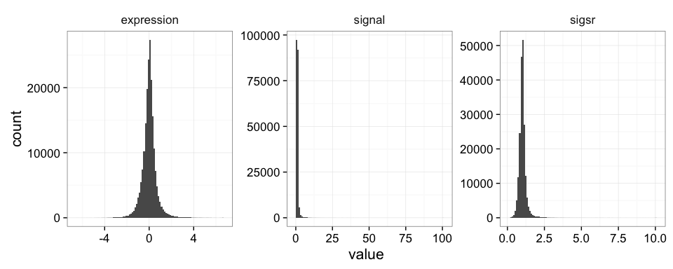

# Advanced Data Manipulation with dplyr


Data analysis involves a large amount of [janitor work](http://www.nytimes.com/2014/08/18/technology/for-big-data-scientists-hurdle-to-insights-is-janitor-work.html) -- munging and cleaning data to facilitate downstream data analysis. This lesson demonstrates techniques for advanced data manipulation and analysis with the split-apply-combine strategy. We will use the dplyr package in R to effectively manipulate and conditionally compute summary statistics over subsets of a "big" dataset containing many observations.

This lesson assumes a [basic familiarity with R](r-basics.html) and [data frames](r-dataframes.html).

## Review

### Our data

We're going to use the yeast gene expression dataset [described on the data frames lesson](r-dataframes.html#our-data). This is a cleaned up version of a gene expression dataset from [Brauer et al. Coordination of Growth Rate, Cell Cycle, Stress Response, and Metabolic Activity in Yeast (2008) _Mol Biol Cell_ 19:352-367](http://www.ncbi.nlm.nih.gov/pubmed/17959824). This data is from a gene expression microarray, and in this paper the authors are examining the relationship between growth rate and gene expression in yeast cultures limited by one of six different nutrients (glucose, leucine, ammonium, sulfate, phosphate, uracil). If you give yeast a rich media loaded with nutrients except restrict the supply of a _single_ nutrient, you can control the growth rate to any rate you choose. By starving yeast of specific nutrients you can find genes that: 

1. **Raise or lower their expression in response to growth rate**. Growth-rate dependent expression patterns can tell us a lot about cell cycle control, and how the cell responds to stress. The authors found that expression of >25% of all yeast genes is linearly correlated with growth rate, independent of the limiting nutrient. They also found that the subset of negatively growth-correlated genes is enriched for peroxisomal functions, and positively correlated genes mainly encode ribosomal functions. 
2. **Respond differently when different nutrients are being limited**. If you see particular genes that respond very differently when a nutrient is sharply restricted, these genes might be involved in the transport or metabolism of that specific nutrient.

You can download the cleaned up version of the data at [bioconnector.org/data](http://bioconnector.org/data). The file is called **brauer2007_tidy.csv**. Later on we'll actually start with the original raw data (minimally processed) and manipulate it so that we can make it more amenable for analysis. 

### Reading in data

We need to load both the dplyr and readr packages for efficiently reading in and displaying this data. We're also going to use many other functions from the dplyr package. Make sure you have these packages installed as described on the [setup page](setup-r.html).


```r
# Load packages
library(readr)
library(dplyr)

# Read in data
ydat <- read_csv(file="data/brauer2007_tidy.csv")

# Display the data
ydat

# Optionally, bring up the data in a viewer window
# View(ydat)
```

```
## Source: local data frame [198,430 x 7]
## 
##    symbol systematic_name nutrient  rate expression
##     (chr)           (chr)    (chr) (dbl)      (dbl)
## 1    SFB2         YNL049C  Glucose  0.05      -0.24
## 2      NA         YNL095C  Glucose  0.05       0.28
## 3    QRI7         YDL104C  Glucose  0.05      -0.02
## 4    CFT2         YLR115W  Glucose  0.05      -0.33
## 5    SSO2         YMR183C  Glucose  0.05       0.05
## 6    PSP2         YML017W  Glucose  0.05      -0.69
## 7    RIB2         YOL066C  Glucose  0.05      -0.55
## 8   VMA13         YPR036W  Glucose  0.05      -0.75
## 9    EDC3         YEL015W  Glucose  0.05      -0.24
## 10   VPS5         YOR069W  Glucose  0.05      -0.16
## ..    ...             ...      ...   ...        ...
## Variables not shown: bp (chr), mf (chr)
```

## The dplyr package

The [dplyr package](https://github.com/hadley/dplyr) is a relatively new R package that makes data manipulation fast and easy. It imports functionality from another package called magrittr that allows you to chain commands together into a pipeline that will completely change the way you write R code such that you're writing code the way you're thinking about the problem.

When you read in data with the readr package (`read_csv()`) and you had the dplyr package loaded already, the data frame takes on this "special" class of data frames called a `tbl`, which you can see with `class(ydat)`. If you have other "regular" data frames in your workspace, the `tbl_df()` function will convert it into the special dplyr `tbl` that displays nicely (e.g.: `iris <- tbl_df(iris)`). You don't have to turn all your data frame objects into tbl_df objects, but it does make working with large datasets a bit easier.

## dplyr verbs

The dplyr package gives you a handful of useful **verbs** for managing data. On their own they don't do anything that base R can't do. Here are some of the _single-table_ verbs we'll be working with in this lesson (single-table meaning that they only work on a single table -- contrast that to _two-table_ verbs used for joining data together, which we'll cover in a later lesson).

1. `filter()`
1. `select()`
1. `mutate()`
1. `arrange()`
1. `summarize()`
1. `group_by()`

They all take a `data.frame` or `tbl_df` as their input for the first argument, and they all return a `data.frame` or `tbl_df` as output.

### filter()

If you want to filter **rows** of the data where some condition is true, use the `filter()` function. 

1. The first argument is the data frame you want to filter, e.g. `filter(mydata, ...`.
2. The second argument is a condition you must satisfy, e.g. `filter(ydat, symbol == "LEU1")`. If you want to satisfy *all* of multiple conditions, you can use the "and" operator, `&`. The "or" operator `|` (the pipe character, usually shift-backslash) will return a subset that meet *any* of the conditions.

- `==`: Equal to
- `!=`: Not equal to
- `>`, `>=`: Greater than, greater than or equal to
- `<`, `<=`: Less than, less than or equal to

Let's try it out. For this to work you have to have already loaded the dplyr package. Let's take a look at [LEU1](http://www.yeastgenome.org/locus/Leu1/overview), a gene involved in leucine synthesis.


```r
# First, make sure you've loaded the dplyr package
library(dplyr)

# Look at a single gene involved in leucine synthesis pathway
filter(ydat, symbol == "LEU1")
```

```
## Source: local data frame [36 x 7]
## 
##    symbol systematic_name nutrient  rate expression                   bp
##     (chr)           (chr)    (chr) (dbl)      (dbl)                (chr)
## 1    LEU1         YGL009C  Glucose  0.05      -1.12 leucine biosynthesis
## 2    LEU1         YGL009C  Glucose  0.10      -0.77 leucine biosynthesis
## 3    LEU1         YGL009C  Glucose  0.15      -0.67 leucine biosynthesis
## 4    LEU1         YGL009C  Glucose  0.20      -0.59 leucine biosynthesis
## 5    LEU1         YGL009C  Glucose  0.25      -0.20 leucine biosynthesis
## 6    LEU1         YGL009C  Glucose  0.30       0.03 leucine biosynthesis
## 7    LEU1         YGL009C  Ammonia  0.05      -0.76 leucine biosynthesis
## 8    LEU1         YGL009C  Ammonia  0.10      -1.17 leucine biosynthesis
## 9    LEU1         YGL009C  Ammonia  0.15      -1.20 leucine biosynthesis
## 10   LEU1         YGL009C  Ammonia  0.20      -1.02 leucine biosynthesis
## ..    ...             ...      ...   ...        ...                  ...
## Variables not shown: mf (chr)
```

```r
# Optionally, bring that result up in a View window
# View(filter(ydat, symbol == "LEU1"))

# Look at multiple genes
filter(ydat, symbol=="LEU1" | symbol=="ADH2")
```

```
## Source: local data frame [72 x 7]
## 
##    symbol systematic_name nutrient  rate expression                   bp
##     (chr)           (chr)    (chr) (dbl)      (dbl)                (chr)
## 1    LEU1         YGL009C  Glucose  0.05      -1.12 leucine biosynthesis
## 2    ADH2         YMR303C  Glucose  0.05       6.28        fermentation*
## 3    LEU1         YGL009C  Glucose  0.10      -0.77 leucine biosynthesis
## 4    ADH2         YMR303C  Glucose  0.10       5.81        fermentation*
## 5    LEU1         YGL009C  Glucose  0.15      -0.67 leucine biosynthesis
## 6    ADH2         YMR303C  Glucose  0.15       5.64        fermentation*
## 7    LEU1         YGL009C  Glucose  0.20      -0.59 leucine biosynthesis
## 8    ADH2         YMR303C  Glucose  0.20       5.10        fermentation*
## 9    LEU1         YGL009C  Glucose  0.25      -0.20 leucine biosynthesis
## 10   ADH2         YMR303C  Glucose  0.25       1.89        fermentation*
## ..    ...             ...      ...   ...        ...                  ...
## Variables not shown: mf (chr)
```

```r
# Look at LEU1 expression at a low growth rate due to nutrient depletion
# Notice how LEU1 is highly upregulated when leucine is depleted!
filter(ydat, symbol=="LEU1" & rate==.05)
```

```
## Source: local data frame [6 x 7]
## 
##   symbol systematic_name  nutrient  rate expression                   bp
##    (chr)           (chr)     (chr) (dbl)      (dbl)                (chr)
## 1   LEU1         YGL009C   Glucose  0.05      -1.12 leucine biosynthesis
## 2   LEU1         YGL009C   Ammonia  0.05      -0.76 leucine biosynthesis
## 3   LEU1         YGL009C Phosphate  0.05      -0.81 leucine biosynthesis
## 4   LEU1         YGL009C   Sulfate  0.05      -1.57 leucine biosynthesis
## 5   LEU1         YGL009C   Leucine  0.05       3.84 leucine biosynthesis
## 6   LEU1         YGL009C    Uracil  0.05      -2.07 leucine biosynthesis
## Variables not shown: mf (chr)
```

```r
# But expression goes back down when the growth/nutrient restriction is relaxed
filter(ydat, symbol=="LEU1" & rate==.3)
```

```
## Source: local data frame [6 x 7]
## 
##   symbol systematic_name  nutrient  rate expression                   bp
##    (chr)           (chr)     (chr) (dbl)      (dbl)                (chr)
## 1   LEU1         YGL009C   Glucose   0.3       0.03 leucine biosynthesis
## 2   LEU1         YGL009C   Ammonia   0.3      -0.22 leucine biosynthesis
## 3   LEU1         YGL009C Phosphate   0.3      -0.07 leucine biosynthesis
## 4   LEU1         YGL009C   Sulfate   0.3      -0.76 leucine biosynthesis
## 5   LEU1         YGL009C   Leucine   0.3       0.87 leucine biosynthesis
## 6   LEU1         YGL009C    Uracil   0.3      -0.16 leucine biosynthesis
## Variables not shown: mf (chr)
```

```r
# Show only stats for LEU1 and Leucine depletion. 
# LEU1 expression starts off high and drops
filter(ydat, symbol=="LEU1" & nutrient=="Leucine")
```

```
## Source: local data frame [6 x 7]
## 
##   symbol systematic_name nutrient  rate expression                   bp
##    (chr)           (chr)    (chr) (dbl)      (dbl)                (chr)
## 1   LEU1         YGL009C  Leucine  0.05       3.84 leucine biosynthesis
## 2   LEU1         YGL009C  Leucine  0.10       3.36 leucine biosynthesis
## 3   LEU1         YGL009C  Leucine  0.15       3.24 leucine biosynthesis
## 4   LEU1         YGL009C  Leucine  0.20       2.84 leucine biosynthesis
## 5   LEU1         YGL009C  Leucine  0.25       2.04 leucine biosynthesis
## 6   LEU1         YGL009C  Leucine  0.30       0.87 leucine biosynthesis
## Variables not shown: mf (chr)
```

```r
# What about LEU1 expression with other nutrients being depleted?
filter(ydat, symbol=="LEU1" & nutrient=="Glucose")
```

```
## Source: local data frame [6 x 7]
## 
##   symbol systematic_name nutrient  rate expression                   bp
##    (chr)           (chr)    (chr) (dbl)      (dbl)                (chr)
## 1   LEU1         YGL009C  Glucose  0.05      -1.12 leucine biosynthesis
## 2   LEU1         YGL009C  Glucose  0.10      -0.77 leucine biosynthesis
## 3   LEU1         YGL009C  Glucose  0.15      -0.67 leucine biosynthesis
## 4   LEU1         YGL009C  Glucose  0.20      -0.59 leucine biosynthesis
## 5   LEU1         YGL009C  Glucose  0.25      -0.20 leucine biosynthesis
## 6   LEU1         YGL009C  Glucose  0.30       0.03 leucine biosynthesis
## Variables not shown: mf (chr)
```

Let's look at this graphically. Don't worry about what these commands are doing just yet - we'll cover that later on when we talk about ggplot2. Here's I'm taking the filtered dataset containing just expression estimates for LEU1 where I have 36 rows (one for each of 6 nutrients $\times$ 6 growth rates), and I'm _piping_ that dataset to the plotting function, where I'm plotting rate on the x-axis, expression on the y-axis, mapping the value of nutrient to the color, and using a line plot to display the data.


```r
library(ggplot2)
filter(ydat, symbol=="LEU1") %>% 
  ggplot(aes(rate, expression, colour=nutrient)) + geom_line(lwd=1.5)
```


Look closely at that! LEU1 is _highly expressed_ when starved of leucine because the cell has to synthesize its own! And as the amount of leucine in the environment (the growth _rate_) increases, the cell can worry less about synthesizing leucine, so LEU1 expression goes back down. Consequently the cell can devote more energy into other functions, and we see other genes' expression very slightly raising.

----

**EXERCISE 1**

1. Display the data where the gene ontology biological process (the `bp` variable) is "leucine biosynthesis" (case-sensitive) _and_ the limiting nutrient was Leucine. (Answer should return a 24-by-7 data frame -- 4 genes $\times$ 6 growth rates).
1. Gene/rate combinations had high expression (in the top 1% of expressed genes)? _Hint:_ see `?quantile` and try `quantile(ydat$expression, probs=.99)` to see the expression value which is higher than 99% of all the data, then `filter()` based on that. Try wrapping your answer with a `View()` function so you can see the whole thing. What does it look like those genes are doing? Answer should return a 1971-by-7 data frame.


----

### select()

The `filter()` function allows you to return only certain _rows_ matching a condition. The `select()` function returns only certain _columns_. The first argument is the data, and subsequent arguments are the columns you want.


```r
# Select just the symbol and systematic_name
select(ydat, symbol, systematic_name)
```

```
## Source: local data frame [198,430 x 2]
## 
##    symbol systematic_name
##     (chr)           (chr)
## 1    SFB2         YNL049C
## 2      NA         YNL095C
## 3    QRI7         YDL104C
## 4    CFT2         YLR115W
## 5    SSO2         YMR183C
## 6    PSP2         YML017W
## 7    RIB2         YOL066C
## 8   VMA13         YPR036W
## 9    EDC3         YEL015W
## 10   VPS5         YOR069W
## ..    ...             ...
```

```r
# Alternatively, just remove columns. Remove the bp and mf columns.
select(ydat, -bp, -mf)
```

```
## Source: local data frame [198,430 x 5]
## 
##    symbol systematic_name nutrient  rate expression
##     (chr)           (chr)    (chr) (dbl)      (dbl)
## 1    SFB2         YNL049C  Glucose  0.05      -0.24
## 2      NA         YNL095C  Glucose  0.05       0.28
## 3    QRI7         YDL104C  Glucose  0.05      -0.02
## 4    CFT2         YLR115W  Glucose  0.05      -0.33
## 5    SSO2         YMR183C  Glucose  0.05       0.05
## 6    PSP2         YML017W  Glucose  0.05      -0.69
## 7    RIB2         YOL066C  Glucose  0.05      -0.55
## 8   VMA13         YPR036W  Glucose  0.05      -0.75
## 9    EDC3         YEL015W  Glucose  0.05      -0.24
## 10   VPS5         YOR069W  Glucose  0.05      -0.16
## ..    ...             ...      ...   ...        ...
```

```r
# Notice that the original data doesn't change!
ydat
```

```
## Source: local data frame [198,430 x 7]
## 
##    symbol systematic_name nutrient  rate expression
##     (chr)           (chr)    (chr) (dbl)      (dbl)
## 1    SFB2         YNL049C  Glucose  0.05      -0.24
## 2      NA         YNL095C  Glucose  0.05       0.28
## 3    QRI7         YDL104C  Glucose  0.05      -0.02
## 4    CFT2         YLR115W  Glucose  0.05      -0.33
## 5    SSO2         YMR183C  Glucose  0.05       0.05
## 6    PSP2         YML017W  Glucose  0.05      -0.69
## 7    RIB2         YOL066C  Glucose  0.05      -0.55
## 8   VMA13         YPR036W  Glucose  0.05      -0.75
## 9    EDC3         YEL015W  Glucose  0.05      -0.24
## 10   VPS5         YOR069W  Glucose  0.05      -0.16
## ..    ...             ...      ...   ...        ...
## Variables not shown: bp (chr), mf (chr)
```

Notice above how the original data doesn't change. We're selecting out only certain columns of interest and throwing away columns we don't care about. If we wanted to _keep_ this data, we would need to _reassign_ the result of the `select()` operation to a new object. Let's make a new object called `nogo` that does not contain the GO annotations. Notice again how the original data is unchanged.


```r
# create a new dataset without the go annotations.
nogo <- select(ydat, -bp, -mf)
nogo
```

```
## Source: local data frame [198,430 x 5]
## 
##    symbol systematic_name nutrient  rate expression
##     (chr)           (chr)    (chr) (dbl)      (dbl)
## 1    SFB2         YNL049C  Glucose  0.05      -0.24
## 2      NA         YNL095C  Glucose  0.05       0.28
## 3    QRI7         YDL104C  Glucose  0.05      -0.02
## 4    CFT2         YLR115W  Glucose  0.05      -0.33
## 5    SSO2         YMR183C  Glucose  0.05       0.05
## 6    PSP2         YML017W  Glucose  0.05      -0.69
## 7    RIB2         YOL066C  Glucose  0.05      -0.55
## 8   VMA13         YPR036W  Glucose  0.05      -0.75
## 9    EDC3         YEL015W  Glucose  0.05      -0.24
## 10   VPS5         YOR069W  Glucose  0.05      -0.16
## ..    ...             ...      ...   ...        ...
```

```r
# we could filter this new dataset
filter(nogo, symbol=="LEU1" & rate==.05)
```

```
## Source: local data frame [6 x 5]
## 
##   symbol systematic_name  nutrient  rate expression
##    (chr)           (chr)     (chr) (dbl)      (dbl)
## 1   LEU1         YGL009C   Glucose  0.05      -1.12
## 2   LEU1         YGL009C   Ammonia  0.05      -0.76
## 3   LEU1         YGL009C Phosphate  0.05      -0.81
## 4   LEU1         YGL009C   Sulfate  0.05      -1.57
## 5   LEU1         YGL009C   Leucine  0.05       3.84
## 6   LEU1         YGL009C    Uracil  0.05      -2.07
```

```r
# Notice how the original data is unchanged - still have all 7 columns
ydat
```

```
## Source: local data frame [198,430 x 7]
## 
##    symbol systematic_name nutrient  rate expression
##     (chr)           (chr)    (chr) (dbl)      (dbl)
## 1    SFB2         YNL049C  Glucose  0.05      -0.24
## 2      NA         YNL095C  Glucose  0.05       0.28
## 3    QRI7         YDL104C  Glucose  0.05      -0.02
## 4    CFT2         YLR115W  Glucose  0.05      -0.33
## 5    SSO2         YMR183C  Glucose  0.05       0.05
## 6    PSP2         YML017W  Glucose  0.05      -0.69
## 7    RIB2         YOL066C  Glucose  0.05      -0.55
## 8   VMA13         YPR036W  Glucose  0.05      -0.75
## 9    EDC3         YEL015W  Glucose  0.05      -0.24
## 10   VPS5         YOR069W  Glucose  0.05      -0.16
## ..    ...             ...      ...   ...        ...
## Variables not shown: bp (chr), mf (chr)
```


### mutate()

The `mutate()` function adds new columns to the data. Remember, it doesn't actually modify the data frame you're operating on, and the result is transient unless you assign it to a new object or reassign it back to itself (generally, not always a good practice). 

The expression level reported here is the $log_2$ of the sample signal divided by the signal in the reference channel, where the reference RNA for all samples was taken from the glucose-limited chemostat grown at a dilution rate of 0.25 $h^{-1}$. Let's mutate this data to add a new variable called "signal" that's the actual raw signal ratio instead of the log-transformed signal.


```r
mutate(nogo, signal=2^expression)
```

Mutate has a nice little feature too in that it's "lazy." You can mutate and add one variable, then continue mutating to add more variables based on that variable. Let's make another column that's the square root of the signal ratio.


```r
mutate(nogo, signal=2^expression, sigsr=sqrt(signal))
```

```
## Source: local data frame [198,430 x 7]
## 
##    symbol systematic_name nutrient  rate expression    signal     sigsr
##     (chr)           (chr)    (chr) (dbl)      (dbl)     (dbl)     (dbl)
## 1    SFB2         YNL049C  Glucose  0.05      -0.24 0.8467453 0.9201877
## 2      NA         YNL095C  Glucose  0.05       0.28 1.2141949 1.1019051
## 3    QRI7         YDL104C  Glucose  0.05      -0.02 0.9862327 0.9930925
## 4    CFT2         YLR115W  Glucose  0.05      -0.33 0.7955365 0.8919285
## 5    SSO2         YMR183C  Glucose  0.05       0.05 1.0352649 1.0174797
## 6    PSP2         YML017W  Glucose  0.05      -0.69 0.6198538 0.7873080
## 7    RIB2         YOL066C  Glucose  0.05      -0.55 0.6830201 0.8264503
## 8   VMA13         YPR036W  Glucose  0.05      -0.75 0.5946036 0.7711054
## 9    EDC3         YEL015W  Glucose  0.05      -0.24 0.8467453 0.9201877
## 10   VPS5         YOR069W  Glucose  0.05      -0.16 0.8950251 0.9460576
## ..    ...             ...      ...   ...        ...       ...       ...
```

Again, don't worry about the code here to make the plot -- we'll learn about this later. Why do you think we log-transform the data prior to analysis?


```r
library(tidyr)
mutate(nogo, signal=2^expression, sigsr=sqrt(signal)) %>% 
  gather(unit, value, expression:sigsr) %>% 
  ggplot(aes(value)) + geom_histogram(bins=100) + facet_wrap(~unit, scales="free")
```

\

### arrange()

The `arrange()` function does what it sounds like. It takes a data frame or tbl and arranges (or sorts) by column(s) of interest. The first argument is the data, and subsequent arguments are columns to sort on. Use the `desc()` function to arrange by descending.


```r
# arrange by gene symbol
arrange(ydat, symbol)
```

```
## Source: local data frame [198,430 x 7]
## 
##    symbol systematic_name nutrient  rate expression                   bp
##     (chr)           (chr)    (chr) (dbl)      (dbl)                (chr)
## 1    AAC1         YMR056C  Glucose  0.05       1.50 aerobic respiration*
## 2    AAC1         YMR056C  Glucose  0.10       1.54 aerobic respiration*
## 3    AAC1         YMR056C  Glucose  0.15       1.16 aerobic respiration*
## 4    AAC1         YMR056C  Glucose  0.20       1.04 aerobic respiration*
## 5    AAC1         YMR056C  Glucose  0.25       0.84 aerobic respiration*
## 6    AAC1         YMR056C  Glucose  0.30       0.01 aerobic respiration*
## 7    AAC1         YMR056C  Ammonia  0.05       0.80 aerobic respiration*
## 8    AAC1         YMR056C  Ammonia  0.10       1.47 aerobic respiration*
## 9    AAC1         YMR056C  Ammonia  0.15       0.97 aerobic respiration*
## 10   AAC1         YMR056C  Ammonia  0.20       0.76 aerobic respiration*
## ..    ...             ...      ...   ...        ...                  ...
## Variables not shown: mf (chr)
```

```r
# arrange by expression (default: increasing)
arrange(ydat, expression)
```

```
## Source: local data frame [198,430 x 7]
## 
##    symbol systematic_name  nutrient  rate expression
##     (chr)           (chr)     (chr) (dbl)      (dbl)
## 1    SUL1         YBR294W Phosphate  0.05      -6.50
## 2    SUL1         YBR294W Phosphate  0.10      -6.34
## 3    ADH2         YMR303C Phosphate  0.10      -6.15
## 4    ADH2         YMR303C Phosphate  0.30      -6.04
## 5    ADH2         YMR303C Phosphate  0.25      -5.89
## 6    SUL1         YBR294W    Uracil  0.05      -5.55
## 7    SFC1         YJR095W Phosphate  0.20      -5.52
## 8    JEN1         YKL217W Phosphate  0.30      -5.44
## 9    MHT1         YLL062C Phosphate  0.05      -5.36
## 10   SFC1         YJR095W Phosphate  0.25      -5.35
## ..    ...             ...       ...   ...        ...
## Variables not shown: bp (chr), mf (chr)
```

```r
# arrange by decreasing expression
arrange(ydat, desc(expression))
```

```
## Source: local data frame [198,430 x 7]
## 
##    symbol systematic_name  nutrient  rate expression
##     (chr)           (chr)     (chr) (dbl)      (dbl)
## 1    GAP1         YKR039W   Ammonia  0.05       6.64
## 2    DAL5         YJR152W   Ammonia  0.05       6.64
## 3    GAP1         YKR039W   Ammonia  0.10       6.64
## 4    DAL5         YJR152W   Ammonia  0.10       6.64
## 5    DAL5         YJR152W   Ammonia  0.15       6.64
## 6    DAL5         YJR152W   Ammonia  0.20       6.64
## 7    DAL5         YJR152W   Ammonia  0.25       6.64
## 8    DAL5         YJR152W   Ammonia  0.30       6.64
## 9    GIT1         YCR098C Phosphate  0.05       6.64
## 10   PHM6         YDR281C Phosphate  0.05       6.64
## ..    ...             ...       ...   ...        ...
## Variables not shown: bp (chr), mf (chr)
```

----

**EXERCISE 2**

1. First, re-run the command you used above to filter the data for genes involved in the "leucine biosynthesis" biological process _and_ where the limiting nutrient is Leucine. 
2. Wrap this entire filtered result with a call to `arrange()` where you'll arrange the result of #1 by the gene symbol.
3. Wrap this entire result in a `View()` statement so you can see the entire result.


----

### summarize()

The `summarize()` function summarizes multiple values to a single value. On its own the `summarize()` function doesn't seem to be all that useful. The dplyr package provides a few convenience functions called `n()` and `n_distinct()` that tell you the number of observations or the number of distinct values of a particular variable.

Notice that summarize takes a data frame and returns a data frame. In this case it's a 1x1 data frame with a single row and a single column. The name of the column, by default is whatever the expression was used to summarize the data. This usually isn't pretty, and if we wanted to work with this resulting data frame later on, we'd want to name that returned value something easier to deal with.


```r
# Get the mean expression for all genes
summarize(ydat, mean(expression))
```

```
## Source: local data frame [1 x 1]
## 
##   mean(expression)
##              (dbl)
## 1      0.003367182
```

```r
# Use a more friendly name, e.g., meanexp, or whatever you want to call it.
summarize(ydat, meanexp=mean(expression))
```

```
## Source: local data frame [1 x 1]
## 
##       meanexp
##         (dbl)
## 1 0.003367182
```

```r
# Measure the correlation between rate and expression 
summarize(ydat, r=cor(rate, expression))
```

```
## Source: local data frame [1 x 1]
## 
##             r
##         (dbl)
## 1 -0.02197312
```

```r
# Get the number of observations
summarize(ydat, n())
```

```
## Source: local data frame [1 x 1]
## 
##      n()
##    (int)
## 1 198430
```

```r
# The number of distinct gene symbols in the data 
summarize(ydat, n_distinct(symbol))
```

```
## Source: local data frame [1 x 1]
## 
##   n_distinct(symbol)
##                (int)
## 1               4211
```

### group_by()

We saw that `summarize()` isn't that useful on its own. Neither is `group_by()` All this does is takes an existing data frame and coverts it into a grouped data frame where operations are performed by group.


```r
ydat
```

```
## Source: local data frame [198,430 x 7]
## 
##    symbol systematic_name nutrient  rate expression
##     (chr)           (chr)    (chr) (dbl)      (dbl)
## 1    SFB2         YNL049C  Glucose  0.05      -0.24
## 2      NA         YNL095C  Glucose  0.05       0.28
## 3    QRI7         YDL104C  Glucose  0.05      -0.02
## 4    CFT2         YLR115W  Glucose  0.05      -0.33
## 5    SSO2         YMR183C  Glucose  0.05       0.05
## 6    PSP2         YML017W  Glucose  0.05      -0.69
## 7    RIB2         YOL066C  Glucose  0.05      -0.55
## 8   VMA13         YPR036W  Glucose  0.05      -0.75
## 9    EDC3         YEL015W  Glucose  0.05      -0.24
## 10   VPS5         YOR069W  Glucose  0.05      -0.16
## ..    ...             ...      ...   ...        ...
## Variables not shown: bp (chr), mf (chr)
```

```r
group_by(ydat, nutrient)
```

```
## Source: local data frame [198,430 x 7]
## Groups: nutrient [6]
## 
##    symbol systematic_name nutrient  rate expression
##     (chr)           (chr)    (chr) (dbl)      (dbl)
## 1    SFB2         YNL049C  Glucose  0.05      -0.24
## 2      NA         YNL095C  Glucose  0.05       0.28
## 3    QRI7         YDL104C  Glucose  0.05      -0.02
## 4    CFT2         YLR115W  Glucose  0.05      -0.33
## 5    SSO2         YMR183C  Glucose  0.05       0.05
## 6    PSP2         YML017W  Glucose  0.05      -0.69
## 7    RIB2         YOL066C  Glucose  0.05      -0.55
## 8   VMA13         YPR036W  Glucose  0.05      -0.75
## 9    EDC3         YEL015W  Glucose  0.05      -0.24
## 10   VPS5         YOR069W  Glucose  0.05      -0.16
## ..    ...             ...      ...   ...        ...
## Variables not shown: bp (chr), mf (chr)
```

```r
group_by(ydat, nutrient, rate)
```

```
## Source: local data frame [198,430 x 7]
## Groups: nutrient, rate [36]
## 
##    symbol systematic_name nutrient  rate expression
##     (chr)           (chr)    (chr) (dbl)      (dbl)
## 1    SFB2         YNL049C  Glucose  0.05      -0.24
## 2      NA         YNL095C  Glucose  0.05       0.28
## 3    QRI7         YDL104C  Glucose  0.05      -0.02
## 4    CFT2         YLR115W  Glucose  0.05      -0.33
## 5    SSO2         YMR183C  Glucose  0.05       0.05
## 6    PSP2         YML017W  Glucose  0.05      -0.69
## 7    RIB2         YOL066C  Glucose  0.05      -0.55
## 8   VMA13         YPR036W  Glucose  0.05      -0.75
## 9    EDC3         YEL015W  Glucose  0.05      -0.24
## 10   VPS5         YOR069W  Glucose  0.05      -0.16
## ..    ...             ...      ...   ...        ...
## Variables not shown: bp (chr), mf (chr)
```

The real power comes in where `group_by()` and `summarize()` are used together. First, write the `group_by()` statement. Then wrap the result of that with a call to `summarize()`.


```r
# Get the mean expression for each gene
# group_by(ydat, symbol)
summarize(group_by(ydat, symbol), meanexp=mean(expression))
```

```
## Source: local data frame [4,211 x 2]
## 
##    symbol      meanexp
##     (chr)        (dbl)
## 1    AAC1  0.528888889
## 2    AAC3 -0.216285714
## 3   AAD10  0.438333333
## 4   AAD14 -0.071666667
## 5   AAD16  0.241944444
## 6    AAD4 -0.791666667
## 7    AAD6  0.290277778
## 8    AAH1  0.046111111
## 9    AAP1 -0.003611111
## 10  AAP1' -0.421388889
## ..    ...          ...
```

```r
# Get the correlation between rate and expression for each nutrient
# group_by(ydat, nutrient)
summarize(group_by(ydat, nutrient), r=cor(rate, expression))
```

```
## Source: local data frame [6 x 2]
## 
##    nutrient           r
##       (chr)       (dbl)
## 1   Ammonia -0.01752025
## 2   Glucose -0.01119529
## 3   Leucine -0.03837677
## 4 Phosphate -0.01935061
## 5   Sulfate -0.01664016
## 6    Uracil -0.03534036
```

## The almighty pipe: **%>%**

### How the pipe works

This is where things get awesome. The dplyr package imports functionality from the [magrittr](https://github.com/smbache/magrittr) package that lets you _pipe_ the output of one function to the input of another, so you can avoid nesting functions. It looks like this: **`%>%`**. You don't have to load the magrittr package to use it since dplyr imports its functionality when you load the dplyr package.

Here's the simplest way to use it. Remember the `tail()` function. It expects a data frame as input, and the next argument is the number of lines to print. These two commands are identical:


```r
tail(ydat, 5)
```

```
## Source: local data frame [5 x 7]
## 
##   symbol systematic_name nutrient  rate expression
##    (chr)           (chr)    (chr) (dbl)      (dbl)
## 1   KRE1         YNL322C   Uracil   0.3       0.28
## 2   MTL1         YGR023W   Uracil   0.3       0.27
## 3   KRE9         YJL174W   Uracil   0.3       0.43
## 4   UTH1         YKR042W   Uracil   0.3       0.19
## 5     NA         YOL111C   Uracil   0.3       0.04
## Variables not shown: bp (chr), mf (chr)
```

```r
ydat %>% tail(5)
```

```
## Source: local data frame [5 x 7]
## 
##   symbol systematic_name nutrient  rate expression
##    (chr)           (chr)    (chr) (dbl)      (dbl)
## 1   KRE1         YNL322C   Uracil   0.3       0.28
## 2   MTL1         YGR023W   Uracil   0.3       0.27
## 3   KRE9         YJL174W   Uracil   0.3       0.43
## 4   UTH1         YKR042W   Uracil   0.3       0.19
## 5     NA         YOL111C   Uracil   0.3       0.04
## Variables not shown: bp (chr), mf (chr)
```

Let's use one of the dplyr verbs.


```r
filter(ydat, nutrient=="Leucine")
```

```
## Source: local data frame [33,178 x 7]
## 
##    symbol systematic_name nutrient  rate expression
##     (chr)           (chr)    (chr) (dbl)      (dbl)
## 1    SFB2         YNL049C  Leucine  0.05       0.18
## 2      NA         YNL095C  Leucine  0.05       0.16
## 3    QRI7         YDL104C  Leucine  0.05      -0.30
## 4    CFT2         YLR115W  Leucine  0.05      -0.27
## 5    SSO2         YMR183C  Leucine  0.05      -0.59
## 6    PSP2         YML017W  Leucine  0.05      -0.17
## 7    RIB2         YOL066C  Leucine  0.05      -0.02
## 8   VMA13         YPR036W  Leucine  0.05      -0.11
## 9    EDC3         YEL015W  Leucine  0.05       0.12
## 10   VPS5         YOR069W  Leucine  0.05      -0.20
## ..    ...             ...      ...   ...        ...
## Variables not shown: bp (chr), mf (chr)
```

```r
ydat %>% filter(nutrient=="Leucine")
```

```
## Source: local data frame [33,178 x 7]
## 
##    symbol systematic_name nutrient  rate expression
##     (chr)           (chr)    (chr) (dbl)      (dbl)
## 1    SFB2         YNL049C  Leucine  0.05       0.18
## 2      NA         YNL095C  Leucine  0.05       0.16
## 3    QRI7         YDL104C  Leucine  0.05      -0.30
## 4    CFT2         YLR115W  Leucine  0.05      -0.27
## 5    SSO2         YMR183C  Leucine  0.05      -0.59
## 6    PSP2         YML017W  Leucine  0.05      -0.17
## 7    RIB2         YOL066C  Leucine  0.05      -0.02
## 8   VMA13         YPR036W  Leucine  0.05      -0.11
## 9    EDC3         YEL015W  Leucine  0.05       0.12
## 10   VPS5         YOR069W  Leucine  0.05      -0.20
## ..    ...             ...      ...   ...        ...
## Variables not shown: bp (chr), mf (chr)
```


### Nesting versus piping 

So what? 

Now, think about this for a minute. What if we wanted to get the correlation between the growth rate and expression separately for each limiting nutrient only for genes in the leucine biosynthesis pathway, and return a sorted list of those correlation coeffients rounded to two digits? Mentally we would do something like this:

0. Take the `ydat` dataset
0. _then_ `filter()` it for genes in the leucine biosynthesis pathway
0. _then_ `group_by()` the limiting nutrient
0. _then_ `summarize()` to get the correlation (`cor()`) between rate and expression 
0. _then_ `mutate()` to round the result of the above calculation to two significant digits
0. _then_ `arrange()` by the rounded correlation coefficient above

But in code, it gets ugly. First, take the `ydat` dataset


```r
ydat
```

_then_ `filter()` it for genes in the leucine biosynthesis pathway


```r
filter(ydat, bp=="leucine biosynthesis")
```

_then_ `group_by()` the limiting nutrient


```r
group_by(filter(ydat, bp=="leucine biosynthesis"), nutrient)
```

_then_ `summarize()` to get the correlation (`cor()`) between rate and expression 


```r
summarize(group_by(filter(ydat, bp == "leucine biosynthesis"), nutrient), r = cor(rate, 
    expression))
```

_then_ `mutate()` to round the result of the above calculation to two significant digits


```r
mutate(summarize(group_by(filter(ydat, bp == "leucine biosynthesis"), nutrient), 
    r = cor(rate, expression)), r = round(r, 2))
```

_then_ `arrange()` by the rounded correlation coefficient above


```r
arrange(
  mutate(
    summarize(
      group_by(
        filter(ydat, bp=="leucine biosynthesis"), 
      nutrient), 
    r=cor(rate, expression)), 
  r=round(r, 2)), 
r)
```

```
## Source: local data frame [6 x 2]
## 
##    nutrient     r
##       (chr) (dbl)
## 1   Leucine -0.58
## 2   Glucose -0.04
## 3   Ammonia  0.16
## 4   Sulfate  0.33
## 5 Phosphate  0.44
## 6    Uracil  0.58
```

Now compare that with the mental process of what you're actually trying to accomplish. The way you would do this without pipes is completely inside-out and backwards from the way you express in words and in thought what you want to do. The pipe operator `%>%` allows you to pass the output data frame from one function to the input data frame to another function.


This is how we would do that in code. It's as simple as replacing the word "then" in words to the symbol `%>%` in code. (There's a keyboard shortcut that I'll use frequently to insert the `%>%` sequence -- you can see what it is by clicking the _Tools_ menu in RStudio, then selecting _Keyboard Shortcut Help_. On Mac, it's CMD-SHIFT-M.)


```r
ydat %>% 
  filter(bp=="leucine biosynthesis") %>%
  group_by(nutrient) %>% 
  summarize(r=cor(rate, expression)) %>% 
  mutate(r=round(r,2)) %>% 
  arrange(r)
```

```
## Source: local data frame [6 x 2]
## 
##    nutrient     r
##       (chr) (dbl)
## 1   Leucine -0.58
## 2   Glucose -0.04
## 3   Ammonia  0.16
## 4   Sulfate  0.33
## 5 Phosphate  0.44
## 6    Uracil  0.58
```

### Piping exercises

**EXERCISE 3**

Here's a warm-up round. Try the following.

Show the limiting nutrient and expression values for the gene ADH2 when the growth rate is restricted to 0.05. _Hint:_ 2 pipes: `filter` and `select`.


```
## Source: local data frame [6 x 2]
## 
##    nutrient expression
##       (chr)      (dbl)
## 1   Glucose       6.28
## 2   Ammonia       0.55
## 3 Phosphate      -4.60
## 4   Sulfate      -1.18
## 5   Leucine       4.15
## 6    Uracil       0.63
```

What are the four most highly expressed genes when the growth rate is restricted to 0.05 by restricting glucose? Show only the symbol, expression value, and GO terms. _Hint:_ 4 pipes: `filter`, `arrange`, `head`, and `select`.


```
## Source: local data frame [4 x 4]
## 
##   symbol expression                  bp                             mf
##    (chr)      (dbl)               (chr)                          (chr)
## 1   ADH2       6.28       fermentation* alcohol dehydrogenase activity
## 2  HSP26       5.86 response to stress*       unfolded protein binding
## 3   MLS1       5.64    glyoxylate cycle       malate synthase activity
## 4   HXT5       5.56    hexose transport  glucose transporter activity*
```

When the growth rate is restricted to 0.05, what is the average expression level across all genes in the "response to stress" biological process, separately for each limiting nutrient? What about genes in the "protein biosynthesis" biological process? _Hint:_ 3 pipes: `filter`, `group_by`, `summarize`.


```
## Source: local data frame [6 x 2]
## 
##    nutrient   meanexp
##       (chr)     (dbl)
## 1   Ammonia 0.9426667
## 2   Glucose 0.7426667
## 3   Leucine 0.8106667
## 4 Phosphate 0.9806667
## 5   Sulfate 0.7430769
## 6    Uracil 0.7313333
```

```
## Source: local data frame [6 x 2]
## 
##    nutrient    meanexp
##       (chr)      (dbl)
## 1   Ammonia -1.6133514
## 2   Glucose -0.6911351
## 3   Leucine -0.5735676
## 4 Phosphate -0.7496216
## 5   Sulfate -0.9134807
## 6    Uracil -0.8799454
```

----

**EXERCISE 4**

That was easy, right? How about some tougher ones.

First, some review. How do we see the number of distinct values of a variable? Use `n_distinct()` within a `summarize()` call.


```r
ydat %>% summarize(n_distinct(mf))
```

```
## Source: local data frame [1 x 1]
## 
##   n_distinct(mf)
##            (int)
## 1           1086
```

Which 10 biological process annotations have the most genes associated with them? What about molecular functions? _Hint:_ 4 pipes: `group_by`, `summarize` with `n_distinct`, `arrange`, `head`.


```
## Source: local data frame [10 x 2]
## 
##                                                              bp     n
##                                                           (chr) (int)
## 1                                    biological process unknown   269
## 2                                          protein biosynthesis   182
## 3                           protein amino acid phosphorylation*    78
## 4                                         protein biosynthesis*    73
## 5                        cell wall organization and biogenesis*    64
## 6  regulation of transcription from RNA polymerase II promoter*    49
## 7                        nuclear mRNA splicing, via spliceosome    47
## 8                                                   DNA repair*    44
## 9                                          aerobic respiration*    42
## 10                                       ER to Golgi transport*    42
```

```
## Source: local data frame [10 x 2]
## 
##                                        mf     n
##                                     (chr) (int)
## 1              molecular function unknown   886
## 2      structural constituent of ribosome   185
## 3                         protein binding   107
## 4                             RNA binding    63
## 5                        protein binding*    53
## 6                            DNA binding*    44
## 7            structural molecule activity    43
## 8                         GTPase activity    40
## 9  structural constituent of cytoskeleton    39
## 10          transcription factor activity    38
```

How many distinct genes are there where we know what process the gene is involved in but we don't know what it does? _Hint:_ 3 pipes; `filter` where `bp!="biological process unknown" & mf=="molecular function unknown"`, and after `select`ing columns of interest, pipe the output to `distinct()`. The answer should be **737**, and here are a few:


```
## Source: local data frame [737 x 3]
## 
##    symbol                                                              bp
##     (chr)                                                           (chr)
## 1    SFB2                                           ER to Golgi transport
## 2    EDC3                           deadenylylation-independent decapping
## 3    PER1                                   response to unfolded protein*
## 4   PEX25                         peroxisome organization and biogenesis*
## 5    BNI5                                                    cytokinesis*
## 6   CSN12 adaptation to pheromone during conjugation with cellular fusion
## 7   SEC39                                               secretory pathway
## 8    ABC1                                         ubiquinone biosynthesis
## 9   PRP46                          nuclear mRNA splicing, via spliceosome
## 10   MAM3                      mitochondrion organization and biogenesis*
## ..    ...                                                             ...
## Variables not shown: mf (chr)
```

When the growth rate is restricted to 0.05 by limiting Glucose, which biological processes are the most upregulated? Show a sorted list with the most upregulated BPs on top, displaying the biological process and the average expression of all genes in that process rounded to two digits. _Hint:_ 5 pipes: `filter`, `group_by`, `summarize`, `mutate`, `arrange`.


```
## Source: local data frame [881 x 2]
## 
##                                               bp meanexp
##                                            (chr)   (dbl)
## 1                                  fermentation*    6.28
## 2                               glyoxylate cycle    5.29
## 3  oxygen and reactive oxygen species metabolism    5.04
## 4                            fumarate transport*    5.03
## 5                       acetyl-CoA biosynthesis*    4.32
## 6                                gluconeogenesis    3.64
## 7                      fatty acid beta-oxidation    3.57
## 8                              lactate transport    3.48
## 9                           carnitine metabolism    3.30
## 10                           alcohol metabolism*    3.25
## ..                                           ...     ...
```

Group the data by limiting nutrient (primarily) then by biological process. Get the average expression for all genes annotated with each process, separately for each limiting nutrient, where the growth rate is restricted to 0.05. Arrange the result to show the most upregulated processes on top. The initial result will look like the result below. Pipe this output to a `View()` statement. What's going on? Why didn't the `arrange()` work? _Hint:_ 5 pipes: `filter`, `group_by`, `summarize`, `arrange`, `View`.


```
## Source: local data frame [5,257 x 3]
## Groups: nutrient [6]
## 
##    nutrient                     bp meanexp
##       (chr)                  (chr)   (dbl)
## 1   Ammonia   allantoate transport  6.6400
## 2   Ammonia  amino acid transport*  6.6400
## 3   Ammonia    allantoin transport  5.5600
## 4   Ammonia    proline catabolism*  5.1400
## 5   Ammonia         urea transport  5.1400
## 6   Ammonia asparagine catabolism*  4.7325
## 7   Ammonia  allantoin catabolism*  4.4400
## 8   Ammonia      peptide transport  3.9200
## 9   Ammonia       glyoxylate cycle  3.9100
## 10  Ammonia   sodium ion transport  3.2650
## ..      ...                    ...     ...
```

Let's try to further process that result to get only the top three most upregulated biolgocal processes for each limiting nutrient. Google search "dplyr first result within group." You'll need a `filter(row_number()......)` in there somewhere. _Hint:_ 5 pipes: `filter`, `group_by`, `summarize`, `arrange`, `filter(row_number()...`. _Note:_ dplyr's pipe syntax used to be `%.%` before it changed to `%>%`. So when looking around, you might still see some people use the old syntax. Now if you try to use the old syntax, you'll get a deprecation warning.


```
## Source: local data frame [18 x 3]
## Groups: nutrient [6]
## 
##     nutrient                                            bp meanexp
##        (chr)                                         (chr)   (dbl)
## 1    Ammonia                          allantoate transport   6.640
## 2    Ammonia                         amino acid transport*   6.640
## 3    Ammonia                           allantoin transport   5.560
## 4    Glucose                                 fermentation*   6.280
## 5    Glucose                              glyoxylate cycle   5.285
## 6    Glucose oxygen and reactive oxygen species metabolism   5.040
## 7    Leucine                                 fermentation*   4.150
## 8    Leucine                           fumarate transport*   3.720
## 9    Leucine                              glyoxylate cycle   3.650
## 10 Phosphate               glycerophosphodiester transport   6.640
## 11 Phosphate                vacuole fusion, non-autophagic   4.195
## 12 Phosphate         regulation of cell redox homeostasis*   4.030
## 13   Sulfate                        protein ubiquitination   3.400
## 14   Sulfate                           fumarate transport*   3.270
## 15   Sulfate                 sulfur amino acid metabolism*   2.690
## 16    Uracil                           fumarate transport*   4.320
## 17    Uracil                         pyridoxine metabolism   3.110
## 18    Uracil                        asparagine catabolism*   3.060
```

There's a slight problem with the examples above. We're getting the average expression of all the biological processes separately by each nutrient. But some of these biological processes only have a single gene in them! If we tried to do the same thing to get the correlation between rate and expression, the calculation would work, but we'd get a warning about a standard deviation being zero. The correlation coefficient value that results is `NA`, i.e., missing. While we're summarizing the correlation between rate and expression, let's also show the number of distinct genes within each grouping.


```r
ydat %>% 
  group_by(nutrient, bp) %>% 
  summarize(r=cor(rate, expression), ngenes=n_distinct(symbol))
```

```
## Warning in cor(c(0.05, 0.05, 0.05, 0.05, 0.05, 0.05, 0.05, 0.05, 0.05,
## 0.05, : the standard deviation is zero
```

```
## Source: local data frame [5,286 x 4]
## Groups: nutrient [?]
## 
##    nutrient                                      bp           r ngenes
##       (chr)                                   (chr)       (dbl)  (int)
## 1   Ammonia             'de novo' IMP biosynthesis*  0.31247162      8
## 2   Ammonia  'de novo' pyrimidine base biosynthesis -0.04817745      3
## 3   Ammonia 'de novo' pyrimidine base biosynthesis*  0.16699596      4
## 4   Ammonia       35S primary transcript processing  0.50795855     13
## 5   Ammonia      35S primary transcript processing*  0.42397321     30
## 6   Ammonia                    acetate biosynthesis  0.46768319      1
## 7   Ammonia                      acetate metabolism  0.92909260      1
## 8   Ammonia                     acetate metabolism* -0.68551933      1
## 9   Ammonia                 acetyl-CoA biosynthesis -0.85122895      1
## 10  Ammonia   acetyl-CoA biosynthesis from pyruvate  0.09509414      1
## ..      ...                                     ...         ...    ...
```

Take the above code and continue to process the result to show only results where the process has at least 5 genes. Add a column corresponding to the absolute value of the correlation coefficient, and show for each nutrient the singular process with the highest correlation between rate and expression, regardless of direction. _Hint:_ 4 more pipes: `filter`, `mutate`, `arrange`, and `filter` again with `row_number()==1`. Ignore the warning.


```
## Source: local data frame [6 x 5]
## Groups: nutrient [6]
## 
##    nutrient                                          bp     r ngenes  absr
##       (chr)                                       (chr) (dbl)  (int) (dbl)
## 1   Ammonia telomerase-independent telomere maintenance -0.91      7  0.91
## 2   Glucose telomerase-independent telomere maintenance -0.95      7  0.95
## 3   Leucine telomerase-independent telomere maintenance -0.90      7  0.90
## 4 Phosphate telomerase-independent telomere maintenance -0.90      7  0.90
## 5   Sulfate                   translational elongation*  0.79      5  0.79
## 6    Uracil telomerase-independent telomere maintenance -0.81      7  0.81
```
