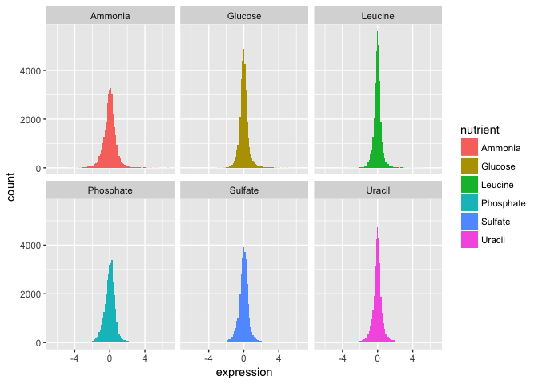
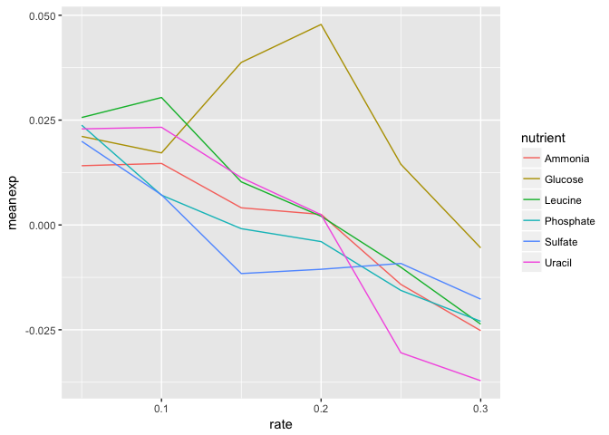
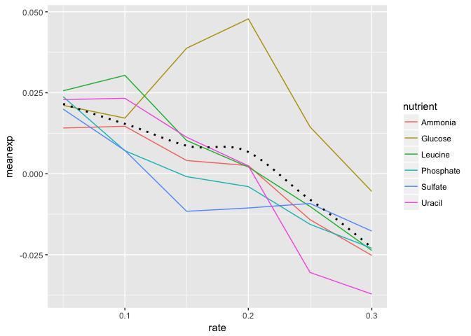
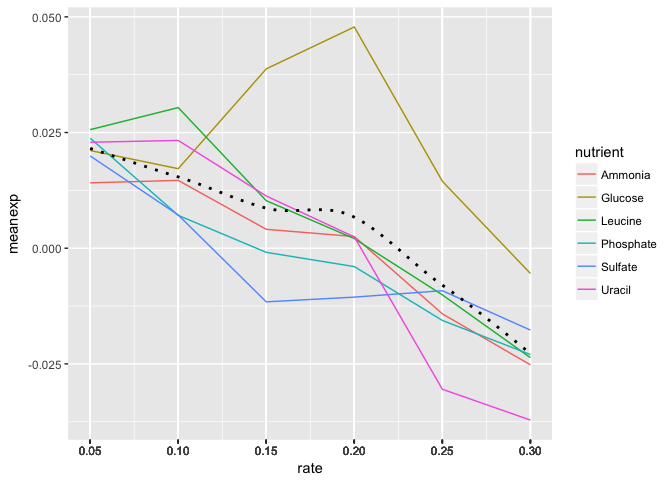

# ggplot2 homework

## Key Concepts

> 
- geoms
- aesthetic mappings
- statistical layers
- scales
- ggthemes
- ggsave


## Getting Started

Load the **ggplot2**, **dplyr**, **readr** packages, and read the tidy "Brauer" data into R using the `read_csv()` function. Make sure you store the results in an object called `ydat`.

**n.b. `read_csv()` is *not* the same as `read.csv()`**


```r
library(ggplot2)
library(dplyr)
library(readr)
library(ggthemes)

# Preferably: read data from web 
ydat <- read_csv("http://bioconnector.org/data/brauer2007_tidy.csv")

# Alternatively read from file:
# ydat <- read_csv("data/brauer2007_tidy.csv")

# Display the data
ydat
```

```
## # A tibble: 198,430 × 7
##    symbol systematic_name nutrient  rate expression
##     <chr>           <chr>    <chr> <dbl>      <dbl>
## 1    SFB2         YNL049C  Glucose  0.05      -0.24
## 2    <NA>         YNL095C  Glucose  0.05       0.28
## 3    QRI7         YDL104C  Glucose  0.05      -0.02
## 4    CFT2         YLR115W  Glucose  0.05      -0.33
## 5    SSO2         YMR183C  Glucose  0.05       0.05
## 6    PSP2         YML017W  Glucose  0.05      -0.69
## 7    RIB2         YOL066C  Glucose  0.05      -0.55
## 8   VMA13         YPR036W  Glucose  0.05      -0.75
## 9    EDC3         YEL015W  Glucose  0.05      -0.24
## 10   VPS5         YOR069W  Glucose  0.05      -0.16
## # ... with 198,420 more rows, and 2 more variables: bp <chr>, mf <chr>
```


## Problem Set

Follow the prompts and use **ggplot2** to reproduce the plots below. 

### Part 1

We can start by taking a look at the distribution of the expression values. 

1) Plot a histogram of the expression variable, and set the bin number equal to 100.

<!-- -->


2) Check the distribution of each nutrient in the data set by adjusting the fill aesthetic. Use the same bin number for this histogram.

<!-- -->

Wow. That's ugly. Might be a candidate for [accidental aRt](http://accidental-art.tumblr.com/) but not very helpful for our analysis.

3) Now split off the same histogram into a faceted display with 3 columns.

<!-- -->


The basic exploratory process above confirms that the overall distribution (as well each distribution by nutrient) is normal.

### Part 2

Let's compare the genes with the highest and lowest average expression values. 

We can figure out which these are using some familiar logic:

1. Take the original *ydat* data frame ... 
2. Then *group by* symbol ...
3. Then *summarize* mean of all expression values for that symbol ...
4. Then *arrange* descending by the mean ...
5. Then *filter* for the first or last row.

The code below implements that pipeline in **dplyr** syntax:


```r
ydat %>%
    group_by(symbol) %>%
    summarise(meanexp = mean(expression)) %>%
    arrange(desc(meanexp)) %>%
    filter(row_number() == 1 | row_number() == n())
```

```
## # A tibble: 2 × 2
##   symbol   meanexp
##    <chr>     <dbl>
## 1   HXT3  4.010000
## 2   HXT6 -2.681667
```


The output tells us that the gene with the highest mean expression is *HXT3*, while the gene with the lowest mean expression is *HXT6*.

4) Subset the data to only include these genes, and create a stripplot that has expression values as "jittered" points on the y-axis and the gene symbols the x-axis. 

> **HINT** you can add a "jitter" position to `geom_point()` but it's easier to control width of the effect if you use `geom_jitter()`

<!-- -->


5) Now map each observation to its nutrient by color and adjust the size of the points to be 2.

<!-- -->

Although these two genes are on opposite ends of the distribution of average expression values, they both seem to express similar amounts when Glucose is the restricted nutrient. 

### Part 3

Now let's try to make something that has a little bit more of a polished look. 

6) Using **dplyr** logic, create a data frame that has the mean expression values for all combinations of rate and nutrient (_hint_: use `group_by()` and `summarize()`). Create a plot of this data with rate on the x-axis and mean expression on the y-axis and lines colored by nutrient. 

<!-- -->


7) Add black dotted line (lty=3) that represents the smoothed mean of expression across all combinations of nutrients and rates. 

<!-- -->

8) Change the scale to include breaks for *all* of the rates.

> **HINT** The `read_csv()` function read in the rate variable as continuous rather than discrete. There are a few ways to remedy this, but first see if you can set the scale for the x axis variable without changing the dataframe.

<!-- -->


9) By default `ggplot()` will name the x and y axes with names of their respective variables. You might want to apply more meaningful labels. Change the name of the x-axis to "Rate", the name of the y-axis to "Mean Expression" and the plot title to "Mean Expression By Rate (Brauer)"

> **HINT** `?labs` will pull up the **ggplot2** documentation on axes labels and plot titles.

<!-- -->


10) Add a theme from the **ggthemes** package. The plot below is based on Edward Tufte's book _The Visual Display of Quantitative Information_. Choose a theme that you like, but choose wisely -- some of these themes will override other adjustments you've made to your plot above, including axis labels.

> **HINT 1**: `library(ggthemes)` not working for you? [Install the package first](https://github.com/jrnold/ggthemes#install).

> **HINT 2** You can either do this by trial-and-error or check out the package vignette to get an idea of what each theme looks like: <https://github.com/jrnold/ggthemes>

<!-- -->


11) The last step is to save the plot you've created. Write your plot to a 10 X 6 PDF using a **ggplot2** function.


