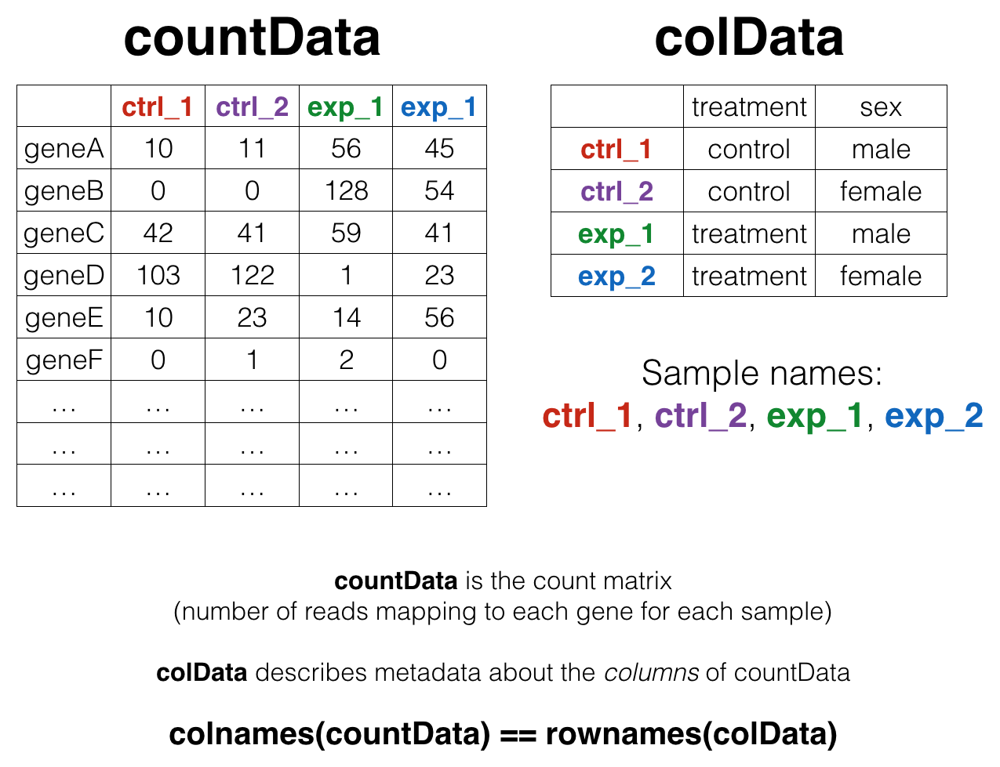
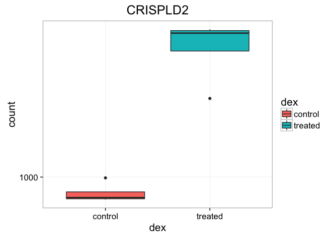
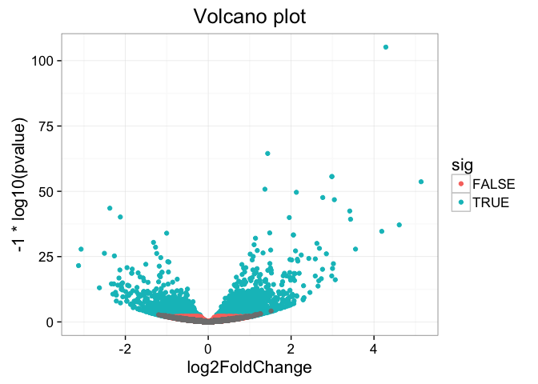

# Count-Based Differential Expression Analysis of RNA-seq Data


This is an introduction to RNAseq analysis involving reading in count data from an RNAseq experiment, exploring the data using base R functions and then analysis with the DESeq2 package. This lesson assumes a [basic familiarity with R](r-basics.html), [data frames](r-dataframes.html), and [manipulating data with dplyr and `%>%`](r-dplyr.html). See also the [_Bioconductor_ heading on the setup page](setup-r.html#bioconductor) -- you'll need a few additional packages that are available through Bioconductor, not CRAN (the installation process is slightly different).

## Background

### The Biology

The data for this lesson comes from:

> Himes _et al_. "RNA-Seq Transcriptome Profiling Identifies CRISPLD2 as a Glucocorticoid Responsive Gene that Modulates Cytokine Function in Airway Smooth Muscle Cells." _PLoS ONE_. [2014 Jun 13;9(6):e99625](http://journals.plos.org/plosone/article?id=10.1371/journal.pone.0099625). PMID: [24926665](http://www.ncbi.nlm.nih.gov/pubmed/24926665).

Glucocorticoids are potent inhibitors of inflammatory processes, and are widely used to treat asthma because of their anti-inflammatory effects on airway smooth muscle (ASM) cells. But what's the molecular mechanism? This study used RNA-seq to profile gene expression changes in four different ASM cell lines treated with dexamethasone, a synthetic glucocorticoid molecule. They found a number of differentially expressed genes comparing dexamethasone-treated ASM cells to control cells, but focus much of the discussion on a gene called CRISPLD2. This gene encodes a secreted protein known to be involved in lung development, and SNPs in this gene in previous GWAS studies are associated with inhaled corticosteroid resistance and bronchodilator response in asthma patients. They confirmed the upregulated CRISPLD2 mRNA expression with qPCR and increased protein expression using Western blotting.

They did their analysis using [Tophat and Cufflinks](http://rdcu.be/gk0S). We're taking a different approach and using an R package called [DESeq2](https://bioconductor.org/packages/release/bioc/html/DESeq2.html). [Click here](help.html#rna-seq-resources) to read more on DESeq2 and other approaches.

### Data Pre-processing

Analyzing an RNAseq experiment begins with sequencing reads. There are many ways to begin analyzing this data, and you should check out the three papers below to get a sense of other analysis strategies. In the workflow we'll use here, sequencing reads were aligned to a reference genome, then the number of reads that mapped to each gene region were counted. This is the starting point - a "count matrix," where each cell indicates the number of reads mapping to a particular gene (in rows) for each sample (in columns). This workflow was chosen because of its widespread use, and because of recent data showing that it's relatively robust to potential gene length biases [3]. However, there are many well-established alternative analysis paths, and the goal here is to provide a reference point to acquire fundamental skills that will be applicable to other bioinformatics tools and workflows.

1. Griffith, Malachi, et al. "Informatics for RNA sequencing: a web resource for analysis on the cloud." [_PLoS Comput Biol_ 11.8: e1004393](http://journals.plos.org/ploscompbiol/article?id=10.1371/journal.pcbi.1004393) (2015).
1. Conesa, A. et al. "A survey of best practices for RNA-seq data analysis." [_Genome Biology_ 17:13](http://genomebiology.biomedcentral.com/articles/10.1186/s13059-016-0881-8) (2016).
1. Soneson, C., Love, M. I. & Robinson, M. D. "Differential analyses for RNA-seq: transcript-level estimates improve gene-level inferences." [_F1000Res._ 4:1521](http://f1000research.com/articles/4-1521/v1) (2016).

This data was downloaded from GEO ([GSE:GSE52778](http://www.ncbi.nlm.nih.gov/geo/query/acc.cgi?acc=GSE52778)). You can read more about how the data was processed [here](https://www.bioconductor.org/packages/3.3/data/experiment/vignettes/airway/inst/doc/airway.html). In summary, the process looks something like this. We have reads; we use an aligner and a reference genome to figure out where in the genome the reads come from (chromosome and position), and we cross-reference that against a reference annotation, which tells the chromosome/position location of exons for known genes.


### Data structure

We'll come back to this again later, but the data at our starting point looks like this (_note: this is a generic schematic - our genes are not actually `geneA` and `geneB`, and our samples aren't called `ctrl_1`, `ctrl_2`, etc._):



That is, we have **two tables**:

1. The "count matrix" (called the `countData` in DESeq-speak) -- where _genes_ are in _rows_ and _samples_ are in _columns_, and the number in each cell is the number of reads that mapped to exons in that gene for that sample.
1. The sample metadata (called the `colData` in DESeq-speak) -- where _samples_ are in _rows_ and _metadata_ about those samples are in _columns_. It's called the `colData` because this table supplies metadata/information about the columns of the `countData` matrix. Notice that the column names of the `countData` must match the row names of the `colData`. A bit later we'll revisit this, because there's special syntax in R for specifying row names and column names of data frames.

## Import count data and metadata

First, let's load the **readr**, **dplyr**, and **ggplot2** libraries, and import our data [like we've always done](r-dataframes.html) with `read_csv()` (_note_: not `read.csv()`). Let's read in the actual count data and the experimental metadata.


```r
library(readr)
library(dplyr)
library(ggplot2)

rawcounts <- read_csv("data/airway_rawcounts.csv")
metadata <-  read_csv("data/airway_metadata.csv")
```

Now, take a look at each.


```r
rawcounts
```

```
## Source: local data frame [64,102 x 9]
## 
##            ensgene SRR1039508 SRR1039509 SRR1039512 SRR1039513 SRR1039516
##              (chr)      (int)      (int)      (int)      (int)      (int)
## 1  ENSG00000000003        679        448        873        408       1138
## 2  ENSG00000000005          0          0          0          0          0
## 3  ENSG00000000419        467        515        621        365        587
## 4  ENSG00000000457        260        211        263        164        245
## 5  ENSG00000000460         60         55         40         35         78
## 6  ENSG00000000938          0          0          2          0          1
## 7  ENSG00000000971       3251       3679       6177       4252       6721
## 8  ENSG00000001036       1433       1062       1733        881       1424
## 9  ENSG00000001084        519        380        595        493        820
## 10 ENSG00000001167        394        236        464        175        658
## ..             ...        ...        ...        ...        ...        ...
## Variables not shown: SRR1039517 (int), SRR1039520 (int), SRR1039521 (int)
```

```r
metadata
```

```
## Source: local data frame [8 x 4]
## 
##           id     dex celltype     geo_id
##        (chr)   (chr)    (chr)      (chr)
## 1 SRR1039508 control   N61311 GSM1275862
## 2 SRR1039509 treated   N61311 GSM1275863
## 3 SRR1039512 control  N052611 GSM1275866
## 4 SRR1039513 treated  N052611 GSM1275867
## 5 SRR1039516 control  N080611 GSM1275870
## 6 SRR1039517 treated  N080611 GSM1275871
## 7 SRR1039520 control  N061011 GSM1275874
## 8 SRR1039521 treated  N061011 GSM1275875
```

Notice something here. The sample IDs in the metadata sheet (SRR1039508, SRR1039509, etc.) exactly match the column names of the countdata, except for the first column, which contains the Ensembl gene ID. This is important, and we'll get more strict about it later on. 

## Poor man's differential expression

**_Note: this analysis is for demonstration only. NEVER do differential expression analysis this way!_**

Let's start with an exercise.

---- 

#### **EXERCISE 1**

If we look at our metadata, we see that the control samples are SRR1039508, SRR1039512, SRR1039516, and SRR1039520. This bit of code will take the rawcounts data, mutate it to add a column called `controlmean`, then select only the gene name and this newly created column, and assigning the result to a new object called `meancounts`.


```r
meancounts <- rawcounts %>% 
  mutate(controlmean = SRR1039508+SRR1039512+SRR1039516+SRR1039520) %>% 
  select(ensgene, controlmean)
meancounts
```

```
## Source: local data frame [64,102 x 2]
## 
##            ensgene controlmean
##              (chr)       (int)
## 1  ENSG00000000003        3460
## 2  ENSG00000000005           0
## 3  ENSG00000000419        2092
## 4  ENSG00000000457        1001
## 5  ENSG00000000460         254
## 6  ENSG00000000938           3
## 7  ENSG00000000971       21325
## 8  ENSG00000001036        5949
## 9  ENSG00000001084        2630
## 10 ENSG00000001167        1876
## ..             ...         ...
```

1. Build off of this code, `mutate` it once more (prior to the `select()`) function, to add another column called `treatedmean` that takes the mean of the expression values of the treated samples. Then `select` only the `ensgene`, `controlmean` and `treatedmean` columns, assigning it to a new object called meancounts. It should look like this.


```
## Source: local data frame [64,102 x 3]
## 
##            ensgene controlmean treatedmean
##              (chr)       (int)       (int)
## 1  ENSG00000000003        3460        2475
## 2  ENSG00000000005           0           0
## 3  ENSG00000000419        2092        2187
## 4  ENSG00000000457        1001         935
## 5  ENSG00000000460         254         213
## 6  ENSG00000000938           3           0
## 7  ENSG00000000971       21325       26953
## 8  ENSG00000001036        5949        4491
## 9  ENSG00000001084        2630        2291
## 10 ENSG00000001167        1876        1264
## ..             ...         ...         ...
```

2. Directly comparing the raw counts is going to be problematic if we just happened to sequence one group at a higher depth than another. Later on we'll do this analysis properly, normalizing by sequencing depth. But for now, `summarize()` the data to show the `sum` of the mean counts across all genes for each group. Your answer should look like this:


```
## Source: local data frame [1 x 2]
## 
##   sum(controlmean) sum(treatedmean)
##              (int)            (int)
## 1         89561179         85955244
```

----

How about another?

---- 

#### **EXERCISE 2**

1. Create a scatter plot showing the mean of the treated samples against the mean of the control samples.


2. Wait a sec. There are 60,000-some rows in this data, but I'm only seeing a few dozen dots at most outside of the big clump around the origin. Try plotting both axes on a log scale (_hint_: `... + scale_..._log10()`)


----


We can find candidate differentially expressed genes by looking for genes with a large change between control and dex-treated samples. We usually look at the $log_2$ of the fold change, because this has better mathematical properties. On the absolute scale, upregulation goes from 1 to infinity, while downregulation is bounded by 0 and 1. On the log scale, upregulation goes from 0 to infinity, and downregulation goes from 0 to negative infinity. So, let's mutate our `meancounts` object to add a `log2foldchange` column. Optionally pipe this to `View()`.


```r
meancounts %>% mutate(log2fc=log2(treatedmean/controlmean))
```

```
## Source: local data frame [64,102 x 4]
## 
##            ensgene controlmean treatedmean      log2fc
##              (chr)       (int)       (int)       (dbl)
## 1  ENSG00000000003        3460        2475 -0.48334351
## 2  ENSG00000000005           0           0         NaN
## 3  ENSG00000000419        2092        2187  0.06407037
## 4  ENSG00000000457        1001         935 -0.09840370
## 5  ENSG00000000460         254         213 -0.25397507
## 6  ENSG00000000938           3           0        -Inf
## 7  ENSG00000000971       21325       26953  0.33790012
## 8  ENSG00000001036        5949        4491 -0.40561046
## 9  ENSG00000001084        2630        2291 -0.19908534
## 10 ENSG00000001167        1876        1264 -0.56966336
## ..             ...         ...         ...         ...
```

There are a couple of "weird" results. Namely, the `NaN` ("not a number") and `-Inf` (negative infinity) results. The `NaN` is returned when you divide by zero and try to take the log. The `-Inf` is returned when you try to take the log of zero. It turns out that there are a lot of genes with zero expression. Let's filter our `meancounts` data, mutate it to add the $log_2(Fold Change)$, and when we're happy with what we see, let's _reassign_ the result of that operation _back to the meancounts object_. (_Note: this is destructive. If you're coding interactively like we're doing now, before you do this it's good practice to see what the result of the operation is prior to making the reassignment_.)


```r
# Try running the code first, prior to reassigning.
meancounts <- meancounts %>% 
  filter(controlmean>0 & treatedmean>0) %>% 
  mutate(log2fc=log2(treatedmean/controlmean))
meancounts
```

```
## Source: local data frame [27,450 x 4]
## 
##            ensgene controlmean treatedmean      log2fc
##              (chr)       (int)       (int)       (dbl)
## 1  ENSG00000000003        3460        2475 -0.48334351
## 2  ENSG00000000419        2092        2187  0.06407037
## 3  ENSG00000000457        1001         935 -0.09840370
## 4  ENSG00000000460         254         213 -0.25397507
## 5  ENSG00000000971       21325       26953  0.33790012
## 6  ENSG00000001036        5949        4491 -0.40561046
## 7  ENSG00000001084        2630        2291 -0.19908534
## 8  ENSG00000001167        1876        1264 -0.56966336
## 9  ENSG00000001460         832         673 -0.30597702
## 10 ENSG00000001461       12451       10180 -0.29052406
## ..             ...         ...         ...         ...
```

A common threshold used for calling something differentially expressed is a $log_2(FoldChange)$ of greater than 2 or less than -2. Let's filter the dataset both ways to see how many genes are up or down-regulated.


```r
meancounts %>% filter(log2fc>2)
```

```
## Source: local data frame [343 x 4]
## 
##            ensgene controlmean treatedmean   log2fc
##              (chr)       (int)       (int)    (dbl)
## 1  ENSG00000004799        1074        5560 2.372091
## 2  ENSG00000006788           9          73 3.019900
## 3  ENSG00000008438           2          11 2.459432
## 4  ENSG00000009950           3          15 2.321928
## 5  ENSG00000015592           1           5 2.321928
## 6  ENSG00000046653        1382        8244 2.576587
## 7  ENSG00000060718         516        2177 2.076898
## 8  ENSG00000067798        1064        4743 2.156302
## 9  ENSG00000070388           6          40 2.736966
## 10 ENSG00000078114           6          50 3.058894
## ..             ...         ...         ...      ...
```

```r
meancounts %>% filter(log2fc<(-2))
```

```
## Source: local data frame [549 x 4]
## 
##            ensgene controlmean treatedmean    log2fc
##              (chr)       (int)       (int)     (dbl)
## 1  ENSG00000002079          10           2 -2.321928
## 2  ENSG00000004846         123          28 -2.135160
## 3  ENSG00000005844           5           1 -2.321928
## 4  ENSG00000006047           5           1 -2.321928
## 5  ENSG00000013293        1823         228 -2.999209
## 6  ENSG00000015520         134          23 -2.542527
## 7  ENSG00000016391         613         134 -2.193654
## 8  ENSG00000019186         111           5 -4.472488
## 9  ENSG00000025423        1203         218 -2.464237
## 10 ENSG00000027644           5           1 -2.321928
## ..             ...         ...         ...       ...
```

In total, we've got 892 differentially expressed genes, in either direction.

---- 

#### **EXERCISE 3**

Go back and refresh your memory on [using `inner_join()` to join two tables by a common column/key](r-tidy.html#inner_join-it-to-the-gene-ontology-information). You previously downloaded [annotables_grch37.csv](http://bioconnector.org/data/annotables_grch37.csv) from [bioconnector.org/data](http://bioconnector.org/data/). Load this data with `read_csv()` into an object called `anno`. Pipe it to `View` or click on the object in the Environment pane to view the entire dataset. This table links the unambiguous Ensembl gene ID to things like the gene symbol, full gene name, location, Entrez gene ID, etc.


```r
anno <- read_csv("data/annotables_grch37.csv")
anno
```

```
## Source: local data frame [67,416 x 9]
## 
##            ensgene entrez   symbol   chr     start       end strand
##              (chr)  (int)    (chr) (chr)     (int)     (int)  (int)
## 1  ENSG00000000003   7105   TSPAN6     X  99883667  99894988     -1
## 2  ENSG00000000005  64102     TNMD     X  99839799  99854882      1
## 3  ENSG00000000419   8813     DPM1    20  49551404  49575092     -1
## 4  ENSG00000000457  57147    SCYL3     1 169818772 169863408     -1
## 5  ENSG00000000460  55732 C1orf112     1 169631245 169823221      1
## 6  ENSG00000000938   2268      FGR     1  27938575  27961788     -1
## 7  ENSG00000000971   3075      CFH     1 196621008 196716634      1
## 8  ENSG00000001036   2519    FUCA2     6 143815948 143832827     -1
## 9  ENSG00000001084   2729     GCLC     6  53362139  53481768     -1
## 10 ENSG00000001167   4800     NFYA     6  41040684  41067715      1
## ..             ...    ...      ...   ...       ...       ...    ...
## Variables not shown: biotype (chr), description (chr)
```

1. Take our newly created `meancounts` object, and arrange it `desc`ending by the absolute value (`abs()`) of the `log2fc` column. The results should look like this:


```
## Source: local data frame [27,450 x 4]
## 
##            ensgene controlmean treatedmean    log2fc
##              (chr)       (int)       (int)     (dbl)
## 1  ENSG00000109906          22        2862  7.023376
## 2  ENSG00000250978           6         411  6.098032
## 3  ENSG00000128285          55           1 -5.781360
## 4  ENSG00000260802           1          48  5.584963
## 5  ENSG00000171819          38        1670  5.457705
## 6  ENSG00000137673           1          41  5.357552
## 7  ENSG00000127954          60        1797  4.904484
## 8  ENSG00000249364           2          59  4.882643
## 9  ENSG00000267339         222           8 -4.794416
## 10 ENSG00000100033          15         375  4.643856
## ..             ...         ...         ...       ...
```

2. Continue on that pipeline, and `inner_join()` it to the `anno` data by the `ensgene` column. Either assign it to a temporary object or pipe the whole thing to `View` to take a look. What do you notice? Would you trust these results? Why or why not?


```
## Source: local data frame [29,034 x 12]
## 
##            ensgene controlmean treatedmean    log2fc    entrez
##              (chr)       (int)       (int)     (dbl)     (int)
## 1  ENSG00000109906          22        2862  7.023376      7704
## 2  ENSG00000250978           6         411  6.098032        NA
## 3  ENSG00000128285          55           1 -5.781360      2847
## 4  ENSG00000260802           1          48  5.584963    401613
## 5  ENSG00000171819          38        1670  5.457705     10218
## 6  ENSG00000137673           1          41  5.357552      4316
## 7  ENSG00000127954          60        1797  4.904484     79689
## 8  ENSG00000249364           2          59  4.882643 101928858
## 9  ENSG00000267339         222           8 -4.794416    148145
## 10 ENSG00000100033          15         375  4.643856      5625
## ..             ...         ...         ...       ...       ...
## Variables not shown: symbol (chr), chr (chr), start (int), end (int),
##   strand (int), biotype (chr), description (chr)
```

----

## DESeq2 analysis

### The DESeq2 package

Let's do this the right way. DESeq2 is an R package for analyzing count-based NGS data like RNA-seq. It is available from [Bioconductor](http://www.bioconductor.org/). Bioconductor is a project to provide tools for analysing high-throughput genomic data including RNA-seq, ChIP-seq and arrays. You can explore Bioconductor packages [here](http://www.bioconductor.org/packages/release/BiocViews.html#___Software).

Bioconductor packages usually have great documentation in the form of _vignettes_. For a great example, take a look at the [DESeq2 vignette for analyzing count data](http://www.bioconductor.org/packages/release/bioc/vignettes/DESeq2/inst/doc/DESeq2.pdf). This 40+ page manual is packed full of examples on using DESeq2, importing data, fitting models, creating visualizations, references, etc.

Just like R packages from CRAN, you only need to install Bioconductor packages once ([instructions here](setup-r.html#bioconductor)), then load them every time you start a new R session. 


```r
library(DESeq2)
citation("DESeq2")
```

```
## 
##   Michael I Love, Wolfgang Huber and Simon Anders (2014):
##   Moderated estimation of fold change and dispersion for RNA-Seq
##   data with DESeq2. Genome Biology
## 
## A BibTeX entry for LaTeX users is
## 
##   @Article{,
##     title = {Moderated estimation of fold change and dispersion for RNA-seq data with DESeq2},
##     author = {Michael I Love and Wolfgang Huber and Simon Anders},
##     year = {2014},
##     journal = {Genome Biology},
##     doi = {10.1186/s13059-014-0550-8},
##     volume = {15},
##     issue = {12},
##     pages = {550},
##   }
```

Take a second and read through all the stuff that flies by the screen when you load the DESeq2 package. When you first installed DESeq2 it may have taken a while, because DESeq2 _depends_ on a number of other R packages (S4Vectors, BiocGenerics, parallel, IRanges, etc.) Each of these, in turn, may depend on other packages. These are all loaded into your working environment when you load DESeq2. Also notice the lines that start with `The following objects are masked from 'package:...`. One example of this is the `rename()` function from the dplyr package. When the S4Vectors package was loaded, it loaded it's own function called `rename()`. Now, if you wanted to use dplyr's rename function, you'll have to call it explicitly using this kind of syntax: `dplyr::rename()`. [See this Q&A thread for more](http://stackoverflow.com/questions/4879377/r-masked-functions).


### Importing data

DESeq works on a particular type of object called a DESeqDataSet. The DESeqDataSet is a single object that contains input values, intermediate calculations like how things are normalized, and all results of a differential expression analysis. You can construct a DESeqDataSet from a count matrix, a metadata file, and a formula indicating the design of the experiment. See the help for `?DESeqDataSetFromMatrix`. If you read through the [DESeq2 vignette](http://www.bioconductor.org/packages/release/bioc/vignettes/DESeq2/inst/doc/DESeq2.pdf) you'll read about the structure of the data that you need to construct a DESeqDataSet object.

`DESeqDataSetFromMatrix` requires the count matrix (`countData` argument) to be a matrix or numeric data frame, with it's column names identical to the row names of `colData`, an additional dataframe describing sample metadata. Furthermore, the row names of the `countData` must be the identifier you'll use for each gene. 


Let's look at our rawcounts and metadata again.


```r
rawcounts
```

```
## Source: local data frame [64,102 x 9]
## 
##            ensgene SRR1039508 SRR1039509 SRR1039512 SRR1039513 SRR1039516
##              (chr)      (int)      (int)      (int)      (int)      (int)
## 1  ENSG00000000003        679        448        873        408       1138
## 2  ENSG00000000005          0          0          0          0          0
## 3  ENSG00000000419        467        515        621        365        587
## 4  ENSG00000000457        260        211        263        164        245
## 5  ENSG00000000460         60         55         40         35         78
## 6  ENSG00000000938          0          0          2          0          1
## 7  ENSG00000000971       3251       3679       6177       4252       6721
## 8  ENSG00000001036       1433       1062       1733        881       1424
## 9  ENSG00000001084        519        380        595        493        820
## 10 ENSG00000001167        394        236        464        175        658
## ..             ...        ...        ...        ...        ...        ...
## Variables not shown: SRR1039517 (int), SRR1039520 (int), SRR1039521 (int)
```

```r
metadata
```

```
## Source: local data frame [8 x 4]
## 
##           id     dex celltype     geo_id
##        (chr)   (chr)    (chr)      (chr)
## 1 SRR1039508 control   N61311 GSM1275862
## 2 SRR1039509 treated   N61311 GSM1275863
## 3 SRR1039512 control  N052611 GSM1275866
## 4 SRR1039513 treated  N052611 GSM1275867
## 5 SRR1039516 control  N080611 GSM1275870
## 6 SRR1039517 treated  N080611 GSM1275871
## 7 SRR1039520 control  N061011 GSM1275874
## 8 SRR1039521 treated  N061011 GSM1275875
```

See those numbers in the "gutter" to the left of the `ensgene` or `id` columns? Those are technically the row names of the dataset. For example:


```r
row.names(metadata)
```

```
## [1] "1" "2" "3" "4" "5" "6" "7" "8"
```

Notice how these don't match the column names of the raw count data! Also, the gene ID is in a column called _ensgene_, which is not the same as `row.names(rawcounts)`. There are other ways we could have imported the data where the row names were set as DESeq2 expects them, but I chose not to do this because such a dataset isn't "tidy." That is, you couldn't do tidy-data operations like filtering, arranging, etc. when a variable is in a row name. But, this is how DESeq2 expects the data, and this is what we must provide. There's a function (in base R) called `data.frame` that can construct a data frame from an existing data frame, but letting you specify which columns the row names are. Let's create two new data frames where we specify which column contain our row names. Lets stick a `RN` on the end of the object name so we know the difference.


```r
rawcounts
```

```
## Source: local data frame [64,102 x 9]
## 
##            ensgene SRR1039508 SRR1039509 SRR1039512 SRR1039513 SRR1039516
##              (chr)      (int)      (int)      (int)      (int)      (int)
## 1  ENSG00000000003        679        448        873        408       1138
## 2  ENSG00000000005          0          0          0          0          0
## 3  ENSG00000000419        467        515        621        365        587
## 4  ENSG00000000457        260        211        263        164        245
## 5  ENSG00000000460         60         55         40         35         78
## 6  ENSG00000000938          0          0          2          0          1
## 7  ENSG00000000971       3251       3679       6177       4252       6721
## 8  ENSG00000001036       1433       1062       1733        881       1424
## 9  ENSG00000001084        519        380        595        493        820
## 10 ENSG00000001167        394        236        464        175        658
## ..             ...        ...        ...        ...        ...        ...
## Variables not shown: SRR1039517 (int), SRR1039520 (int), SRR1039521 (int)
```

```r
rawcountsRN <- data.frame(rawcounts, row.names=1)
head(rawcountsRN)
```

```
##                 SRR1039508 SRR1039509 SRR1039512 SRR1039513 SRR1039516
## ENSG00000000003        679        448        873        408       1138
## ENSG00000000005          0          0          0          0          0
## ENSG00000000419        467        515        621        365        587
## ENSG00000000457        260        211        263        164        245
## ENSG00000000460         60         55         40         35         78
## ENSG00000000938          0          0          2          0          1
##                 SRR1039517 SRR1039520 SRR1039521
## ENSG00000000003       1047        770        572
## ENSG00000000005          0          0          0
## ENSG00000000419        799        417        508
## ENSG00000000457        331        233        229
## ENSG00000000460         63         76         60
## ENSG00000000938          0          0          0
```

```r
metadata
```

```
## Source: local data frame [8 x 4]
## 
##           id     dex celltype     geo_id
##        (chr)   (chr)    (chr)      (chr)
## 1 SRR1039508 control   N61311 GSM1275862
## 2 SRR1039509 treated   N61311 GSM1275863
## 3 SRR1039512 control  N052611 GSM1275866
## 4 SRR1039513 treated  N052611 GSM1275867
## 5 SRR1039516 control  N080611 GSM1275870
## 6 SRR1039517 treated  N080611 GSM1275871
## 7 SRR1039520 control  N061011 GSM1275874
## 8 SRR1039521 treated  N061011 GSM1275875
```

```r
metadataRN <- data.frame(metadata, row.names=1)
metadataRN
```

```
##                dex celltype     geo_id
## SRR1039508 control   N61311 GSM1275862
## SRR1039509 treated   N61311 GSM1275863
## SRR1039512 control  N052611 GSM1275866
## SRR1039513 treated  N052611 GSM1275867
## SRR1039516 control  N080611 GSM1275870
## SRR1039517 treated  N080611 GSM1275871
## SRR1039520 control  N061011 GSM1275874
## SRR1039521 treated  N061011 GSM1275875
```

See the difference there? Now you'll see that the row names of `metadataRN` are identical to the column names of `rawcountsRN`, and further, that the row names of `rawcountsRN` are the gene IDs!


```r
row.names(metadataRN)
row.names(rawcountsRN)
```

Now we can move on to constructing the actual DESeqDataSet object. The last thing we'll need to specify is a _design_ -- a _formula_ which expresses how the counts for each gene depend on the variables in colData. Take a look at `metadataRN` again. The thing we're interested in is the `dex` column, which tells us which samples are treated with dexamethasone versus which samples are untreated controls. We'll specify the design with a tilde, like this: `design=~dex`. (The tilde is the shifted key to the left of the number 1 key on my keyboard. It looks like a little squiggly line). So let's contruct the object and call it `dds`, short for our DESeqDataSet. If you get a warning about "some variables in design formula are characters, converting to factors" don't worry about it. Take a look at the `dds` object once you create it.


```r
dds <- DESeqDataSetFromMatrix(countData=rawcountsRN, colData=metadataRN, design=~dex)
dds
```

```
## class: DESeqDataSet 
## dim: 64102 8 
## metadata(0):
## assays(1): counts
## rownames(64102): ENSG00000000003 ENSG00000000005 ... LRG_98 LRG_99
## rowRanges metadata column names(0):
## colnames(8): SRR1039508 SRR1039509 ... SRR1039520 SRR1039521
## colData names(3): dex celltype geo_id
```


### Run the DESeq pipeline

Next, let's run the DESeq pipeline on the dataset, and reassign the resulting object back to the same variable. Before we start, `dds` is a bare-bones DESeqDataSet. The `DESeq()` function takes a DESeqDataSet and returns a DESeqDataSet, but with lots of other information filled in (normalization, dispersion estimates, differential expression results, etc). Notice how if we try to access these objects before running the analysis, nothing exists.


```r
sizeFactors(dds)
```

```
## NULL
```

```r
dispersions(dds)
```

```
## NULL
```

```r
results(dds)
```

```
## Error in results(dds): couldn't find results. you should first run DESeq()
```

Here, we're running the DESeq pipeline on the `dds` object, and reassigning the whole thing back to `dds`, which will now be a DESeqDataSet populated with all those values. Get some help on `?DESeq` (notice, no "2" on the end). This function calls a number of other functions within the package to essentially run the entire pipeline (normalizing by library size by estimating the "size factors," estimating dispersion for the negative binomial model, and fitting models and getting statistics for each gene for the design specified when you imported the data).


```r
dds <- DESeq(dds)
```


### Getting results

Since we've got a fairly simple design (single factor, two groups, treated versus control), we can get results out of the object simply by calling the `results()` function on the DESeqDataSet that has been run through the pipeline. The help page for `?results` and the vignette both have extensive documentation about how to pull out the results for more complicated models (multi-factor experiments, specific contrasts, interaction terms, time courses, etc.). 

Note two things:

1. We're passing the `tidy=TRUE` argument, which tells DESeq2 to output the results table with rownames as a first column called 'row.' If we didn't do this, the gene names would be stuck in the row.names, and we'd have a hard time filtering or otherwise using that column.
1. This returns a regular old data frame. Try displaying it to the screen by just typing `res`. You'll see that it doesn't print as nicly as the data we read in with `read_csv`. We can add this "special" attribute to the raw data returned which just tells R to print it nicely.


```r
res <- results(dds, tidy=TRUE)
res <- tbl_df(res)
res
```

```
## Source: local data frame [64,102 x 7]
## 
##                row     baseMean log2FoldChange      lfcSE       stat
##              (chr)        (dbl)          (dbl)      (dbl)      (dbl)
## 1  ENSG00000000003  708.6021697    -0.36104266 0.16514090 -2.1862703
## 2  ENSG00000000005    0.0000000             NA         NA         NA
## 3  ENSG00000000419  520.2979006     0.20042133 0.09909924  2.0224305
## 4  ENSG00000000457  237.1630368     0.03317563 0.12298962  0.2697433
## 5  ENSG00000000460   57.9326331    -0.10201614 0.26145414 -0.3901875
## 6  ENSG00000000938    0.3180984    -0.16086303 0.17739299 -0.9068173
## 7  ENSG00000000971 5817.3528677     0.39709896 0.23345688  1.7009520
## 8  ENSG00000001036 1282.1063855    -0.23635158 0.11709363 -2.0184836
## 9  ENSG00000001084  609.8920919    -0.02721896 0.21294470 -0.1278218
## 10 ENSG00000001167  369.3428078    -0.45633572 0.19650290 -2.3222849
## ..             ...          ...            ...        ...        ...
## Variables not shown: pvalue (dbl), padj (dbl)
```

Either click on the `res` object in the environment pane or pass it to `View()` to bring it up in a data viewer. Why do you think so many of the adjusted p-values are missing (`NA`)? Try looking at the `baseMean` column, which tells you the average overall expression of this gene, and how that relates to whether or not the p-value was missing. Go to the [DESeq2 vignette](http://www.bioconductor.org/packages/release/bioc/vignettes/DESeq2/inst/doc/DESeq2.pdf) and read the section about "Independent filtering and multiple testing."

---- 

#### **EXERCISE 4**

1. Using a `%>%`, `arrange` the results by the adjusted p-value.


```
## Source: local data frame [64,102 x 7]
## 
##                row   baseMean log2FoldChange      lfcSE      stat
##              (chr)      (dbl)          (dbl)      (dbl)     (dbl)
## 1  ENSG00000152583   997.4398       4.285847 0.19605831  21.86006
## 2  ENSG00000148175 11193.7188       1.434388 0.08411178  17.05336
## 3  ENSG00000179094   776.5967       2.984244 0.18864120  15.81968
## 4  ENSG00000109906   385.0710       5.137007 0.33077733  15.53010
## 5  ENSG00000134686  2737.9820       1.368176 0.09059205  15.10261
## 6  ENSG00000125148  3656.2528       2.127162 0.14255648  14.92154
## 7  ENSG00000120129  3409.0294       2.763614 0.18915513  14.61030
## 8  ENSG00000189221  2341.7673       3.043757 0.21020671  14.47983
## 9  ENSG00000178695  2649.8501      -2.374629 0.17015595 -13.95560
## 10 ENSG00000101347 12703.3871       3.414854 0.24787488  13.77652
## ..             ...        ...            ...        ...       ...
## Variables not shown: pvalue (dbl), padj (dbl)
```

2. Continue piping to `inner_join()`, joining the results to the `anno` object. See the help for `?inner_join`, specifically the `by=` argument. You'll have to do something like `... %>% inner_join(anno, by=c("row"="ensgene"))`. Once you're happy with this result, reassign the result back to `res`. It'll look like this.


```
##               row   baseMean log2FoldChange      lfcSE     stat
## 1 ENSG00000152583   997.4398       4.285847 0.19605831 21.86006
## 2 ENSG00000148175 11193.7188       1.434388 0.08411178 17.05336
## 3 ENSG00000179094   776.5967       2.984244 0.18864120 15.81968
## 4 ENSG00000179094   776.5967       2.984244 0.18864120 15.81968
## 5 ENSG00000109906   385.0710       5.137007 0.33077733 15.53010
## 6 ENSG00000134686  2737.9820       1.368176 0.09059205 15.10261
##          pvalue          padj    entrez  symbol chr     start       end
## 1 6.235872e-106 1.119464e-101      8404 SPARCL1   4  88394487  88452213
## 2  3.300017e-65  2.962096e-61      2040    STOM   9 124101355 124132531
## 3  2.276377e-56  1.362184e-52 102465532    PER1  17   8043790   8059824
## 4  2.276377e-56  1.362184e-52      5187    PER1  17   8043790   8059824
## 5  2.170243e-54  9.740052e-51      7704  ZBTB16  11 113930315 114121398
## 6  1.556576e-51  5.588730e-48      1912    PHC2   1  33789224  33896653
##   strand        biotype
## 1     -1 protein_coding
## 2     -1 protein_coding
## 3     -1 protein_coding
## 4     -1 protein_coding
## 5      1 protein_coding
## 6     -1 protein_coding
##                                                               description
## 1                     SPARC-like 1 (hevin) [Source:HGNC Symbol;Acc:11220]
## 2                                  stomatin [Source:HGNC Symbol;Acc:3383]
## 3                  period circadian clock 1 [Source:HGNC Symbol;Acc:8845]
## 4                  period circadian clock 1 [Source:HGNC Symbol;Acc:8845]
## 5 zinc finger and BTB domain containing 16 [Source:HGNC Symbol;Acc:12930]
## 6       polyhomeotic homolog 2 (Drosophila) [Source:HGNC Symbol;Acc:3183]
```

3. How many are significant with an adjusted p-value <0.05? (Pipe to `filter()`).


```
## Source: local data frame [2,852 x 15]
## 
##                row   baseMean log2FoldChange      lfcSE      stat
##              (chr)      (dbl)          (dbl)      (dbl)     (dbl)
## 1  ENSG00000152583   997.4398       4.285847 0.19605831  21.86006
## 2  ENSG00000148175 11193.7188       1.434388 0.08411178  17.05336
## 3  ENSG00000179094   776.5967       2.984244 0.18864120  15.81968
## 4  ENSG00000179094   776.5967       2.984244 0.18864120  15.81968
## 5  ENSG00000109906   385.0710       5.137007 0.33077733  15.53010
## 6  ENSG00000134686  2737.9820       1.368176 0.09059205  15.10261
## 7  ENSG00000125148  3656.2528       2.127162 0.14255648  14.92154
## 8  ENSG00000120129  3409.0294       2.763614 0.18915513  14.61030
## 9  ENSG00000189221  2341.7673       3.043757 0.21020671  14.47983
## 10 ENSG00000178695  2649.8501      -2.374629 0.17015595 -13.95560
## ..             ...        ...            ...        ...       ...
## Variables not shown: pvalue (dbl), padj (dbl), entrez (int), symbol (chr),
##   chr (chr), start (int), end (int), strand (int), biotype (chr),
##   description (chr)
```

----

Finally, let's write out the significant results. See the help for `?write_csv`, which is part of the **readr** package (note: this is _not_ the same as `write.csv` with a dot.). We can continue that pipe and write out the significant results to a file like so:


```r
res %>% 
  filter(padj<0.05) %>% 
  write_csv("sigresults.csv")
```

You can open this file in Excel or any text editor (try it now).

## Data Visualization

### Plotting counts

DESeq2 offers a function called `plotCounts()` that takes a DESeqDataSet that has been run through the pipeline, the name of a gene, and the name of the variable in the `colData` that you're interested in, and plots those values. See the help for `?plotCounts`. Let's first see what the gene ID is for the CRISPLD2 gene using `res %>% filter(symbol=="CRISPLD2")`. Now, let's plot the counts, where our `intgroup`, or "interesting group" variable is the "dex" column.


```r
plotCounts(dds, gene="ENSG00000103196", intgroup="dex")
```


That's just okay. Keep looking at the help for `?plotCounts`. Notice that we could have actually returned the data instead of plotting. We could then pipe this to ggplot and make our own figure. Let's make a boxplot.


```r
# Return the data
plotCounts(dds, gene="ENSG00000103196", intgroup="dex", returnData=TRUE)
```

```
##                count     dex
## SRR1039508  762.4809 control
## SRR1039509 6432.3389 treated
## SRR1039512  989.9139 control
## SRR1039513 6285.0697 treated
## SRR1039516  753.6813 control
## SRR1039517 2690.2083 treated
## SRR1039520  782.4469 control
## SRR1039521 5964.4132 treated
```

```r
# Plot it
plotCounts(dds, gene="ENSG00000103196", intgroup="dex", returnData=TRUE) %>% 
  ggplot(aes(dex, count)) + geom_boxplot(aes(fill=dex)) + scale_y_log10() + ggtitle("CRISPLD2")
```




### MA & Volcano plots

Let's make some commonly produced visualizations from this data. First, let's mutate our results object to add a column called `sig` that evaluates to `TRUE` if padj<0.05, and FALSE if not, and NA if padj is also NA.


```r
# Create the new column
res <- res %>% mutate(sig=padj<0.05)

# How many of each?
res %>% 
  group_by(sig) %>% 
  summarize(n=n())
```

```
## Source: local data frame [3 x 2]
## 
##     sig     n
##   (lgl) (int)
## 1 FALSE 16283
## 2  TRUE  2852
## 3    NA 48281
```

----

#### **EXERCISE 5**


Look up the Wikipedia articles on [MA plots](https://en.wikipedia.org/wiki/MA_plot) and [volcano plots](https://en.wikipedia.org/wiki/Volcano_plot_(statistics)). An MA plot shows the average expression on the X-axis and the log fold change on the y-axis. A volcano plot shows the log fold change on the X-axis, and the $-log_{10}$ of the p-value on the Y-axis (the more significant the p-value, the larger the $-log_{10}$ of that value will be).

1. Make an MA plot. Use a $log_{10}$-scaled x-axis, color-code by whether the gene is significant, and give your plot a title. It should look like this. What's the deal with the gray points?


```r
res %>% ggplot(aes(baseMean, log2FoldChange, col=sig)) + geom_point() + scale_x_log10() + ggtitle("MA plot")
```


2. Make a volcano plot. Similarly, color-code by whether it's significant or not.


```r
res %>% ggplot(aes(log2FoldChange, -1*log10(pvalue), col=sig)) + geom_point() + ggtitle("Volcano plot")
```




----


### Principal Components Analysis

Let's do some exploratory plotting of the data.

The differential expression analysis above operates on the raw (normalized) count data. But for visualizing or clustering data as you would with a microarray experiment, you ned to work with transformed versions of the data. First, let's use a _regularlized log_ transformation, which transforms the count data to the log2 scale in a way which minimizes differences between samples for rows with small counts. Let's call the returned object `rld`, short for regularized log data.


```r
rld <- rlogTransformation(dds)
```

Now, let's use the DESeq2-provided `plotPCA` function. See the help for `?plotPCA` and notice that it also has a `returnData` option, just like `plotCounts`.


```r
plotPCA(rld, intgroup="dex")
```


Principal Components Analysis (PCA) is a dimension reduction and visualization technique that is here used to project the multivariate data vector of each sample into a two-dimensional plot, such that the spatial arrangement of the points in the plot reflects the overall data (dis)similarity between the samples. In essence, principal component analysis distills all the global variation between samples down to a few variables called _principal components_. The majority of variation between the samples can be summarized by the first principal component, which is shown on the x-axis. The second principal component summarizes the residual variation that isn't explained by PC1. PC2 is shown on the y-axis. The percentage of the global variation explained by each principal component is given in the axis labels. In a two-condition scenario (e.g., mutant vs WT, or treated vs control), you would expect PC1 to separate the two experimental conditions, so for example, having all the controls on the left and all experimental samples on the right (or vice versa - the units and directionality isn't important). The secondary axis may separate other aspects of the design - cell line, time point, etc. You would hope that the experimental design is reflected in the PCA plot, and in this case, it is. But this kind of diagnostic can be useful for finding outliers, investigating batch effects, finding sample swaps, and other technical problems with the data. [This YouTube video](https://youtu.be/_UVHneBUBW0) from the Genetics Department at UNC gives a very accessible explanation of what PCA is all about in the context of a gene expression experiment, without the need for an advanced math background. Take a look.

### Bonus: Heatmaps

[Heatmaps are complicated, and are often poorly understood](http://www.opiniomics.org/you-probably-dont-understand-heatmaps/). It's a type of visualization used very often in high-throughput biology where data are clustered on rows and columns, and the actual data is displayed as tiles on a grid, where the values are mapped to some color spectrum. Our R useRs group MeetUp had a session on making heatmaps, which I summarized in [this blog post](http://www.gettinggeneticsdone.com/2015/04/r-user-group-recap-heatmaps-and-using.html). Take a look at [the code from that meetup](https://github.com/UVa-R-Users-Group/meetup/blob/master/2015-02-19-heat-maps/heatmaps.R), and the [documentation for the `aheatmap` function in the NMF package](http://nmf.r-forge.r-project.org/aheatmap.html) to see if you can re-create this image. Here, I'm clustering all samples using the top 50 most differentially regulatd genes, labeling the rows with the gene symbol, and putting two annotation color bars across the top of the main heatmap panel showing treatment and cell line annotations from our metadata.


## Record `sessionInfo()`

The `sessionInfo()` prints version information about R and any attached packages. It's a good practice to always run this command at the end of your R session and record it for the sake of reproducibility in the future.


```r
sessionInfo()
```

```
## R version 3.2.3 (2015-12-10)
## Platform: x86_64-apple-darwin13.4.0 (64-bit)
## Running under: OS X 10.10.5 (Yosemite)
## 
## locale:
## [1] en_US.UTF-8/en_US.UTF-8/en_US.UTF-8/C/en_US.UTF-8/en_US.UTF-8
## 
## attached base packages:
## [1] parallel  stats4    stats     graphics  grDevices utils     datasets 
## [8] methods   base     
## 
## other attached packages:
##  [1] DESeq2_1.10.1              RcppArmadillo_0.6.500.4.0 
##  [3] Rcpp_0.12.3                SummarizedExperiment_1.0.2
##  [5] Biobase_2.30.0             GenomicRanges_1.22.4      
##  [7] GenomeInfoDb_1.6.3         IRanges_2.4.7             
##  [9] S4Vectors_0.8.11           BiocGenerics_0.16.1       
## [11] dplyr_0.4.3                readr_0.2.2               
## [13] ggplot2_2.0.0              knitr_1.12.3              
## 
## loaded via a namespace (and not attached):
##  [1] locfit_1.5-9.1       lattice_0.20-33      assertthat_0.1      
##  [4] digest_0.6.9         foreach_1.4.3        gridBase_0.4-7      
##  [7] R6_2.1.2             plyr_1.8.3           futile.options_1.0.0
## [10] acepack_1.3-3.3      RSQLite_1.0.0        evaluate_0.8        
## [13] zlibbioc_1.16.0      lazyeval_0.1.10      annotate_1.48.0     
## [16] rpart_4.1-10         rmarkdown_0.9.2      labeling_0.3        
## [19] splines_3.2.3        BiocParallel_1.4.3   geneplotter_1.48.0  
## [22] stringr_1.0.0        foreign_0.8-66       munsell_0.4.2       
## [25] pkgmaker_0.22        htmltools_0.3        nnet_7.3-12         
## [28] gridExtra_2.0.0      Hmisc_3.17-1         codetools_0.2-14    
## [31] XML_3.98-1.3         grid_3.2.3           xtable_1.8-2        
## [34] gtable_0.1.2         registry_0.3         DBI_0.3.1           
## [37] magrittr_1.5         formatR_1.2.1        scales_0.3.0        
## [40] stringi_1.0-1        reshape2_1.4.1       XVector_0.10.0      
## [43] genefilter_1.52.1    doParallel_1.0.10    latticeExtra_0.6-28 
## [46] futile.logger_1.4.1  Formula_1.2-1        lambda.r_1.1.7      
## [49] RColorBrewer_1.1-2   NMF_0.20.6           iterators_1.0.8     
## [52] tools_3.2.3          rngtools_1.2.4       survival_2.38-3     
## [55] yaml_2.1.13          AnnotationDbi_1.32.3 colorspace_1.2-6    
## [58] cluster_2.0.3
```

