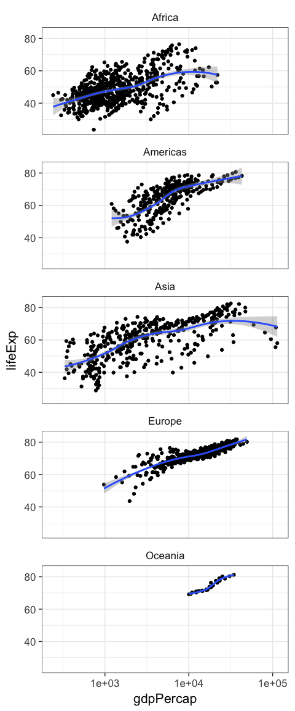
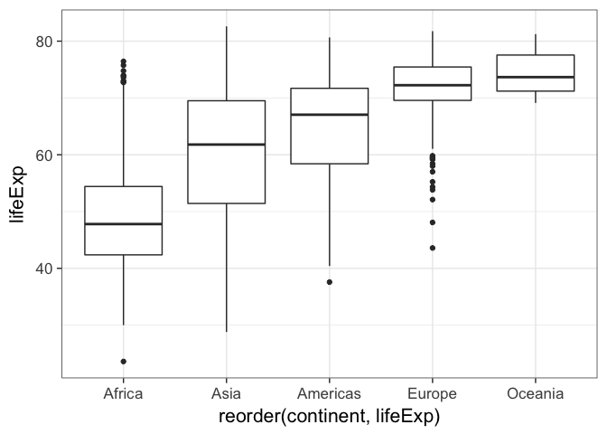
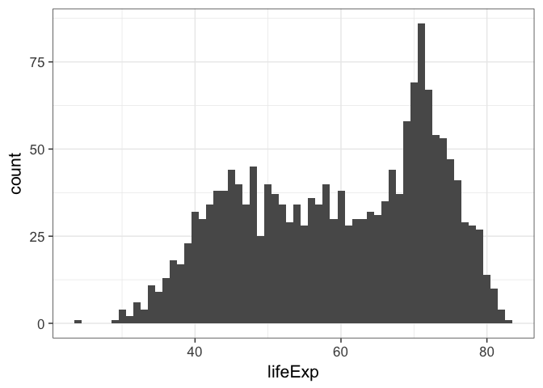
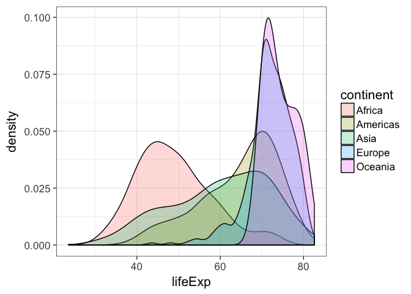
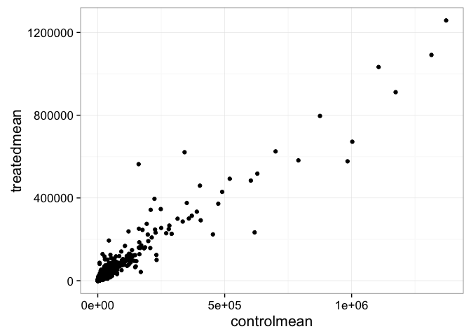
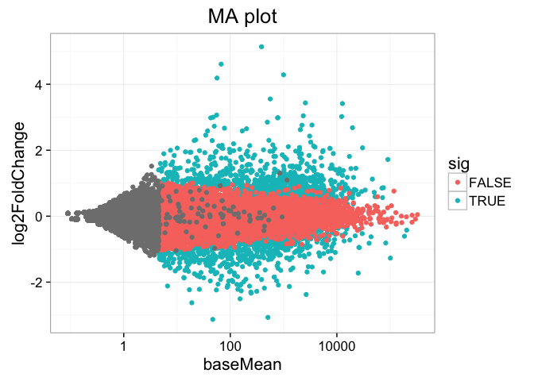
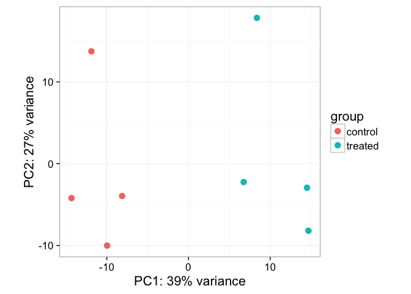
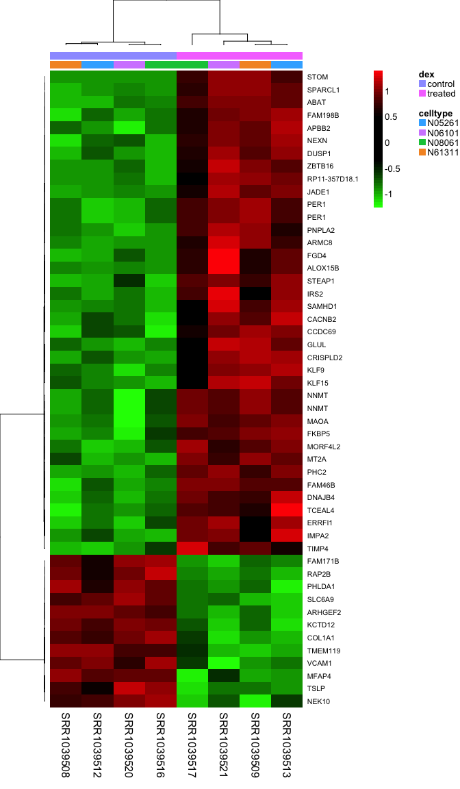

% Introduction to Biomedical Data Science  
  (BIMS 8382)
% Stephen D. Turner, Ph.D.
% _First Edition_  
  February, 2016

\chapter*{Preface}

This class introduces methods, tools, and software for reproducibly managing, manipulating, analyzing, and visualizing large-scale biomedical data. Specifically, the course introduces the R statistical computing environment and packages for manipulating and visualizing high-dimensional data, covers strategies for reproducible research, and culminates with analysis of data from a real RNA-seq experiment using R and Bioconductor packages.

This book is a PDF version of the online materials available at [bioconnector.org/bims8382](http://bioconnector.org/bims8382/).

----

This work is licensed under a [CC BY-NC-SA International License](http://creativecommons.org/licenses/by-nc-sa/4.0/).

_Attribution_: Some of the course material and content layout here is modified in part from [Jenny Bryan's Stat 545 course](http://stat545-ubc.github.io/), [Software Carpentry](http://software-carpentry.org/), [Data Carpentry](http://datacarpentry.org/), [David Robinson's blog](http://varianceexplained.org/), [Marian Schmidt's MSU NGS Workshop](https://github.com/marschmi/NGS2015_RMarkdown_Reproducibility), and likely many others.


# Syllabus

## General Information

**Lead Instructor:** Stephen Turner, PhD

**Co-instructor/TA:** VP Nagraj

**When:**  
Spring 2016 Module S1  
Feb 15 - Mar 21, 2016  
1:00pm - 4:00pm  

**Where:** Carter Classroom, Health Sciences Library (_downstairs one floor, to the right_)

**Textbook:** Available online (_free!_): [bioconnector.org/bims8382/textbook.pdf](http://bioconnector.org/bims8382/textbook.pdf)

## Week 1: Introduction to R

This novice-level introduction is directed toward life scientists with little to no experience with statistical computing or bioinformatics. This interactive introduction will introduce the R statistical computing environment. The first part of this workshop will demonstrate very basic functionality in R, including functions, functions, vectors, creating variables, getting help, filtering, data frames, plotting, and reading/writing files.

## Week 2: Advanced Data Manipulation with R

Data analysis involves a large amount of janitor work -- munging and cleaning data to facilitate downstream data analysis. This session assumes a basic familiarity with R and covers tools and techniques for advanced data manipulation. It will cover data cleaning and "tidy data," and will introduce R packages that enable data manipulation, analysis, and visualization using split-apply-combine strategies. Upon completing this lesson, students will be able to use the _dplyr_ package in R to effectively manipulate and conditionally compute summary statistics over subsets of a "big" dataset containing many observations.

## Week 3: Advanced Data Visualization with R and ggplot2

This session will cover fundamental concepts for creating effective data visualization and will introduce tools and techniques for visualizing large, high-dimensional data using R. We will review fundamental concepts for visually displaying quantitative information, such as using series of small multiples, avoiding "chart-junk," and maximizing the data-ink ratio. After briefly covering data visualization using base R graphics, we will introduce the _ggplot2_ package for advanced high-dimensional visualization. We will cover the grammar of graphics (geoms, aesthetics, stats, and faceting), and using ggplot2 to create plots layer-by-layer. Upon completing this lesson, students will be able to use R to explore a high-dimensional dataset by faceting and scaling arbitrarily complex plots in small multiples.

## Week 4: Reproducible Research & Dynamic Documents

Contemporary life sciences research is plagued by reproducibility issues. This session covers some of the barriers to reproducible research and how to start to address some of those problems during the data management and analysis phases of the research life cycle. In this session we will cover using R and dynamic document generation with RMarkdown and RStudio to weave together reporting text with executable R code to automatically generate reports in the form of PDF, Word, or HTML documents.

## Weeks 5-6: Introduction to RNA-seq data analysis

This session will introduce both the Linux/UNIX operating system and a cloud computing environment, focusing on analyzing real data from a biological application - analyzing RNA-seq data for differentially expressed genes. The first part will introduce basic operation in a cloud-enabled UNIX environment, and will cover the first steps in an RNA-seq analysis including QC, alignment, and quantitation. The second part will cover differential gene expression analysis of the RNA-seq data using Bioconductor packages.

# R Setup Instructions

## Basic R Setup

**Note:** R and RStudio are separate downloads and installations. **R** is the underlying statistical computing environment, but using R alone is no fun. **RStudio** is a graphical integrated development environment that makes using R much easier. You need R installed before you install RStudio.

1. **Create a new folder** somewhere on your computer that's easy to get to (e.g., your Desktop). Name it `bims8382`. Inside that folder, make a folder called `data`, all lowercase. 
1. **Download 8 datasets** from [bioconnector.org/data](http://bioconnector.org/data/). Save these data files to `bims8382/data`, that new folder you just made. Or just click these direct links:
    1. [brauer2007_tidy.csv](http://bioconnector.org/data/brauer2007_tidy.csv)
    1. [brauer2007_messy.csv](http://bioconnector.org/data/brauer2007_messy.csv)
    1. [brauer2007_sysname2go.csv](http://bioconnector.org/data/brauer2007_sysname2go.csv)
    1. [heartrate2dose.csv](http://bioconnector.org/data/heartrate2dose.csv)
    1. [gapminder.csv](http://bioconnector.org/data/gapminder.csv)
    1. [airway_rawcounts.csv](http://bioconnector.org/data/airway_rawcounts.csv)
    1. [airway_metadata.csv](http://bioconnector.org/data/airway_metadata.csv)
    1. [annotables_grch37.csv](http://bioconnector.org/data/annotables_grch37.csv)
1. **Install R.** You'll need R version 3.1.2 or higher. Download and install R for [Windows](http://cran.r-project.org/bin/windows/base/) or [Mac OS X](http://cran.r-project.org/bin/macosx/) (download the latest R-3.x.x.pkg file for your appropriate version of OS X).
1. **Install RStudio.** Download and install the latest stable version of [RStudio Desktop](https://www.rstudio.com/products/rstudio/download/).
1. **Install R packages.** Launch RStudio (RStudio, *not R itself*). Ensure that you have internet access, then enter the following commands into the **Console** panel (usually the lower-left panel, by default). _A few notes_:
    - These commands are case-sensitive. 
    - You need to be connected to the internet to do this.
    - Even if you've installed these packages in the past, go ahead and re-install the most recent version. Many of these packages are updated often. For instance, [ggplot2 2.0](http://blog.rstudio.org/2015/12/21/ggplot2-2-0-0/) (released December 2015) came with many new features and changes.
    - At any point (especially if you've used R/Bioconductor in the past), R may ask you if you want to update any old packages by asking `Update all/some/none? [a/s/n]:`. If you see this, type **`a`** at the propt and hit `Enter` to update any old packages. 
    - If you see a note long the lines of "_binary version available but the source version is later_", followed by a question, "_Do you want to install from sources the package which needs compilation? y/n_", type **`n`** for no, and hit enter.
    - If you're using a Windows machine you might get some errors about not having permission to modify the existing libraries -- don't worry about this message. You can avoid this error altogether by running RStudio as an administrator (right click the RStudio icon, then click "run as administrator").

```r
install.packages("dplyr")
install.packages("ggplot2")
install.packages("tidyr")
install.packages("readr")
install.packages("stringr")
install.packages("knitr")
install.packages("rmarkdown")
```

You can check that you've installed everything correctly by closing and reopening RStudio and entering the following commands at the console window:

```r
library(dplyr)
library(ggplot2)
library(tidyr)
library(readr)
library(stringr)
library(knitr)
library(rmarkdown)
```

These commands may produce some notes or other output, but as long as they work without an error message, you're good to go. If you get a message that says something like: `Error in library(packageName) : there is no package called 'packageName'`, then the required packages did not install correctly. Please do not hesitate to [email me](people.html) _prior to the course_ if you are still having difficulty.

## Bioconductor

Additionally, you'll need to install a few [Bioconductor](http://bioconductor.org/) packages. These packages are installed differently than "regular" R packages from CRAN. Copy and paste these lines of code into your R console.

```r
source("http://bioconductor.org/biocLite.R")
biocLite()
biocLite("DESeq2")
```

You can check that you've installed everything correctly by closing and reopening RStudio and entering the following commands at the console window:

```r
library(DESeq2)
```

If you get a message that says something like: `Error in library(packageName) : there is no package called 'packageName'`, then the required packages did not install correctly. Please do not hesitate to [email me](people.html) _prior to the course_ if you are still having difficulty.

## Additional steps for Reproducible Research classes

A few additional setup steps required for the reproducible research / dynamic documents class.

1. First, launch RStudio (not R). Click File, New File, R Markdown. This may tell you that you need to install additional packages (knitr, yaml, htmltools, caTools, bitops, and rmarkdown). Click "Yes" to install these.
1. Sign up for a free account at **[RPubs.com](http://rpubs.com/)**.
1. If you want to convert to PDF, you will need to install a **LaTeX** typesetting engine. This differs on Mac and Windows. **Note that this part of the installation may take up to several hours, and isn't strictly required for the class.**
    - **Windows LaTeX instructions**:
        1. Download the installer [using this link](http://mirrors.ctan.org/systems/win32/miktex/setup/setup-2.9.5870-x64.exe) (or [this link](http://mirrors.ctan.org/systems/win32/miktex/setup/setup-2.9.5870.exe) if you're using an older 32-bit version of Windows). It is important to use the full installer, not the basic installer. Run the installer .exe that you downloaded.
        1. Run the installer _twice_, making sure to use the Complete, not Basic, installation:
            1. First, When prompted, select the box to "Download MiKTeX." Select the closest mirror to your location. If you're doing this from Charlottesville, the United States / JMU mirror is likely the closest. This may take a while.
            1. Run the installer again, but this time select "Install" instead of "Download." When prompted _"Install missing packages on-the-fly"_, drag your selection up to "Yes."
    - **Mac LaTeX instructions**:
        1. Download the installer .pkg file [using this link](http://tug.org/cgi-bin/mactex-download/MacTeX.pkg). This is a very large download (>2 gigabytes). It can take a while depending on your network speed.
        1. Run the installer package. 

# R: The Basics


This section introduces the R environment and some of the most basic funcionality aspects of R that are used through the remainder of the class. This section assumes little to no experience with statistical computing with R. We will introduce the R statistical computing environment, RStudio, and the dataset that we will work with for the remainder of the lesson. We will cover very basic functionality in R, including variables, functions, and importing/inspecting data frames.

**Make sure you [complete the setup here](setup-r.html) prior to the class.**

## RStudio

Let's start by learning about RStudio. **R** is the underlying statistical computing environment, but using R alone is no fun. **RStudio** is a graphical integrated development environment that makes using R much easier.

- Panes in RStudio. There are four panes, and their orientation is configurable under "Tools -- Global Options." You don't have to do it this way, but I usually set up my window to have:
    - Editor in the top left
    - Console top right
    - Environment/history on the bottom left
    - Plots/help on the bottom right.  
- Projects: first, start a new project in a new folder somewhere easy to remember. When we start reading in data it'll be important that the _code and the data are in the same place._ Creating a project creates an Rproj file that opens R running _in that folder_. This way, when you want to read in dataset _whatever.txt_, you just tell it the filename rather than a full path. This is critical for reproducibility, and we'll talk about that more later.
- Code that you type into the console is code that R executes. From here forward we will use the editor window to write a script that we can save to a file and run it again whenever we want to. We usually give it a `.R` extension, but it's just a plain text file. If you want to send commands from your editor to the console, use `CMD`+`Enter` (`Ctrl`+`Enter` on Windows).
- Anything after a `#` sign is a comment. Use them liberally to *comment your code*.

## Basic operations

R can be used as a glorified calculator. Try typing this in directly into the console. Make sure you're typing into into the editor, not the console, and save your script. Use the run button, or press `CMD`+`Enter` (`Ctrl`+`Enter` on Windows).


```r
2+2
5*4
2^3
```

R Knows order of operations and scientific notation.


```r
2+3*4/(5+3)*15/2^2+3*4^2
5e4
```

However, to do useful and interesting things, we need to assign _values_ to _objects_. To create objects, we need to give it a name followed by the assignment operator `<-` and the value we want to give it:


```r
weight_kg <- 55
```

`<-` is the assignment operator. Assigns values on the right to objects on the left, it is like an arrow that points from the value to the object. Mostly similar to `=` but not always. Learn to use `<-` as it is good programming practice. Using `=` in place of `<-` can lead to issues down the line. The keyboard shortcut for inserting the `<-` operator is `Alt-dash`.

Objects can be given any name such as `x`, `current_temperature`, or `subject_id`. You want your object names to be explicit and not too long. They cannot start with a number (`2x` is not valid but `x2` is). R is case sensitive (e.g., `weight_kg` is different from `Weight_kg`). There are some names that cannot be used because they represent the names of fundamental functions in R (e.g., `if`, `else`, `for`, see [here](https://stat.ethz.ch/R-manual/R-devel/library/base/html/Reserved.html) for a complete list). In general, even if it's allowed, it's best to not use other function names, which we'll get into shortly (e.g., `c`, `T`, `mean`, `data`, `df`, `weights`). In doubt check the help to see if the name is already in use. It's also best to avoid dots (`.`) within a variable name as in `my.dataset`. It is also recommended to use nouns for variable names, and verbs for function names.

When assigning a value to an object, R does not print anything. You can force to print the value by typing the name:


```r
weight_kg
```

Now that R has `weight_kg` in memory, we can do arithmetic with it. For instance, we may want to convert this weight in pounds (weight in pounds is 2.2 times the weight in kg).


```r
2.2 * weight_kg
```

We can also change a variable's value by assigning it a new one:


```r
weight_kg <- 57.5
2.2 * weight_kg
```

This means that assigning a value to one variable does not change the values of other variables. For example, let's store the animal's weight in pounds in a variable.


```r
weight_lb <- 2.2 * weight_kg
```

and then change `weight_kg` to 100.


```r
weight_kg <- 100
```

What do you think is the current content of the object `weight_lb`? 126.5 or 220?

You can see what objects (variables) are stored by viewing the Environment tab in Rstudio. You can also use the `ls()` function. You can remove objects (variables) with the `rm()` function. You can do this one at a time or remove several objects at once. You can also use the little broom button in your environment pane to remove everything from your environment.


```r
ls()
rm(weight_lb, weight_kg)
ls()
weight_lb # oops! you should get an error because weight_lb no longer exists!
```

----

**EXERCISE 1**

What are the values after each statement in the following?


```r
mass <- 50              # mass?
age  <- 30              # age?
mass <- mass * 2        # mass?
age  <- age - 10        # age?
mass_index <- mass/age  # massIndex?
```

----

## Functions

R has built-in functions.


```r
# Notice that this is a comment.
# Anything behind a # is "commented out" and is not run.
sqrt(144)
log(1000)
```

Get help by typing a question mark in front of the function's name, or `help(functionname)`:

```
help(log)
?log
```

Note syntax highlighting when typing this into the editor. Also note how we pass *arguments* to functions. The `base=` part inside the parentheses is called an argument, and most functions use arguments. Arguments modify the behavior of the function. Functions some input (e.g., some data, an object) and other options to change what the function will return, or how to treat the data provided. Finally, see how you can *next* one function inside of another (here taking the square root of the log-base-10 of 1000).


```r
log(1000)
log(1000, base=10)
log(1000, 10)
sqrt(log(1000, base=10))
```

----

**EXERCISE 2**

See `?abs` and calculate the square root of the log-base-10 of the absolute value of `-4*(2550-50)`. Answer should be `2`.

----

## Data Frames

There are _lots_ of different basic data structures in R. If you take any kind of longer introduction to R you'll probably learn about arrays, lists, matrices, etc. We are going to skip straight to the data structure you'll probably use most -- the **data frame**. We use data frames to store heterogeneous tabular data in R: tabular, meaning that individuals or observations are typically represented in rows, while variables or features are represented as columns; heterogeneous, meaning that columns/features/variables can be different classes (on variable, e.g. age, can be numeric, while another, e.g., cause of death, can be text). 

[Let's move on to learning about data frames](r-dataframes.html).

# Data Manipulation with dplyr


Data analysis involves a large amount of [janitor work](http://www.nytimes.com/2014/08/18/technology/for-big-data-scientists-hurdle-to-insights-is-janitor-work.html) -- munging and cleaning data to facilitate downstream data analysis. This lesson demonstrates techniques for advanced data manipulation and analysis with the split-apply-combine strategy. We will use the dplyr package in R to effectively manipulate and conditionally compute summary statistics over subsets of a "big" dataset containing many observations.

This lesson assumes a [basic familiarity with R](r-basics.html) and [data frames](r-dataframes.html).

## Review

### Our data

We're going to use the yeast gene expression dataset [described on the data frames lesson](r-dataframes.html#our-data). This is a cleaned up version of a gene expression dataset from [Brauer et al. Coordination of Growth Rate, Cell Cycle, Stress Response, and Metabolic Activity in Yeast (2008) _Mol Biol Cell_ 19:352-367](http://www.ncbi.nlm.nih.gov/pubmed/17959824). This data is from a gene expression microarray, and in this paper the authors are examining the relationship between growth rate and gene expression in yeast cultures limited by one of six different nutrients (glucose, leucine, ammonium, sulfate, phosphate, uracil). If you give yeast a rich media loaded with nutrients except restrict the supply of a _single_ nutrient, you can control the growth rate to any rate you choose. By starving yeast of specific nutrients you can find genes that: 

1. **Raise or lower their expression in response to growth rate**. Growth-rate dependent expression patterns can tell us a lot about cell cycle control, and how the cell responds to stress. The authors found that expression of >25% of all yeast genes is linearly correlated with growth rate, independent of the limiting nutrient. They also found that the subset of negatively growth-correlated genes is enriched for peroxisomal functions, and positively correlated genes mainly encode ribosomal functions. 
2. **Respond differently when different nutrients are being limited**. If you see particular genes that respond very differently when a nutrient is sharply restricted, these genes might be involved in the transport or metabolism of that specific nutrient.

You can download the cleaned up version of the data at [bioconnector.org/data](http://bioconnector.org/data). The file is called **brauer2007_tidy.csv**. Later on we'll actually start with the original raw data (minimally processed) and manipulate it so that we can make it more amenable for analysis. 

### Reading in data

We need to load both the dplyr and readr packages for efficiently reading in and displaying this data. We're also going to use many other functions from the dplyr package. Make sure you have these packages installed as described on the [setup page](setup-r.html).


```r
# Load packages
library(readr)
library(dplyr)

# Read in data
ydat <- read_csv(file="data/brauer2007_tidy.csv")

# Display the data
ydat

# Optionally, bring up the data in a viewer window
# View(ydat)
```

```
## Source: local data frame [198,430 x 7]
## 
##    symbol systematic_name nutrient  rate expression
##     (chr)           (chr)    (chr) (dbl)      (dbl)
## 1    SFB2         YNL049C  Glucose  0.05      -0.24
## 2      NA         YNL095C  Glucose  0.05       0.28
## 3    QRI7         YDL104C  Glucose  0.05      -0.02
## 4    CFT2         YLR115W  Glucose  0.05      -0.33
## 5    SSO2         YMR183C  Glucose  0.05       0.05
## 6    PSP2         YML017W  Glucose  0.05      -0.69
## 7    RIB2         YOL066C  Glucose  0.05      -0.55
## 8   VMA13         YPR036W  Glucose  0.05      -0.75
## 9    EDC3         YEL015W  Glucose  0.05      -0.24
## 10   VPS5         YOR069W  Glucose  0.05      -0.16
## ..    ...             ...      ...   ...        ...
## Variables not shown: bp (chr), mf (chr)
```

## The dplyr package

The [dplyr package](https://github.com/hadley/dplyr) is a relatively new R package that makes data manipulation fast and easy. It imports functionality from another package called magrittr that allows you to chain commands together into a pipeline that will completely change the way you write R code such that you're writing code the way you're thinking about the problem.

When you read in data with the readr package (`read_csv()`) and you had the dplyr package loaded already, the data frame takes on this "special" class of data frames called a `tbl`, which you can see with `class(ydat)`. If you have other "regular" data frames in your workspace, the `tbl_df()` function will convert it into the special dplyr `tbl` that displays nicely (e.g.: `iris <- tbl_df(iris)`). You don't have to turn all your data frame objects into tbl_df objects, but it does make working with large datasets a bit easier.

## dplyr verbs

The dplyr package gives you a handful of useful **verbs** for managing data. On their own they don't do anything that base R can't do. Here are some of the _single-table_ verbs we'll be working with in this lesson (single-table meaning that they only work on a single table -- contrast that to _two-table_ verbs used for joining data together, which we'll cover in a later lesson).

1. `filter()`
1. `select()`
1. `mutate()`
1. `arrange()`
1. `summarize()`
1. `group_by()`

They all take a `data.frame` or `tbl_df` as their input for the first argument, and they all return a `data.frame` or `tbl_df` as output.

### filter()

If you want to filter **rows** of the data where some condition is true, use the `filter()` function. 

1. The first argument is the data frame you want to filter, e.g. `filter(mydata, ...`.
2. The second argument is a condition you must satisfy, e.g. `filter(ydat, symbol == "LEU1")`. If you want to satisfy *all* of multiple conditions, you can use the "and" operator, `&`. The "or" operator `|` (the pipe character, usually shift-backslash) will return a subset that meet *any* of the conditions.

- `==`: Equal to
- `!=`: Not equal to
- `>`, `>=`: Greater than, greater than or equal to
- `<`, `<=`: Less than, less than or equal to

Let's try it out. For this to work you have to have already loaded the dplyr package. Let's take a look at [LEU1](http://www.yeastgenome.org/locus/Leu1/overview), a gene involved in leucine synthesis.


```r
# First, make sure you've loaded the dplyr package
library(dplyr)

# Look at a single gene involved in leucine synthesis pathway
filter(ydat, symbol == "LEU1")
```

```
## Source: local data frame [36 x 7]
## 
##    symbol systematic_name nutrient  rate expression                   bp
##     (chr)           (chr)    (chr) (dbl)      (dbl)                (chr)
## 1    LEU1         YGL009C  Glucose  0.05      -1.12 leucine biosynthesis
## 2    LEU1         YGL009C  Glucose  0.10      -0.77 leucine biosynthesis
## 3    LEU1         YGL009C  Glucose  0.15      -0.67 leucine biosynthesis
## 4    LEU1         YGL009C  Glucose  0.20      -0.59 leucine biosynthesis
## 5    LEU1         YGL009C  Glucose  0.25      -0.20 leucine biosynthesis
## 6    LEU1         YGL009C  Glucose  0.30       0.03 leucine biosynthesis
## 7    LEU1         YGL009C  Ammonia  0.05      -0.76 leucine biosynthesis
## 8    LEU1         YGL009C  Ammonia  0.10      -1.17 leucine biosynthesis
## 9    LEU1         YGL009C  Ammonia  0.15      -1.20 leucine biosynthesis
## 10   LEU1         YGL009C  Ammonia  0.20      -1.02 leucine biosynthesis
## ..    ...             ...      ...   ...        ...                  ...
## Variables not shown: mf (chr)
```

```r
# Optionally, bring that result up in a View window
# View(filter(ydat, symbol == "LEU1"))

# Look at multiple genes
filter(ydat, symbol=="LEU1" | symbol=="ADH2")
```

```
## Source: local data frame [72 x 7]
## 
##    symbol systematic_name nutrient  rate expression                   bp
##     (chr)           (chr)    (chr) (dbl)      (dbl)                (chr)
## 1    LEU1         YGL009C  Glucose  0.05      -1.12 leucine biosynthesis
## 2    ADH2         YMR303C  Glucose  0.05       6.28        fermentation*
## 3    LEU1         YGL009C  Glucose  0.10      -0.77 leucine biosynthesis
## 4    ADH2         YMR303C  Glucose  0.10       5.81        fermentation*
## 5    LEU1         YGL009C  Glucose  0.15      -0.67 leucine biosynthesis
## 6    ADH2         YMR303C  Glucose  0.15       5.64        fermentation*
## 7    LEU1         YGL009C  Glucose  0.20      -0.59 leucine biosynthesis
## 8    ADH2         YMR303C  Glucose  0.20       5.10        fermentation*
## 9    LEU1         YGL009C  Glucose  0.25      -0.20 leucine biosynthesis
## 10   ADH2         YMR303C  Glucose  0.25       1.89        fermentation*
## ..    ...             ...      ...   ...        ...                  ...
## Variables not shown: mf (chr)
```

```r
# Look at LEU1 expression at a low growth rate due to nutrient depletion
# Notice how LEU1 is highly upregulated when leucine is depleted!
filter(ydat, symbol=="LEU1" & rate==.05)
```

```
## Source: local data frame [6 x 7]
## 
##   symbol systematic_name  nutrient  rate expression                   bp
##    (chr)           (chr)     (chr) (dbl)      (dbl)                (chr)
## 1   LEU1         YGL009C   Glucose  0.05      -1.12 leucine biosynthesis
## 2   LEU1         YGL009C   Ammonia  0.05      -0.76 leucine biosynthesis
## 3   LEU1         YGL009C Phosphate  0.05      -0.81 leucine biosynthesis
## 4   LEU1         YGL009C   Sulfate  0.05      -1.57 leucine biosynthesis
## 5   LEU1         YGL009C   Leucine  0.05       3.84 leucine biosynthesis
## 6   LEU1         YGL009C    Uracil  0.05      -2.07 leucine biosynthesis
## Variables not shown: mf (chr)
```

```r
# But expression goes back down when the growth/nutrient restriction is relaxed
filter(ydat, symbol=="LEU1" & rate==.3)
```

```
## Source: local data frame [6 x 7]
## 
##   symbol systematic_name  nutrient  rate expression                   bp
##    (chr)           (chr)     (chr) (dbl)      (dbl)                (chr)
## 1   LEU1         YGL009C   Glucose   0.3       0.03 leucine biosynthesis
## 2   LEU1         YGL009C   Ammonia   0.3      -0.22 leucine biosynthesis
## 3   LEU1         YGL009C Phosphate   0.3      -0.07 leucine biosynthesis
## 4   LEU1         YGL009C   Sulfate   0.3      -0.76 leucine biosynthesis
## 5   LEU1         YGL009C   Leucine   0.3       0.87 leucine biosynthesis
## 6   LEU1         YGL009C    Uracil   0.3      -0.16 leucine biosynthesis
## Variables not shown: mf (chr)
```

```r
# Show only stats for LEU1 and Leucine depletion. 
# LEU1 expression starts off high and drops
filter(ydat, symbol=="LEU1" & nutrient=="Leucine")
```

```
## Source: local data frame [6 x 7]
## 
##   symbol systematic_name nutrient  rate expression                   bp
##    (chr)           (chr)    (chr) (dbl)      (dbl)                (chr)
## 1   LEU1         YGL009C  Leucine  0.05       3.84 leucine biosynthesis
## 2   LEU1         YGL009C  Leucine  0.10       3.36 leucine biosynthesis
## 3   LEU1         YGL009C  Leucine  0.15       3.24 leucine biosynthesis
## 4   LEU1         YGL009C  Leucine  0.20       2.84 leucine biosynthesis
## 5   LEU1         YGL009C  Leucine  0.25       2.04 leucine biosynthesis
## 6   LEU1         YGL009C  Leucine  0.30       0.87 leucine biosynthesis
## Variables not shown: mf (chr)
```

```r
# What about LEU1 expression with other nutrients being depleted?
filter(ydat, symbol=="LEU1" & nutrient=="Glucose")
```

```
## Source: local data frame [6 x 7]
## 
##   symbol systematic_name nutrient  rate expression                   bp
##    (chr)           (chr)    (chr) (dbl)      (dbl)                (chr)
## 1   LEU1         YGL009C  Glucose  0.05      -1.12 leucine biosynthesis
## 2   LEU1         YGL009C  Glucose  0.10      -0.77 leucine biosynthesis
## 3   LEU1         YGL009C  Glucose  0.15      -0.67 leucine biosynthesis
## 4   LEU1         YGL009C  Glucose  0.20      -0.59 leucine biosynthesis
## 5   LEU1         YGL009C  Glucose  0.25      -0.20 leucine biosynthesis
## 6   LEU1         YGL009C  Glucose  0.30       0.03 leucine biosynthesis
## Variables not shown: mf (chr)
```

Let's look at this graphically. Don't worry about what these commands are doing just yet - we'll cover that later on when we talk about ggplot2. Here's I'm taking the filtered dataset containing just expression estimates for LEU1 where I have 36 rows (one for each of 6 nutrients $\times$ 6 growth rates), and I'm _piping_ that dataset to the plotting function, where I'm plotting rate on the x-axis, expression on the y-axis, mapping the value of nutrient to the color, and using a line plot to display the data.


```r
library(ggplot2)
filter(ydat, symbol=="LEU1") %>% 
  ggplot(aes(rate, expression, colour=nutrient)) + geom_line(lwd=1.5)
```


Look closely at that! LEU1 is _highly expressed_ when starved of leucine because the cell has to synthesize its own! And as the amount of leucine in the environment (the growth _rate_) increases, the cell can worry less about synthesizing leucine, so LEU1 expression goes back down. Consequently the cell can devote more energy into other functions, and we see other genes' expression very slightly raising.

----

**EXERCISE 1**

1. Display the data where the gene ontology biological process (the `bp` variable) is "leucine biosynthesis" (case-sensitive) _and_ the limiting nutrient was Leucine. (Answer should return a 24-by-7 data frame -- 4 genes $\times$ 6 growth rates).
1. Gene/rate combinations had high expression (in the top 1% of expressed genes)? _Hint:_ see `?quantile` and try `quantile(ydat$expression, probs=.99)` to see the expression value which is higher than 99% of all the data, then `filter()` based on that. Try wrapping your answer with a `View()` function so you can see the whole thing. What does it look like those genes are doing? Answer should return a 1971-by-7 data frame.


----

### select()

The `filter()` function allows you to return only certain _rows_ matching a condition. The `select()` function returns only certain _columns_. The first argument is the data, and subsequent arguments are the columns you want.


```r
# Select just the symbol and systematic_name
select(ydat, symbol, systematic_name)
```

```
## Source: local data frame [198,430 x 2]
## 
##    symbol systematic_name
##     (chr)           (chr)
## 1    SFB2         YNL049C
## 2      NA         YNL095C
## 3    QRI7         YDL104C
## 4    CFT2         YLR115W
## 5    SSO2         YMR183C
## 6    PSP2         YML017W
## 7    RIB2         YOL066C
## 8   VMA13         YPR036W
## 9    EDC3         YEL015W
## 10   VPS5         YOR069W
## ..    ...             ...
```

```r
# Alternatively, just remove columns. Remove the bp and mf columns.
select(ydat, -bp, -mf)
```

```
## Source: local data frame [198,430 x 5]
## 
##    symbol systematic_name nutrient  rate expression
##     (chr)           (chr)    (chr) (dbl)      (dbl)
## 1    SFB2         YNL049C  Glucose  0.05      -0.24
## 2      NA         YNL095C  Glucose  0.05       0.28
## 3    QRI7         YDL104C  Glucose  0.05      -0.02
## 4    CFT2         YLR115W  Glucose  0.05      -0.33
## 5    SSO2         YMR183C  Glucose  0.05       0.05
## 6    PSP2         YML017W  Glucose  0.05      -0.69
## 7    RIB2         YOL066C  Glucose  0.05      -0.55
## 8   VMA13         YPR036W  Glucose  0.05      -0.75
## 9    EDC3         YEL015W  Glucose  0.05      -0.24
## 10   VPS5         YOR069W  Glucose  0.05      -0.16
## ..    ...             ...      ...   ...        ...
```

```r
# Notice that the original data doesn't change!
ydat
```

```
## Source: local data frame [198,430 x 7]
## 
##    symbol systematic_name nutrient  rate expression
##     (chr)           (chr)    (chr) (dbl)      (dbl)
## 1    SFB2         YNL049C  Glucose  0.05      -0.24
## 2      NA         YNL095C  Glucose  0.05       0.28
## 3    QRI7         YDL104C  Glucose  0.05      -0.02
## 4    CFT2         YLR115W  Glucose  0.05      -0.33
## 5    SSO2         YMR183C  Glucose  0.05       0.05
## 6    PSP2         YML017W  Glucose  0.05      -0.69
## 7    RIB2         YOL066C  Glucose  0.05      -0.55
## 8   VMA13         YPR036W  Glucose  0.05      -0.75
## 9    EDC3         YEL015W  Glucose  0.05      -0.24
## 10   VPS5         YOR069W  Glucose  0.05      -0.16
## ..    ...             ...      ...   ...        ...
## Variables not shown: bp (chr), mf (chr)
```

Notice above how the original data doesn't change. We're selecting out only certain columns of interest and throwing away columns we don't care about. If we wanted to _keep_ this data, we would need to _reassign_ the result of the `select()` operation to a new object. Let's make a new object called `nogo` that does not contain the GO annotations. Notice again how the original data is unchanged.


```r
# create a new dataset without the go annotations.
nogo <- select(ydat, -bp, -mf)
nogo
```

```
## Source: local data frame [198,430 x 5]
## 
##    symbol systematic_name nutrient  rate expression
##     (chr)           (chr)    (chr) (dbl)      (dbl)
## 1    SFB2         YNL049C  Glucose  0.05      -0.24
## 2      NA         YNL095C  Glucose  0.05       0.28
## 3    QRI7         YDL104C  Glucose  0.05      -0.02
## 4    CFT2         YLR115W  Glucose  0.05      -0.33
## 5    SSO2         YMR183C  Glucose  0.05       0.05
## 6    PSP2         YML017W  Glucose  0.05      -0.69
## 7    RIB2         YOL066C  Glucose  0.05      -0.55
## 8   VMA13         YPR036W  Glucose  0.05      -0.75
## 9    EDC3         YEL015W  Glucose  0.05      -0.24
## 10   VPS5         YOR069W  Glucose  0.05      -0.16
## ..    ...             ...      ...   ...        ...
```

```r
# we could filter this new dataset
filter(nogo, symbol=="LEU1" & rate==.05)
```

```
## Source: local data frame [6 x 5]
## 
##   symbol systematic_name  nutrient  rate expression
##    (chr)           (chr)     (chr) (dbl)      (dbl)
## 1   LEU1         YGL009C   Glucose  0.05      -1.12
## 2   LEU1         YGL009C   Ammonia  0.05      -0.76
## 3   LEU1         YGL009C Phosphate  0.05      -0.81
## 4   LEU1         YGL009C   Sulfate  0.05      -1.57
## 5   LEU1         YGL009C   Leucine  0.05       3.84
## 6   LEU1         YGL009C    Uracil  0.05      -2.07
```

```r
# Notice how the original data is unchanged - still have all 7 columns
ydat
```

```
## Source: local data frame [198,430 x 7]
## 
##    symbol systematic_name nutrient  rate expression
##     (chr)           (chr)    (chr) (dbl)      (dbl)
## 1    SFB2         YNL049C  Glucose  0.05      -0.24
## 2      NA         YNL095C  Glucose  0.05       0.28
## 3    QRI7         YDL104C  Glucose  0.05      -0.02
## 4    CFT2         YLR115W  Glucose  0.05      -0.33
## 5    SSO2         YMR183C  Glucose  0.05       0.05
## 6    PSP2         YML017W  Glucose  0.05      -0.69
## 7    RIB2         YOL066C  Glucose  0.05      -0.55
## 8   VMA13         YPR036W  Glucose  0.05      -0.75
## 9    EDC3         YEL015W  Glucose  0.05      -0.24
## 10   VPS5         YOR069W  Glucose  0.05      -0.16
## ..    ...             ...      ...   ...        ...
## Variables not shown: bp (chr), mf (chr)
```


### mutate()

The `mutate()` function adds new columns to the data. Remember, it doesn't actually modify the data frame you're operating on, and the result is transient unless you assign it to a new object or reassign it back to itself (generally, not always a good practice). 

The expression level reported here is the $log_2$ of the sample signal divided by the signal in the reference channel, where the reference RNA for all samples was taken from the glucose-limited chemostat grown at a dilution rate of 0.25 $h^{-1}$. Let's mutate this data to add a new variable called "signal" that's the actual raw signal ratio instead of the log-transformed signal.


```r
mutate(nogo, signal=2^expression)
```

Mutate has a nice little feature too in that it's "lazy." You can mutate and add one variable, then continue mutating to add more variables based on that variable. Let's make another column that's the square root of the signal ratio.


```r
mutate(nogo, signal=2^expression, sigsr=sqrt(signal))
```

```
## Source: local data frame [198,430 x 7]
## 
##    symbol systematic_name nutrient  rate expression    signal     sigsr
##     (chr)           (chr)    (chr) (dbl)      (dbl)     (dbl)     (dbl)
## 1    SFB2         YNL049C  Glucose  0.05      -0.24 0.8467453 0.9201877
## 2      NA         YNL095C  Glucose  0.05       0.28 1.2141949 1.1019051
## 3    QRI7         YDL104C  Glucose  0.05      -0.02 0.9862327 0.9930925
## 4    CFT2         YLR115W  Glucose  0.05      -0.33 0.7955365 0.8919285
## 5    SSO2         YMR183C  Glucose  0.05       0.05 1.0352649 1.0174797
## 6    PSP2         YML017W  Glucose  0.05      -0.69 0.6198538 0.7873080
## 7    RIB2         YOL066C  Glucose  0.05      -0.55 0.6830201 0.8264503
## 8   VMA13         YPR036W  Glucose  0.05      -0.75 0.5946036 0.7711054
## 9    EDC3         YEL015W  Glucose  0.05      -0.24 0.8467453 0.9201877
## 10   VPS5         YOR069W  Glucose  0.05      -0.16 0.8950251 0.9460576
## ..    ...             ...      ...   ...        ...       ...       ...
```

Again, don't worry about the code here to make the plot -- we'll learn about this later. Why do you think we log-transform the data prior to analysis?


```r
library(tidyr)
mutate(nogo, signal=2^expression, sigsr=sqrt(signal)) %>% 
  gather(unit, value, expression:sigsr) %>% 
  ggplot(aes(value)) + geom_histogram(bins=100) + facet_wrap(~unit, scales="free")
```

\

### arrange()

The `arrange()` function does what it sounds like. It takes a data frame or tbl and arranges (or sorts) by column(s) of interest. The first argument is the data, and subsequent arguments are columns to sort on. Use the `desc()` function to arrange by descending.


```r
# arrange by gene symbol
arrange(ydat, symbol)
```

```
## Source: local data frame [198,430 x 7]
## 
##    symbol systematic_name nutrient  rate expression                   bp
##     (chr)           (chr)    (chr) (dbl)      (dbl)                (chr)
## 1    AAC1         YMR056C  Glucose  0.05       1.50 aerobic respiration*
## 2    AAC1         YMR056C  Glucose  0.10       1.54 aerobic respiration*
## 3    AAC1         YMR056C  Glucose  0.15       1.16 aerobic respiration*
## 4    AAC1         YMR056C  Glucose  0.20       1.04 aerobic respiration*
## 5    AAC1         YMR056C  Glucose  0.25       0.84 aerobic respiration*
## 6    AAC1         YMR056C  Glucose  0.30       0.01 aerobic respiration*
## 7    AAC1         YMR056C  Ammonia  0.05       0.80 aerobic respiration*
## 8    AAC1         YMR056C  Ammonia  0.10       1.47 aerobic respiration*
## 9    AAC1         YMR056C  Ammonia  0.15       0.97 aerobic respiration*
## 10   AAC1         YMR056C  Ammonia  0.20       0.76 aerobic respiration*
## ..    ...             ...      ...   ...        ...                  ...
## Variables not shown: mf (chr)
```

```r
# arrange by expression (default: increasing)
arrange(ydat, expression)
```

```
## Source: local data frame [198,430 x 7]
## 
##    symbol systematic_name  nutrient  rate expression
##     (chr)           (chr)     (chr) (dbl)      (dbl)
## 1    SUL1         YBR294W Phosphate  0.05      -6.50
## 2    SUL1         YBR294W Phosphate  0.10      -6.34
## 3    ADH2         YMR303C Phosphate  0.10      -6.15
## 4    ADH2         YMR303C Phosphate  0.30      -6.04
## 5    ADH2         YMR303C Phosphate  0.25      -5.89
## 6    SUL1         YBR294W    Uracil  0.05      -5.55
## 7    SFC1         YJR095W Phosphate  0.20      -5.52
## 8    JEN1         YKL217W Phosphate  0.30      -5.44
## 9    MHT1         YLL062C Phosphate  0.05      -5.36
## 10   SFC1         YJR095W Phosphate  0.25      -5.35
## ..    ...             ...       ...   ...        ...
## Variables not shown: bp (chr), mf (chr)
```

```r
# arrange by decreasing expression
arrange(ydat, desc(expression))
```

```
## Source: local data frame [198,430 x 7]
## 
##    symbol systematic_name  nutrient  rate expression
##     (chr)           (chr)     (chr) (dbl)      (dbl)
## 1    GAP1         YKR039W   Ammonia  0.05       6.64
## 2    DAL5         YJR152W   Ammonia  0.05       6.64
## 3    GAP1         YKR039W   Ammonia  0.10       6.64
## 4    DAL5         YJR152W   Ammonia  0.10       6.64
## 5    DAL5         YJR152W   Ammonia  0.15       6.64
## 6    DAL5         YJR152W   Ammonia  0.20       6.64
## 7    DAL5         YJR152W   Ammonia  0.25       6.64
## 8    DAL5         YJR152W   Ammonia  0.30       6.64
## 9    GIT1         YCR098C Phosphate  0.05       6.64
## 10   PHM6         YDR281C Phosphate  0.05       6.64
## ..    ...             ...       ...   ...        ...
## Variables not shown: bp (chr), mf (chr)
```

----

**EXERCISE 2**

1. First, re-run the command you used above to filter the data for genes involved in the "leucine biosynthesis" biological process _and_ where the limiting nutrient is Leucine. 
2. Wrap this entire filtered result with a call to `arrange()` where you'll arrange the result of #1 by the gene symbol.
3. Wrap this entire result in a `View()` statement so you can see the entire result.


----

### summarize()

The `summarize()` function summarizes multiple values to a single value. On its own the `summarize()` function doesn't seem to be all that useful. The dplyr package provides a few convenience functions called `n()` and `n_distinct()` that tell you the number of observations or the number of distinct values of a particular variable.

Notice that summarize takes a data frame and returns a data frame. In this case it's a 1x1 data frame with a single row and a single column. The name of the column, by default is whatever the expression was used to summarize the data. This usually isn't pretty, and if we wanted to work with this resulting data frame later on, we'd want to name that returned value something easier to deal with.


```r
# Get the mean expression for all genes
summarize(ydat, mean(expression))
```

```
## Source: local data frame [1 x 1]
## 
##   mean(expression)
##              (dbl)
## 1      0.003367182
```

```r
# Use a more friendly name, e.g., meanexp, or whatever you want to call it.
summarize(ydat, meanexp=mean(expression))
```

```
## Source: local data frame [1 x 1]
## 
##       meanexp
##         (dbl)
## 1 0.003367182
```

```r
# Measure the correlation between rate and expression 
summarize(ydat, r=cor(rate, expression))
```

```
## Source: local data frame [1 x 1]
## 
##             r
##         (dbl)
## 1 -0.02197312
```

```r
# Get the number of observations
summarize(ydat, n())
```

```
## Source: local data frame [1 x 1]
## 
##      n()
##    (int)
## 1 198430
```

```r
# The number of distinct gene symbols in the data 
summarize(ydat, n_distinct(symbol))
```

```
## Source: local data frame [1 x 1]
## 
##   n_distinct(symbol)
##                (int)
## 1               4211
```

### group_by()

We saw that `summarize()` isn't that useful on its own. Neither is `group_by()` All this does is takes an existing data frame and coverts it into a grouped data frame where operations are performed by group.


```r
ydat
```

```
## Source: local data frame [198,430 x 7]
## 
##    symbol systematic_name nutrient  rate expression
##     (chr)           (chr)    (chr) (dbl)      (dbl)
## 1    SFB2         YNL049C  Glucose  0.05      -0.24
## 2      NA         YNL095C  Glucose  0.05       0.28
## 3    QRI7         YDL104C  Glucose  0.05      -0.02
## 4    CFT2         YLR115W  Glucose  0.05      -0.33
## 5    SSO2         YMR183C  Glucose  0.05       0.05
## 6    PSP2         YML017W  Glucose  0.05      -0.69
## 7    RIB2         YOL066C  Glucose  0.05      -0.55
## 8   VMA13         YPR036W  Glucose  0.05      -0.75
## 9    EDC3         YEL015W  Glucose  0.05      -0.24
## 10   VPS5         YOR069W  Glucose  0.05      -0.16
## ..    ...             ...      ...   ...        ...
## Variables not shown: bp (chr), mf (chr)
```

```r
group_by(ydat, nutrient)
```

```
## Source: local data frame [198,430 x 7]
## Groups: nutrient [6]
## 
##    symbol systematic_name nutrient  rate expression
##     (chr)           (chr)    (chr) (dbl)      (dbl)
## 1    SFB2         YNL049C  Glucose  0.05      -0.24
## 2      NA         YNL095C  Glucose  0.05       0.28
## 3    QRI7         YDL104C  Glucose  0.05      -0.02
## 4    CFT2         YLR115W  Glucose  0.05      -0.33
## 5    SSO2         YMR183C  Glucose  0.05       0.05
## 6    PSP2         YML017W  Glucose  0.05      -0.69
## 7    RIB2         YOL066C  Glucose  0.05      -0.55
## 8   VMA13         YPR036W  Glucose  0.05      -0.75
## 9    EDC3         YEL015W  Glucose  0.05      -0.24
## 10   VPS5         YOR069W  Glucose  0.05      -0.16
## ..    ...             ...      ...   ...        ...
## Variables not shown: bp (chr), mf (chr)
```

```r
group_by(ydat, nutrient, rate)
```

```
## Source: local data frame [198,430 x 7]
## Groups: nutrient, rate [36]
## 
##    symbol systematic_name nutrient  rate expression
##     (chr)           (chr)    (chr) (dbl)      (dbl)
## 1    SFB2         YNL049C  Glucose  0.05      -0.24
## 2      NA         YNL095C  Glucose  0.05       0.28
## 3    QRI7         YDL104C  Glucose  0.05      -0.02
## 4    CFT2         YLR115W  Glucose  0.05      -0.33
## 5    SSO2         YMR183C  Glucose  0.05       0.05
## 6    PSP2         YML017W  Glucose  0.05      -0.69
## 7    RIB2         YOL066C  Glucose  0.05      -0.55
## 8   VMA13         YPR036W  Glucose  0.05      -0.75
## 9    EDC3         YEL015W  Glucose  0.05      -0.24
## 10   VPS5         YOR069W  Glucose  0.05      -0.16
## ..    ...             ...      ...   ...        ...
## Variables not shown: bp (chr), mf (chr)
```

The real power comes in where `group_by()` and `summarize()` are used together. First, write the `group_by()` statement. Then wrap the result of that with a call to `summarize()`.


```r
# Get the mean expression for each gene
# group_by(ydat, symbol)
summarize(group_by(ydat, symbol), meanexp=mean(expression))
```

```
## Source: local data frame [4,211 x 2]
## 
##    symbol      meanexp
##     (chr)        (dbl)
## 1    AAC1  0.528888889
## 2    AAC3 -0.216285714
## 3   AAD10  0.438333333
## 4   AAD14 -0.071666667
## 5   AAD16  0.241944444
## 6    AAD4 -0.791666667
## 7    AAD6  0.290277778
## 8    AAH1  0.046111111
## 9    AAP1 -0.003611111
## 10  AAP1' -0.421388889
## ..    ...          ...
```

```r
# Get the correlation between rate and expression for each nutrient
# group_by(ydat, nutrient)
summarize(group_by(ydat, nutrient), r=cor(rate, expression))
```

```
## Source: local data frame [6 x 2]
## 
##    nutrient           r
##       (chr)       (dbl)
## 1   Ammonia -0.01752025
## 2   Glucose -0.01119529
## 3   Leucine -0.03837677
## 4 Phosphate -0.01935061
## 5   Sulfate -0.01664016
## 6    Uracil -0.03534036
```

## The almighty pipe: **%>%**

### How the pipe works

This is where things get awesome. The dplyr package imports functionality from the [magrittr](https://github.com/smbache/magrittr) package that lets you _pipe_ the output of one function to the input of another, so you can avoid nesting functions. It looks like this: **`%>%`**. You don't have to load the magrittr package to use it since dplyr imports its functionality when you load the dplyr package.

Here's the simplest way to use it. Remember the `tail()` function. It expects a data frame as input, and the next argument is the number of lines to print. These two commands are identical:


```r
tail(ydat, 5)
```

```
## Source: local data frame [5 x 7]
## 
##   symbol systematic_name nutrient  rate expression
##    (chr)           (chr)    (chr) (dbl)      (dbl)
## 1   KRE1         YNL322C   Uracil   0.3       0.28
## 2   MTL1         YGR023W   Uracil   0.3       0.27
## 3   KRE9         YJL174W   Uracil   0.3       0.43
## 4   UTH1         YKR042W   Uracil   0.3       0.19
## 5     NA         YOL111C   Uracil   0.3       0.04
## Variables not shown: bp (chr), mf (chr)
```

```r
ydat %>% tail(5)
```

```
## Source: local data frame [5 x 7]
## 
##   symbol systematic_name nutrient  rate expression
##    (chr)           (chr)    (chr) (dbl)      (dbl)
## 1   KRE1         YNL322C   Uracil   0.3       0.28
## 2   MTL1         YGR023W   Uracil   0.3       0.27
## 3   KRE9         YJL174W   Uracil   0.3       0.43
## 4   UTH1         YKR042W   Uracil   0.3       0.19
## 5     NA         YOL111C   Uracil   0.3       0.04
## Variables not shown: bp (chr), mf (chr)
```

Let's use one of the dplyr verbs.


```r
filter(ydat, nutrient=="Leucine")
```

```
## Source: local data frame [33,178 x 7]
## 
##    symbol systematic_name nutrient  rate expression
##     (chr)           (chr)    (chr) (dbl)      (dbl)
## 1    SFB2         YNL049C  Leucine  0.05       0.18
## 2      NA         YNL095C  Leucine  0.05       0.16
## 3    QRI7         YDL104C  Leucine  0.05      -0.30
## 4    CFT2         YLR115W  Leucine  0.05      -0.27
## 5    SSO2         YMR183C  Leucine  0.05      -0.59
## 6    PSP2         YML017W  Leucine  0.05      -0.17
## 7    RIB2         YOL066C  Leucine  0.05      -0.02
## 8   VMA13         YPR036W  Leucine  0.05      -0.11
## 9    EDC3         YEL015W  Leucine  0.05       0.12
## 10   VPS5         YOR069W  Leucine  0.05      -0.20
## ..    ...             ...      ...   ...        ...
## Variables not shown: bp (chr), mf (chr)
```

```r
ydat %>% filter(nutrient=="Leucine")
```

```
## Source: local data frame [33,178 x 7]
## 
##    symbol systematic_name nutrient  rate expression
##     (chr)           (chr)    (chr) (dbl)      (dbl)
## 1    SFB2         YNL049C  Leucine  0.05       0.18
## 2      NA         YNL095C  Leucine  0.05       0.16
## 3    QRI7         YDL104C  Leucine  0.05      -0.30
## 4    CFT2         YLR115W  Leucine  0.05      -0.27
## 5    SSO2         YMR183C  Leucine  0.05      -0.59
## 6    PSP2         YML017W  Leucine  0.05      -0.17
## 7    RIB2         YOL066C  Leucine  0.05      -0.02
## 8   VMA13         YPR036W  Leucine  0.05      -0.11
## 9    EDC3         YEL015W  Leucine  0.05       0.12
## 10   VPS5         YOR069W  Leucine  0.05      -0.20
## ..    ...             ...      ...   ...        ...
## Variables not shown: bp (chr), mf (chr)
```


### Nesting versus piping 

So what? 

Now, think about this for a minute. What if we wanted to get the correlation between the growth rate and expression separately for each limiting nutrient only for genes in the leucine biosynthesis pathway, and return a sorted list of those correlation coeffients rounded to two digits? Mentally we would do something like this:

0. Take the `ydat` dataset
0. _then_ `filter()` it for genes in the leucine biosynthesis pathway
0. _then_ `group_by()` the limiting nutrient
0. _then_ `summarize()` to get the correlation (`cor()`) between rate and expression 
0. _then_ `mutate()` to round the result of the above calculation to two significant digits
0. _then_ `arrange()` by the rounded correlation coefficient above

But in code, it gets ugly. First, take the `ydat` dataset


```r
ydat
```

_then_ `filter()` it for genes in the leucine biosynthesis pathway


```r
filter(ydat, bp=="leucine biosynthesis")
```

_then_ `group_by()` the limiting nutrient


```r
group_by(filter(ydat, bp=="leucine biosynthesis"), nutrient)
```

_then_ `summarize()` to get the correlation (`cor()`) between rate and expression 


```r
summarize(group_by(filter(ydat, bp == "leucine biosynthesis"), nutrient), r = cor(rate, 
    expression))
```

_then_ `mutate()` to round the result of the above calculation to two significant digits


```r
mutate(summarize(group_by(filter(ydat, bp == "leucine biosynthesis"), nutrient), 
    r = cor(rate, expression)), r = round(r, 2))
```

_then_ `arrange()` by the rounded correlation coefficient above


```r
arrange(
  mutate(
    summarize(
      group_by(
        filter(ydat, bp=="leucine biosynthesis"), 
      nutrient), 
    r=cor(rate, expression)), 
  r=round(r, 2)), 
r)
```

```
## Source: local data frame [6 x 2]
## 
##    nutrient     r
##       (chr) (dbl)
## 1   Leucine -0.58
## 2   Glucose -0.04
## 3   Ammonia  0.16
## 4   Sulfate  0.33
## 5 Phosphate  0.44
## 6    Uracil  0.58
```

Now compare that with the mental process of what you're actually trying to accomplish. The way you would do this without pipes is completely inside-out and backwards from the way you express in words and in thought what you want to do. The pipe operator `%>%` allows you to pass the output data frame from one function to the input data frame to another function.


This is how we would do that in code. It's as simple as replacing the word "then" in words to the symbol `%>%` in code. (There's a keyboard shortcut that I'll use frequently to insert the `%>%` sequence -- you can see what it is by clicking the _Tools_ menu in RStudio, then selecting _Keyboard Shortcut Help_. On Mac, it's CMD-SHIFT-M.)


```r
ydat %>% 
  filter(bp=="leucine biosynthesis") %>%
  group_by(nutrient) %>% 
  summarize(r=cor(rate, expression)) %>% 
  mutate(r=round(r,2)) %>% 
  arrange(r)
```

```
## Source: local data frame [6 x 2]
## 
##    nutrient     r
##       (chr) (dbl)
## 1   Leucine -0.58
## 2   Glucose -0.04
## 3   Ammonia  0.16
## 4   Sulfate  0.33
## 5 Phosphate  0.44
## 6    Uracil  0.58
```

### Piping exercises

**EXERCISE 3**

Here's a warm-up round. Try the following.

Show the limiting nutrient and expression values for the gene ADH2 when the growth rate is restricted to 0.05. _Hint:_ 2 pipes: `filter` and `select`.


```
## Source: local data frame [6 x 2]
## 
##    nutrient expression
##       (chr)      (dbl)
## 1   Glucose       6.28
## 2   Ammonia       0.55
## 3 Phosphate      -4.60
## 4   Sulfate      -1.18
## 5   Leucine       4.15
## 6    Uracil       0.63
```

What are the four most highly expressed genes when the growth rate is restricted to 0.05 by restricting glucose? Show only the symbol, expression value, and GO terms. _Hint:_ 4 pipes: `filter`, `arrange`, `head`, and `select`.


```
## Source: local data frame [4 x 4]
## 
##   symbol expression                  bp                             mf
##    (chr)      (dbl)               (chr)                          (chr)
## 1   ADH2       6.28       fermentation* alcohol dehydrogenase activity
## 2  HSP26       5.86 response to stress*       unfolded protein binding
## 3   MLS1       5.64    glyoxylate cycle       malate synthase activity
## 4   HXT5       5.56    hexose transport  glucose transporter activity*
```

When the growth rate is restricted to 0.05, what is the average expression level across all genes in the "response to stress" biological process, separately for each limiting nutrient? What about genes in the "protein biosynthesis" biological process? _Hint:_ 3 pipes: `filter`, `group_by`, `summarize`.


```
## Source: local data frame [6 x 2]
## 
##    nutrient   meanexp
##       (chr)     (dbl)
## 1   Ammonia 0.9426667
## 2   Glucose 0.7426667
## 3   Leucine 0.8106667
## 4 Phosphate 0.9806667
## 5   Sulfate 0.7430769
## 6    Uracil 0.7313333
```

```
## Source: local data frame [6 x 2]
## 
##    nutrient    meanexp
##       (chr)      (dbl)
## 1   Ammonia -1.6133514
## 2   Glucose -0.6911351
## 3   Leucine -0.5735676
## 4 Phosphate -0.7496216
## 5   Sulfate -0.9134807
## 6    Uracil -0.8799454
```

----

**EXERCISE 4**

That was easy, right? How about some tougher ones.

First, some review. How do we see the number of distinct values of a variable? Use `n_distinct()` within a `summarize()` call.


```r
ydat %>% summarize(n_distinct(mf))
```

```
## Source: local data frame [1 x 1]
## 
##   n_distinct(mf)
##            (int)
## 1           1086
```

Which 10 biological process annotations have the most genes associated with them? What about molecular functions? _Hint:_ 4 pipes: `group_by`, `summarize` with `n_distinct`, `arrange`, `head`.


```
## Source: local data frame [10 x 2]
## 
##                                                              bp     n
##                                                           (chr) (int)
## 1                                    biological process unknown   269
## 2                                          protein biosynthesis   182
## 3                           protein amino acid phosphorylation*    78
## 4                                         protein biosynthesis*    73
## 5                        cell wall organization and biogenesis*    64
## 6  regulation of transcription from RNA polymerase II promoter*    49
## 7                        nuclear mRNA splicing, via spliceosome    47
## 8                                                   DNA repair*    44
## 9                                          aerobic respiration*    42
## 10                                       ER to Golgi transport*    42
```

```
## Source: local data frame [10 x 2]
## 
##                                        mf     n
##                                     (chr) (int)
## 1              molecular function unknown   886
## 2      structural constituent of ribosome   185
## 3                         protein binding   107
## 4                             RNA binding    63
## 5                        protein binding*    53
## 6                            DNA binding*    44
## 7            structural molecule activity    43
## 8                         GTPase activity    40
## 9  structural constituent of cytoskeleton    39
## 10          transcription factor activity    38
```

How many distinct genes are there where we know what process the gene is involved in but we don't know what it does? _Hint:_ 3 pipes; `filter` where `bp!="biological process unknown" & mf=="molecular function unknown"`, and after `select`ing columns of interest, pipe the output to `distinct()`. The answer should be **737**, and here are a few:


```
## Source: local data frame [737 x 3]
## 
##    symbol                                                              bp
##     (chr)                                                           (chr)
## 1    SFB2                                           ER to Golgi transport
## 2    EDC3                           deadenylylation-independent decapping
## 3    PER1                                   response to unfolded protein*
## 4   PEX25                         peroxisome organization and biogenesis*
## 5    BNI5                                                    cytokinesis*
## 6   CSN12 adaptation to pheromone during conjugation with cellular fusion
## 7   SEC39                                               secretory pathway
## 8    ABC1                                         ubiquinone biosynthesis
## 9   PRP46                          nuclear mRNA splicing, via spliceosome
## 10   MAM3                      mitochondrion organization and biogenesis*
## ..    ...                                                             ...
## Variables not shown: mf (chr)
```

When the growth rate is restricted to 0.05 by limiting Glucose, which biological processes are the most upregulated? Show a sorted list with the most upregulated BPs on top, displaying the biological process and the average expression of all genes in that process rounded to two digits. _Hint:_ 5 pipes: `filter`, `group_by`, `summarize`, `mutate`, `arrange`.


```
## Source: local data frame [881 x 2]
## 
##                                               bp meanexp
##                                            (chr)   (dbl)
## 1                                  fermentation*    6.28
## 2                               glyoxylate cycle    5.29
## 3  oxygen and reactive oxygen species metabolism    5.04
## 4                            fumarate transport*    5.03
## 5                       acetyl-CoA biosynthesis*    4.32
## 6                                gluconeogenesis    3.64
## 7                      fatty acid beta-oxidation    3.57
## 8                              lactate transport    3.48
## 9                           carnitine metabolism    3.30
## 10                           alcohol metabolism*    3.25
## ..                                           ...     ...
```

Group the data by limiting nutrient (primarily) then by biological process. Get the average expression for all genes annotated with each process, separately for each limiting nutrient, where the growth rate is restricted to 0.05. Arrange the result to show the most upregulated processes on top. The initial result will look like the result below. Pipe this output to a `View()` statement. What's going on? Why didn't the `arrange()` work? _Hint:_ 5 pipes: `filter`, `group_by`, `summarize`, `arrange`, `View`.


```
## Source: local data frame [5,257 x 3]
## Groups: nutrient [6]
## 
##    nutrient                     bp meanexp
##       (chr)                  (chr)   (dbl)
## 1   Ammonia   allantoate transport  6.6400
## 2   Ammonia  amino acid transport*  6.6400
## 3   Ammonia    allantoin transport  5.5600
## 4   Ammonia    proline catabolism*  5.1400
## 5   Ammonia         urea transport  5.1400
## 6   Ammonia asparagine catabolism*  4.7325
## 7   Ammonia  allantoin catabolism*  4.4400
## 8   Ammonia      peptide transport  3.9200
## 9   Ammonia       glyoxylate cycle  3.9100
## 10  Ammonia   sodium ion transport  3.2650
## ..      ...                    ...     ...
```

Let's try to further process that result to get only the top three most upregulated biolgocal processes for each limiting nutrient. Google search "dplyr first result within group." You'll need a `filter(row_number()......)` in there somewhere. _Hint:_ 5 pipes: `filter`, `group_by`, `summarize`, `arrange`, `filter(row_number()...`. _Note:_ dplyr's pipe syntax used to be `%.%` before it changed to `%>%`. So when looking around, you might still see some people use the old syntax. Now if you try to use the old syntax, you'll get a deprecation warning.


```
## Source: local data frame [18 x 3]
## Groups: nutrient [6]
## 
##     nutrient                                            bp meanexp
##        (chr)                                         (chr)   (dbl)
## 1    Ammonia                          allantoate transport   6.640
## 2    Ammonia                         amino acid transport*   6.640
## 3    Ammonia                           allantoin transport   5.560
## 4    Glucose                                 fermentation*   6.280
## 5    Glucose                              glyoxylate cycle   5.285
## 6    Glucose oxygen and reactive oxygen species metabolism   5.040
## 7    Leucine                                 fermentation*   4.150
## 8    Leucine                           fumarate transport*   3.720
## 9    Leucine                              glyoxylate cycle   3.650
## 10 Phosphate               glycerophosphodiester transport   6.640
## 11 Phosphate                vacuole fusion, non-autophagic   4.195
## 12 Phosphate         regulation of cell redox homeostasis*   4.030
## 13   Sulfate                        protein ubiquitination   3.400
## 14   Sulfate                           fumarate transport*   3.270
## 15   Sulfate                 sulfur amino acid metabolism*   2.690
## 16    Uracil                           fumarate transport*   4.320
## 17    Uracil                         pyridoxine metabolism   3.110
## 18    Uracil                        asparagine catabolism*   3.060
```

There's a slight problem with the examples above. We're getting the average expression of all the biological processes separately by each nutrient. But some of these biological processes only have a single gene in them! If we tried to do the same thing to get the correlation between rate and expression, the calculation would work, but we'd get a warning about a standard deviation being zero. The correlation coefficient value that results is `NA`, i.e., missing. While we're summarizing the correlation between rate and expression, let's also show the number of distinct genes within each grouping.


```r
ydat %>% 
  group_by(nutrient, bp) %>% 
  summarize(r=cor(rate, expression), ngenes=n_distinct(symbol))
```

```
## Warning in cor(c(0.05, 0.05, 0.05, 0.05, 0.05, 0.05, 0.05, 0.05, 0.05,
## 0.05, : the standard deviation is zero
```

```
## Source: local data frame [5,286 x 4]
## Groups: nutrient [?]
## 
##    nutrient                                      bp           r ngenes
##       (chr)                                   (chr)       (dbl)  (int)
## 1   Ammonia             'de novo' IMP biosynthesis*  0.31247162      8
## 2   Ammonia  'de novo' pyrimidine base biosynthesis -0.04817745      3
## 3   Ammonia 'de novo' pyrimidine base biosynthesis*  0.16699596      4
## 4   Ammonia       35S primary transcript processing  0.50795855     13
## 5   Ammonia      35S primary transcript processing*  0.42397321     30
## 6   Ammonia                    acetate biosynthesis  0.46768319      1
## 7   Ammonia                      acetate metabolism  0.92909260      1
## 8   Ammonia                     acetate metabolism* -0.68551933      1
## 9   Ammonia                 acetyl-CoA biosynthesis -0.85122895      1
## 10  Ammonia   acetyl-CoA biosynthesis from pyruvate  0.09509414      1
## ..      ...                                     ...         ...    ...
```

Take the above code and continue to process the result to show only results where the process has at least 5 genes. Add a column corresponding to the absolute value of the correlation coefficient, and show for each nutrient the singular process with the highest correlation between rate and expression, regardless of direction. _Hint:_ 4 more pipes: `filter`, `mutate`, `arrange`, and `filter` again with `row_number()==1`. Ignore the warning.


```
## Source: local data frame [6 x 5]
## Groups: nutrient [6]
## 
##    nutrient                                          bp     r ngenes  absr
##       (chr)                                       (chr) (dbl)  (int) (dbl)
## 1   Ammonia telomerase-independent telomere maintenance -0.91      7  0.91
## 2   Glucose telomerase-independent telomere maintenance -0.95      7  0.95
## 3   Leucine telomerase-independent telomere maintenance -0.90      7  0.90
## 4 Phosphate telomerase-independent telomere maintenance -0.90      7  0.90
## 5   Sulfate                   translational elongation*  0.79      5  0.79
## 6    Uracil telomerase-independent telomere maintenance -0.81      7  0.81
```

# Tidy Data and Advanced Data Manipulation


## Review

### Prior classes

- [R basics](r-basics.html)
- [Data frames](r-dataframes.html)
- [Manipulating data with dplyr and `%>%`](r-dplyr.html)

### Data needed

Go to [bioconnector.org/data](http://bioconnector.org/data/) and download the following datasets, saving them in a `data` folder relative to your current working RStudio project:

- Heart rate data: [heartrate2dose.csv](http://bioconnector.org/data/heartrate2dose.csv)
- _Tidy_ yeast data: [brauer2007_tidy.csv](http://bioconnector.org/data/brauer2007_tidy.csv)
- _Original_ (untidy) yeast data: [brauer2007_messy.csv](http://bioconnector.org/data/brauer2007_messy.csv)
- Yeast systematic names to GO terms: [brauer2007_sysname2go.csv](http://bioconnector.org/data/brauer2007_sysname2go.csv)

## Tidy data

So far we've dealt exclusively with tidy data -- data that's easy to work with, manipulate, and visualize. That's because our dataset has two key properties:

1. Each _column_ is a _variable_.
2. Each _row_ is an _observation_.

You can read a lot more about tidy data [in this paper](http://www.jstatsoft.org/v59/i10/paper). Let's load some untidy data and see if we can see the difference. This is some made-up data for five different patients (Jon, Ann, Bill, Kate, and Joe) given three different drugs (A, B, and C), at two doses (10 and 20), and measuring their heart rate. Download the [heartrate2dose.csv](http://bioconnector.org/data/heartrate2dose.csv) file directly from [bioconnector.org/data](http://bioconnector.org/data/). Load **readr** and **dplyr**, and import and display the data.


```r
library(readr)
library(dplyr)
hr <- read_csv("data/heartrate2dose.csv")
hr
```

```
## Source: local data frame [5 x 7]
## 
##    name  a_10  a_20  b_10  b_20  c_10  c_20
##   (chr) (int) (int) (int) (int) (int) (int)
## 1   jon    60    55    65    60    70    70
## 2   ann    65    60    70    65    75    75
## 3  bill    70    65    75    70    80    80
## 4  kate    75    70    80    75    85    85
## 5   joe    80    75    85    80    90    90
```

Notice how with the yeast data each variable (symbol, nutrient, rate, expression, etc.) were each in their own column. In this heart rate data, we have four variables: name, drug, dose, and heart rate. _Name_ is in a column, but _drug_ is in the header row. Furthermore the drug and _dose_ are tied together in the same column, and the _heart rate_ is scattered around the entire table. If we wanted to do things like `filter` the dataset where `drug=="a"` or `dose==20` or `heartrate>=80` we couldn't do it because these variables aren't in columns.

## The **tidyr** package

The **tidyr** package helps with this. There are several functions in the tidyr package but the ones we're going to use are `separate()` and `gather()`. The `gather()` function takes multiple columns, and gathers them into key-value pairs: it makes "wide" data longer. The `separate()` function separates one column into multiple columns. So, what we need to do is _gather_ all the drug/dose data into a column with their corresponding heart rate, and then _separate_ that column into two separate columns for the drug and dose.

Before we get started, load the **tidyr** package, and look at the help pages for `?gather` and `?separate`. Notice how each of these functions takes a data frame as input and returns a data frame as output. Thus, we can pipe from one function to the next.


```r
library(tidyr)
```


### `gather()`

The help for `?gather` tells us that we first pass in a data frame (or omit the first argument, and pipe in the data with `%>%`). The next two arguments are the names of the key and value columns to create, and all the relevant arguments that come after that are the columns we want to _gather_ together. Here's one way to do it.


```r
hr %>% gather(key=drugdose, value=hr, a_10, a_20, b_10, b_20, c_10, c_20)
```

```
## Source: local data frame [30 x 3]
## 
##     name drugdose    hr
##    (chr)    (chr) (int)
## 1    jon     a_10    60
## 2    ann     a_10    65
## 3   bill     a_10    70
## 4   kate     a_10    75
## 5    joe     a_10    80
## 6    jon     a_20    55
## 7    ann     a_20    60
## 8   bill     a_20    65
## 9   kate     a_20    70
## 10   joe     a_20    75
## ..   ...      ...   ...
```

But that gets cumbersome to type all those names. What if we had 100 drugs and 3 doses of each? There are two other ways of specifying which columns to gather. The help for `?gather` tells you how to do this:

> `...` Specification of columns to gather. Use bare variable names. Select all variables between x and z with x:z, exclude y with -y. For more options, see the `select` documentation.

So, we could accomplish the same thing by doing this:


```r
hr %>% gather(key=drugdose, value=hr, a_10:c_20)
```

```
## Source: local data frame [30 x 3]
## 
##     name drugdose    hr
##    (chr)    (chr) (int)
## 1    jon     a_10    60
## 2    ann     a_10    65
## 3   bill     a_10    70
## 4   kate     a_10    75
## 5    joe     a_10    80
## 6    jon     a_20    55
## 7    ann     a_20    60
## 8   bill     a_20    65
## 9   kate     a_20    70
## 10   joe     a_20    75
## ..   ...      ...   ...
```

But what if we didn't know the drug names or doses, but we _did_ know that the only other column in there that we _don't_ want to gather is `name`?


```r
hr %>% gather(key=drugdose, value=hr, -name)
```

```
## Source: local data frame [30 x 3]
## 
##     name drugdose    hr
##    (chr)    (chr) (int)
## 1    jon     a_10    60
## 2    ann     a_10    65
## 3   bill     a_10    70
## 4   kate     a_10    75
## 5    joe     a_10    80
## 6    jon     a_20    55
## 7    ann     a_20    60
## 8   bill     a_20    65
## 9   kate     a_20    70
## 10   joe     a_20    75
## ..   ...      ...   ...
```


### `separate()`

Finally, look at the help for `?separate`. We can pipe in data and omit the first argument. The second argument is the column to separate; the `into` argument is a _character vector_ of the new column names, and the `sep` argument is a character used to separate columns, or a number indicating the position to split at.

> **_Side note, and 60-second lesson on vectors_**: We can create arbitrary-length _vectors_, which are simply variables that contain an arbitrary number of values. To create a numeric vector, try this: `c(5, 42, 22908)`. That creates a three element vector. Try `c("cat", "dog")`.


```r
hr %>% 
  gather(key=drugdose, value=hr, -name) %>% 
  separate(drugdose, into=c("drug", "dose"), sep="_")
```

```
## Source: local data frame [30 x 4]
## 
##     name  drug  dose    hr
##    (chr) (chr) (chr) (int)
## 1    jon     a    10    60
## 2    ann     a    10    65
## 3   bill     a    10    70
## 4   kate     a    10    75
## 5    joe     a    10    80
## 6    jon     a    20    55
## 7    ann     a    20    60
## 8   bill     a    20    65
## 9   kate     a    20    70
## 10   joe     a    20    75
## ..   ...   ...   ...   ...
```


### Putting it all together: `gather %>% separate %>% filter %>% group_by %>% summarize`

If we create a new data frame that's a tidy version of hr, we can do those kinds of manipulations we talked about before:


```r
# Create a new data.frame
hrtidy <- hr %>% 
  gather(key=drugdose, value=hr, -name) %>% 
  separate(drugdose, into=c("drug", "dose"), sep="_")

# Optionally, view it
# View(hrtidy)

# filter
hrtidy %>% filter(drug=="a")
```

```
## Source: local data frame [10 x 4]
## 
##     name  drug  dose    hr
##    (chr) (chr) (chr) (int)
## 1    jon     a    10    60
## 2    ann     a    10    65
## 3   bill     a    10    70
## 4   kate     a    10    75
## 5    joe     a    10    80
## 6    jon     a    20    55
## 7    ann     a    20    60
## 8   bill     a    20    65
## 9   kate     a    20    70
## 10   joe     a    20    75
```

```r
hrtidy %>% filter(dose==20)
```

```
## Source: local data frame [15 x 4]
## 
##     name  drug  dose    hr
##    (chr) (chr) (chr) (int)
## 1    jon     a    20    55
## 2    ann     a    20    60
## 3   bill     a    20    65
## 4   kate     a    20    70
## 5    joe     a    20    75
## 6    jon     b    20    60
## 7    ann     b    20    65
## 8   bill     b    20    70
## 9   kate     b    20    75
## 10   joe     b    20    80
## 11   jon     c    20    70
## 12   ann     c    20    75
## 13  bill     c    20    80
## 14  kate     c    20    85
## 15   joe     c    20    90
```

```r
hrtidy %>% filter(hr>=80)
```

```
## Source: local data frame [10 x 4]
## 
##     name  drug  dose    hr
##    (chr) (chr) (chr) (int)
## 1    joe     a    10    80
## 2   kate     b    10    80
## 3    joe     b    10    85
## 4    joe     b    20    80
## 5   bill     c    10    80
## 6   kate     c    10    85
## 7    joe     c    10    90
## 8   bill     c    20    80
## 9   kate     c    20    85
## 10   joe     c    20    90
```

```r
# analyze
hrtidy %>%
  filter(name!="joe") %>% 
  group_by(drug, dose) %>%
  summarize(meanhr=mean(hr))
```

```
## Source: local data frame [6 x 3]
## Groups: drug [?]
## 
##    drug  dose meanhr
##   (chr) (chr)  (dbl)
## 1     a    10   67.5
## 2     a    20   62.5
## 3     b    10   72.5
## 4     b    20   67.5
## 5     c    10   77.5
## 6     c    20   77.5
```


## Tidying the yeast data

Now, let's take a look at the yeast data again. The data we've been working with up to this point was already cleaned up to a good degree. All of our variables (symbol, nutrient, rate, expression, GO terms, etc.) were each in their own column. Make sure you have the necessary libraries loaded, and read in the tidy data once more into an object called `ydat`.


```r
# Load libraries
library(readr)
library(dplyr)
library(tidyr)

# Import data
ydat <- read_csv("data/brauer2007_tidy.csv")

# Optionally, View
# View(ydat)

# Or just display to the screen
ydat
```

```
## Source: local data frame [198,430 x 7]
## 
##    symbol systematic_name nutrient  rate expression
##     (chr)           (chr)    (chr) (dbl)      (dbl)
## 1    SFB2         YNL049C  Glucose  0.05      -0.24
## 2      NA         YNL095C  Glucose  0.05       0.28
## 3    QRI7         YDL104C  Glucose  0.05      -0.02
## 4    CFT2         YLR115W  Glucose  0.05      -0.33
## 5    SSO2         YMR183C  Glucose  0.05       0.05
## 6    PSP2         YML017W  Glucose  0.05      -0.69
## 7    RIB2         YOL066C  Glucose  0.05      -0.55
## 8   VMA13         YPR036W  Glucose  0.05      -0.75
## 9    EDC3         YEL015W  Glucose  0.05      -0.24
## 10   VPS5         YOR069W  Glucose  0.05      -0.16
## ..    ...             ...      ...   ...        ...
## Variables not shown: bp (chr), mf (chr)
```

But let's take a look to see what this data originally looked like.


```r
yorig <- read_csv("data/brauer2007_messy.csv")
# View(yorig)
yorig
```

```
## Source: local data frame [5,536 x 40]
## 
##          GID       YORF                    NAME GWEIGHT G0.05  G0.1 G0.15
##        (chr)      (chr)                   (chr)   (int) (dbl) (dbl) (dbl)
## 1  GENE1331X A_06_P5820  SFB2::YNL049C::1082129       1 -0.24 -0.13 -0.21
## 2  GENE4924X A_06_P5866    NA::YNL095C::1086222       1  0.28  0.13 -0.40
## 3  GENE4690X A_06_P1834  QRI7::YDL104C::1085955       1 -0.02 -0.27 -0.27
## 4  GENE1177X A_06_P4928  CFT2::YLR115W::1081958       1 -0.33 -0.41 -0.24
## 5   GENE511X A_06_P5620  SSO2::YMR183C::1081214       1  0.05  0.02  0.40
## 6  GENE2133X A_06_P5307  PSP2::YML017W::1083036       1 -0.69 -0.03  0.23
## 7  GENE1002X A_06_P6258  RIB2::YOL066C::1081766       1 -0.55 -0.30 -0.12
## 8  GENE5478X A_06_P7082 VMA13::YPR036W::1086860       1 -0.75 -0.12 -0.07
## 9  GENE2065X A_06_P2554  EDC3::YEL015W::1082963       1 -0.24 -0.22  0.14
## 10 GENE2440X A_06_P6431  VPS5::YOR069W::1083389       1 -0.16 -0.38  0.05
## ..       ...        ...                     ...     ...   ...   ...   ...
## Variables not shown: G0.2 (dbl), G0.25 (dbl), G0.3 (dbl), N0.05 (dbl),
##   N0.1 (dbl), N0.15 (dbl), N0.2 (dbl), N0.25 (dbl), N0.3 (dbl), P0.05
##   (dbl), P0.1 (dbl), P0.15 (dbl), P0.2 (dbl), P0.25 (dbl), P0.3 (dbl),
##   S0.05 (dbl), S0.1 (dbl), S0.15 (dbl), S0.2 (dbl), S0.25 (dbl), S0.3
##   (dbl), L0.05 (dbl), L0.1 (dbl), L0.15 (dbl), L0.2 (dbl), L0.25 (dbl),
##   L0.3 (dbl), U0.05 (dbl), U0.1 (dbl), U0.15 (dbl), U0.2 (dbl), U0.25
##   (dbl), U0.3 (dbl)
```

There are several issues here.

1. **Multiple variables are stored in one column.** The `NAME` column contains lots of information, split up by `::`s.
1. **Nutrient and rate variables are stuck in column headers.** That is, the column names contain the values of two variables: nutrient (G, N, P, S, L, U) and growth rate (0.05-0.3). Remember, with tidy data, **each _column_ is a _variable_ and each _row_ is an _observation_.** Here, we have not one observation per row, but 36 (6 nutrients $\times$ 6 rates)! There's no way we could filter this data by a certain nutrient, or try to calculate statistics between rate and expression.
1. **Expression values are scattered throughout the table.** Related to the problem above, and just like our heart rate example, `expression` isn't a single-column variable as in the cleaned tidy data, but it's scattered around these 36 columns.
1. **Other important information is in a separate table.** We're missing all the gene ontology information we had in the tidy data (no information about biological process (`bp`) or molecular function (`mf`)).

Let's tackle these issues one at a time, all on a `%>%` pipeline.

### `separate()` the `NAME` column

Let's `separate()` the `NAME` column `into` multiple different variables. The first row looks like this:

> `SFB2::YNL049C::1082129`

That is, it looks like we've got the gene symbol, the systematic name, and some other number (that isn't discussed in the paper). Let's `separate()`!


```r
yorig %>% 
  separate(NAME, into=c("symbol", "systematic_name", "somenumber"), sep="::")
```

```
## Source: local data frame [5,536 x 42]
## 
##          GID       YORF symbol systematic_name somenumber GWEIGHT G0.05
##        (chr)      (chr)  (chr)           (chr)      (chr)   (int) (dbl)
## 1  GENE1331X A_06_P5820   SFB2         YNL049C    1082129       1 -0.24
## 2  GENE4924X A_06_P5866     NA         YNL095C    1086222       1  0.28
## 3  GENE4690X A_06_P1834   QRI7         YDL104C    1085955       1 -0.02
## 4  GENE1177X A_06_P4928   CFT2         YLR115W    1081958       1 -0.33
## 5   GENE511X A_06_P5620   SSO2         YMR183C    1081214       1  0.05
## 6  GENE2133X A_06_P5307   PSP2         YML017W    1083036       1 -0.69
## 7  GENE1002X A_06_P6258   RIB2         YOL066C    1081766       1 -0.55
## 8  GENE5478X A_06_P7082  VMA13         YPR036W    1086860       1 -0.75
## 9  GENE2065X A_06_P2554   EDC3         YEL015W    1082963       1 -0.24
## 10 GENE2440X A_06_P6431   VPS5         YOR069W    1083389       1 -0.16
## ..       ...        ...    ...             ...        ...     ...   ...
## Variables not shown: G0.1 (dbl), G0.15 (dbl), G0.2 (dbl), G0.25 (dbl),
##   G0.3 (dbl), N0.05 (dbl), N0.1 (dbl), N0.15 (dbl), N0.2 (dbl), N0.25
##   (dbl), N0.3 (dbl), P0.05 (dbl), P0.1 (dbl), P0.15 (dbl), P0.2 (dbl),
##   P0.25 (dbl), P0.3 (dbl), S0.05 (dbl), S0.1 (dbl), S0.15 (dbl), S0.2
##   (dbl), S0.25 (dbl), S0.3 (dbl), L0.05 (dbl), L0.1 (dbl), L0.15 (dbl),
##   L0.2 (dbl), L0.25 (dbl), L0.3 (dbl), U0.05 (dbl), U0.1 (dbl), U0.15
##   (dbl), U0.2 (dbl), U0.25 (dbl), U0.3 (dbl)
```

Now, let's `select()` out the stuff we don't want.


```r
yorig %>% 
  separate(NAME, into=c("symbol", "systematic_name", "somenumber"), sep="::") %>% 
  select(-GID, -YORF, -somenumber, -GWEIGHT)
```

```
## Source: local data frame [5,536 x 38]
## 
##    symbol systematic_name G0.05  G0.1 G0.15  G0.2 G0.25  G0.3 N0.05  N0.1
##     (chr)           (chr) (dbl) (dbl) (dbl) (dbl) (dbl) (dbl) (dbl) (dbl)
## 1    SFB2         YNL049C -0.24 -0.13 -0.21 -0.15 -0.05 -0.05  0.20  0.24
## 2      NA         YNL095C  0.28  0.13 -0.40 -0.48 -0.11  0.17  0.31  0.00
## 3    QRI7         YDL104C -0.02 -0.27 -0.27 -0.02  0.24  0.25  0.23  0.06
## 4    CFT2         YLR115W -0.33 -0.41 -0.24 -0.03 -0.03  0.00  0.20 -0.25
## 5    SSO2         YMR183C  0.05  0.02  0.40  0.34 -0.13 -0.14 -0.35 -0.09
## 6    PSP2         YML017W -0.69 -0.03  0.23  0.20  0.00 -0.27  0.17 -0.40
## 7    RIB2         YOL066C -0.55 -0.30 -0.12 -0.03 -0.16 -0.11  0.04  0.00
## 8   VMA13         YPR036W -0.75 -0.12 -0.07  0.02 -0.32 -0.41  0.11 -0.16
## 9    EDC3         YEL015W -0.24 -0.22  0.14  0.06  0.00 -0.13  0.30  0.07
## 10   VPS5         YOR069W -0.16 -0.38  0.05  0.14 -0.04 -0.01  0.39  0.20
## ..    ...             ...   ...   ...   ...   ...   ...   ...   ...   ...
## Variables not shown: N0.15 (dbl), N0.2 (dbl), N0.25 (dbl), N0.3 (dbl),
##   P0.05 (dbl), P0.1 (dbl), P0.15 (dbl), P0.2 (dbl), P0.25 (dbl), P0.3
##   (dbl), S0.05 (dbl), S0.1 (dbl), S0.15 (dbl), S0.2 (dbl), S0.25 (dbl),
##   S0.3 (dbl), L0.05 (dbl), L0.1 (dbl), L0.15 (dbl), L0.2 (dbl), L0.25
##   (dbl), L0.3 (dbl), U0.05 (dbl), U0.1 (dbl), U0.15 (dbl), U0.2 (dbl),
##   U0.25 (dbl), U0.3 (dbl)
```

### `gather()` the nutrient+rate and expression data

Let's gather the data from wide to long format so we get nutrient/rate (key) and expression (value) in their own columns.


```r
yorig %>% 
  separate(NAME, into=c("symbol", "systematic_name", "somenumber"), sep="::") %>% 
  select(-GID, -YORF, -somenumber, -GWEIGHT) %>% 
  gather(key=nutrientrate, value=expression, G0.05:U0.3)
```

```
## Source: local data frame [199,296 x 4]
## 
##    symbol systematic_name nutrientrate expression
##     (chr)           (chr)        (chr)      (dbl)
## 1    SFB2         YNL049C        G0.05      -0.24
## 2      NA         YNL095C        G0.05       0.28
## 3    QRI7         YDL104C        G0.05      -0.02
## 4    CFT2         YLR115W        G0.05      -0.33
## 5    SSO2         YMR183C        G0.05       0.05
## 6    PSP2         YML017W        G0.05      -0.69
## 7    RIB2         YOL066C        G0.05      -0.55
## 8   VMA13         YPR036W        G0.05      -0.75
## 9    EDC3         YEL015W        G0.05      -0.24
## 10   VPS5         YOR069W        G0.05      -0.16
## ..    ...             ...          ...        ...
```

And while we're at it, let's `separate()` that newly created key column. Take a look at the help for `?separate` again. The `sep` argument could be a delimiter or a number position to split at. Let's split after the first character. While we're at it, let's hold onto this intermediate data frame before we add gene ontology information. Call it `ynogo`.


```r
ynogo <- yorig %>% 
  separate(NAME, into=c("symbol", "systematic_name", "somenumber"), sep="::") %>% 
  select(-GID, -YORF, -somenumber, -GWEIGHT) %>% 
  gather(key=nutrientrate, value=expression, G0.05:U0.3) %>% 
  separate(nutrientrate, into=c("nutrient", "rate"), sep=1)
```

### `inner_join()` it to the gene ontology information

It's rare that a data analysis involves only a single table of data. You normally have many tables that contribute to an analysis, and you need flexible tools to combine them. The **dplyr** package has several tools that let you work with multiple tables at once. Do a [Google image search for "SQL Joins"](https://www.google.com/search?q=SQL+join&tbm=isch), and look at [RStudio's Data Wrangling Cheat Sheet](http://www.rstudio.com/wp-content/uploads/2015/02/data-wrangling-cheatsheet.pdf) to learn more. 

First, let's import the dataset that links the systematic name to gene ontology information. It's the [brauer2007_sysname2go.csv](http://bioconnector.org/data/brauer2007_sysname2go.csv) file available at [bioconnector.org/data](http://bioconnector.org/data/). Let's call the imported data frame `sn2go`.


```r
# Import the data
sn2go <- read_csv("data/brauer2007_sysname2go.csv")

# Take a look
# View(sn2go)
head(sn2go)
```

```
## Source: local data frame [6 x 3]
## 
##   systematic_name                           bp
##             (chr)                        (chr)
## 1         YNL049C        ER to Golgi transport
## 2         YNL095C   biological process unknown
## 3         YDL104C proteolysis and peptidolysis
## 4         YLR115W      mRNA polyadenylylation*
## 5         YMR183C              vesicle fusion*
## 6         YML017W   biological process unknown
## Variables not shown: mf (chr)
```

Now, look up some help for `?inner_join`. Inner join will return a table with all rows from the first table where there are matching rows in the second table, and returns all columns from both tables. Let's give this a try.


```r
yjoined <- inner_join(ynogo, sn2go, by="systematic_name")
# View(yjoined)
yjoined
```

```
## Source: local data frame [199,296 x 7]
## 
##    symbol systematic_name nutrient  rate expression
##     (chr)           (chr)    (chr) (chr)      (dbl)
## 1    SFB2         YNL049C        G  0.05      -0.24
## 2      NA         YNL095C        G  0.05       0.28
## 3    QRI7         YDL104C        G  0.05      -0.02
## 4    CFT2         YLR115W        G  0.05      -0.33
## 5    SSO2         YMR183C        G  0.05       0.05
## 6    PSP2         YML017W        G  0.05      -0.69
## 7    RIB2         YOL066C        G  0.05      -0.55
## 8   VMA13         YPR036W        G  0.05      -0.75
## 9    EDC3         YEL015W        G  0.05      -0.24
## 10   VPS5         YOR069W        G  0.05      -0.16
## ..    ...             ...      ...   ...        ...
## Variables not shown: bp (chr), mf (chr)
```

```r
# The glimpse function makes it possible to see a little bit of everything in your data.
glimpse(yjoined)
```

```
## Observations: 199,296
## Variables: 7
## $ symbol          (chr) "SFB2", "NA", "QRI7", "CFT2", "SSO2", "PSP2", ...
## $ systematic_name (chr) "YNL049C", "YNL095C", "YDL104C", "YLR115W", "Y...
## $ nutrient        (chr) "G", "G", "G", "G", "G", "G", "G", "G", "G", "...
## $ rate            (chr) "0.05", "0.05", "0.05", "0.05", "0.05", "0.05"...
## $ expression      (dbl) -0.24, 0.28, -0.02, -0.33, 0.05, -0.69, -0.55,...
## $ bp              (chr) "ER to Golgi transport", "biological process u...
## $ mf              (chr) "molecular function unknown", "molecular funct...
```

Looks like that did it! There are many different kinds of two-table verbs/joins in dplyr. In this example, every systematic name in `ynogo` had a corresponding entry in `sn2go`, but if this weren't the case, those un-annotated genes would have been removed entirely by the `inner_join`. A `left_join` would have returned all the rows in `ynogo`, but would have filled in `bp` and `mf` with missing values (`NA`) when there was no corresponding entry. See also: `right_join`, `semi_join`, and `anti_join`.


# Advanced Data Visualization with ggplot2


This section will cover fundamental concepts for creating effective data visualization and will introduce tools and techniques for visualizing large, high-dimensional data using R. We will review fundamental concepts for visually displaying quantitative information, such as using series of small multiples, avoiding "chart-junk," and maximizing the data-ink ratio. We will cover the grammar of graphics (geoms, aesthetics, stats, and faceting), and using the ggplot2 package to create plots layer-by-layer. 

This lesson assumes a [basic familiarity with R](r-basics.html), [data frames](r-dataframes.html), and [manipulating data with dplyr and `%>%`](r-dplyr.html).

## Review

### Our data: Gapminder

We're going to work with a different dataset for this section. It's a [cleaned-up excerpt](https://github.com/jennybc/gapminder) from the [Gapminder data](http://www.gapminder.org/data/). Download this data at [bioconnector.org/data](http://bioconnector.org/data/) -- it's the [**gapminder.csv** file](http://bioconnector.org/data/gapminder.csv).

Let's read in the data to an object called `gm` and take a look with `View`. Remember, we need to load both the dplyr and readr packages for efficiently reading in and displaying this data. 


```r
# Load packages
library(readr)
library(dplyr)

# You could read the data directly from the web:
# gm <- read_csv("http://bioconnector.org/data/gapminder.csv")

# Or better to download the data locally and read the file
gm <- read_csv(file="data/gapminder.csv")

# Show the first few lines of the data
gm
```

```
## Source: local data frame [1,704 x 6]
## 
##        country continent  year lifeExp      pop gdpPercap
##          (chr)     (chr) (int)   (dbl)    (int)     (dbl)
## 1  Afghanistan      Asia  1952  28.801  8425333  779.4453
## 2  Afghanistan      Asia  1957  30.332  9240934  820.8530
## 3  Afghanistan      Asia  1962  31.997 10267083  853.1007
## 4  Afghanistan      Asia  1967  34.020 11537966  836.1971
## 5  Afghanistan      Asia  1972  36.088 13079460  739.9811
## 6  Afghanistan      Asia  1977  38.438 14880372  786.1134
## 7  Afghanistan      Asia  1982  39.854 12881816  978.0114
## 8  Afghanistan      Asia  1987  40.822 13867957  852.3959
## 9  Afghanistan      Asia  1992  41.674 16317921  649.3414
## 10 Afghanistan      Asia  1997  41.763 22227415  635.3414
## ..         ...       ...   ...     ...      ...       ...
```

```r
# Optionally bring up data in a viewer window.
# View(gm)
```

This particular excerpt has 1704 observations on six variables:

* `country` a categorical variable 142 levels
* `continent`, a categorical variable with 5 levels
* `year`: going from 1952 to 2007 in increments of 5 years
* `pop`: population
* `gdpPercap`: GDP per capita
* `lifeExp`: life expectancy

### dplyr review

The dplyr package gives you a handful of useful **verbs** for managing data. On their own they don't do anything that base R can't do. Here are some of the _single-table_ verbs we'll be working with in this lesson (single-table meaning that they only work on a single table -- contrast that to _two-table_ verbs used for joining data together). They all take a `data.frame` or `tbl_df` as their input for the first argument, and they all return a `data.frame` or `tbl_df` as output.

1. `filter()`: filters _rows_ of the data where some condition is true
1. `select()`: selects out particular _columns_ of interest
1. `mutate()`: adds new columns or changes values of existing columns
1. `arrange()`: arranges a data frame by the value of a column
1. `summarize()`: summarizes multiple values to a single value, most useful when combined with...
1. `group_by()`: groups a data frame by one or more variable. Most data operations are useful done on groups defined by variables in the the dataset. The `group_by` function takes an existing data frame and converts it into a grouped data frame where `summarize()` operations are performed _by group_.

Additionally, the **`%>%`** operator allows you to "chain" operations together. Rather than nesting functions inside out, the `%>%` operator allows you to write operations left-to-right, top-to-bottom. Let's say we wanted to get the average life expectancy and GDP (not GDP per capita) for Asian countries for each year.


The `%>%` would allow us to do this:


```r
gm %>%
  mutate(gdp=gdpPercap*pop) %>%
  filter(continent=="Asia") %>%
  group_by(year) %>%
  summarize(mean(lifeExp), mean(gdp))
```

```
## Source: local data frame [12 x 3]
## 
##     year mean(lifeExp)    mean(gdp)
##    (int)         (dbl)        (dbl)
## 1   1952      46.31439  34095762661
## 2   1957      49.31854  47267432088
## 3   1962      51.56322  60136869012
## 4   1967      54.66364  84648519224
## 5   1972      57.31927 124385747313
## 6   1977      59.61056 159802590186
## 7   1982      62.61794 194429049919
## 8   1987      64.85118 241784763369
## 9   1992      66.53721 307100497486
## 10  1997      68.02052 387597655323
## 11  2002      69.23388 458042336179
## 12  2007      70.72848 627513635079
```

Instead of this:


```r
summarize(
  group_by(
    filter(
      mutate(gm, gdp=gdpPercap*pop), 
    continent=="Asia"), 
  year), 
mean(lifeExp), mean(gdp))
```

## About ggplot2

**ggplot2** is a widely used R package that extends R's visualization capabilities. It takes the hassle out of things like creating legends, mapping other variables to scales like color, or faceting plots into small multiples. We'll learn about what all these things mean shortly. 

_Where does the "gg" in ggplot2 come from?_ The **ggplot2** package provides an R implementation of Leland Wilkinson's *Grammar of Graphics* (1999). The *Grammar of Graphics* allows you to think beyond the garden variety plot types (e.g. scatterplot, barplot) and the consider the components that make up a plot or graphic, such as how data are represented on the plot (as lines, points, etc.), how variables are mapped to coordinates or plotting shape or color, what transformation or statistical summary is required, and so on. 

Specifically, **ggplot2** allows you to build a plot layer-by-layer by specifying:

- a **geom**, which specifies how the data are represented on the plot (points, lines, bars, etc.),
- **aesthetics** that map variables in the data to axes on the plot or to plotting size, shape, color, etc.,
- a **stat**, a statistical transformation or summary of the data applied prior to plotting,
- **facets**, which we've already seen above, that allow the data to be divided into chunks on the basis of other categorical or continuous variables and the same plot drawn for each chunk.

_First, a note about `qplot()`._ The `qplot()` function is a quick and dirty way of making ggplot2 plots. You might see it if you look for help with ggplot2, and it's even covered extensively in the ggplot2 book. And if you're used to making plots with built-in base graphics, the `qplot()` function will probably feel more familiar. But the sooner you abandon the `qplot()` syntax the sooner you'll start to really understand ggplot2's approach to building up plots layer by layer. So we're not going to use it at all in this class.

Finally, see [this course's help page](help.html#ggplot2-resources) for links to getting more help with ggplot2.

## Plotting bivariate data: continuous Y by continuous X

The `ggplot` function has two required arguments: the *data* used for creating the plot, and an *aesthetic* mapping to describe how variables in said data are mapped to things we can see on the plot.

First let's load the package:


```r
library(ggplot2)
```

Now, let's lay out the plot. If we want to plot a continuous Y variable by a continuous X variable we're probably most interested in a scatter plot. Here, we're telling ggplot that we want to use the `gm` dataset, and the aesthetic mapping will map `gdpPercap` onto the x-axis and `lifeExp` onto the y-axis. Remember that the variable names are case sensitive! 


```r
ggplot(gm, aes(x = gdpPercap, y = lifeExp))
```

When we do that we get a blank canvas with no data showing (you might get an error if you're using an old version of ggplot2). That's because all we've done is laid out a two-dimensional plot specifying what goes on the x and y axes, but we haven't told it what kind of geometric object to plot. The obvious choice here is a point. Check out [docs.ggplot2.org](http://docs.ggplot2.org/) to see what kind of geoms are available.


```r
ggplot(gm, aes(x = gdpPercap, y = lifeExp)) + geom_point()
```

Here, we've built our plot in layers. First, we create a canvas for plotting layers to come using the `ggplot` function, specifying which **data** to use (here, the **gm** data frame), and an **aesthetic mapping** of `gdpPercap` to the x-axis and `lifeExp` to the y-axis. We next add a layer to the plot, specifying a **geom**, or a way of visually representing the aesthetic mapping. 

Now, the typical workflow for building up a ggplot2 plot is to first construct the figure and save that to a variable (for example, `p`), and as you're experimenting, you can continue to re-define the `p` object as you develop "keeper commands".

First, let's construct the graphic. Notice that we don't have to specify `x=` and `y=` if we specify the arguments in the correct order (x is first, y is second).


```r
p <- ggplot(gm, aes(gdpPercap, lifeExp))
```

The `p` object now contains the canvas, but nothing else. Try displaying it by just running `p`. Let's experiment with adding points and a different scale to the x-axis.


```r
# Experiment with adding poings
p + geom_point()

# Experiment with a different scale
p + geom_point() + scale_x_log10()
```

I like the look of using a log scale for the x-axis. Let's make that stick.


```r
p <- p + scale_x_log10()
```

Now, if we re-ran `p` still nothing would show up because the `p` object just contains a blank canvas. Now, re-plot again with a layer of points:


```r
p + geom_point()
```

Now notice what I've saved to `p` at this point: only the basic plot layout and the log10 mapping on the x-axis. I didn't save any layers yet because I want to fiddle around with the points for a bit first.

Above we implied the aesthetic mappings for the x- and y- axis should be `gdpPercap` and `lifeExp`, but we can also add aesthetic mappings to the geoms themselves. For instance, what if we wanted to color the points by the value of another variable in the dataset, say, continent?


```r
p + geom_point(aes(color=continent))
```

Notice the difference here. If I wanted the colors to be some static value, I wouldn't wrap that in a call to `aes()`. I would just specify it outright. Same thing with other features of the points. For example, lets make all the points huge (`size=8`) blue (`color="blue"`) semitransparent (`alpha=(1/4)`) triangles (`pch=17`):


```r
p + geom_point(color="blue", pch=17, size=8, alpha=1/4)
```

Now, this time, let's map the aesthetics of the point character to certain features of the data. For instance, let's give the points different colors and character shapes according to the continent, and map the size of the point onto the life Expectancy:


```r
p + geom_point(aes(col=continent, shape=continent, size=lifeExp))
```

Now, this isn't a great plot because there are several aesthetic mappings that are redundant. Life expectancy is mapped to both the y-axis and the size of the points -- the size mapping is superfluous. Similarly, continent is mapped to both the color and the point character (the shape is superfluous). Let's get rid of that, but let's make the points a little bigger outsize of an aesthetic mapping.


```r
p + geom_point(aes(col=continent), size=3)
```

\


----

**EXERCISE 1**

Re-create this same plot from scratch without saving anything to a variable. That is, start from the `ggplot` call. 

* Start with the `ggplot()` function.
* Use the gm data.
* Map `gdpPercap` to the x-axis and `lifeExp` to the y-axis.
* Add points to the plot
  * Make the points size 3
  * Map continent onto the aesthetics of the point
* Use a log<sub>10</sub> scale for the x-axis.


----


### Adding layers to the plot

Let's add a fitted curve to the points. Recreate the plot in the `p` object if you need to.


```r
p <- ggplot(gm, aes(gdpPercap, lifeExp)) + scale_x_log10()
p + geom_point() + geom_smooth()
```

\

By default `geom_smooth()` will try to lowess for data with n<1000 or generalized additive models for data with n>1000. We can change that behavior by tweaking the parameters to use a thick red line, use a linear model instead of a GAM, and to turn off the standard error stripes.


```r
p + geom_point() + geom_smooth(lwd=2, se=FALSE, method="lm", col="red")
```

But let's add back in our aesthetic mapping to the continents. Notice what happens here. We're mapping continent as an aesthetic mapping _to the color of the points only_ -- so `geom_smooth()` still works only on the entire data. 


```r
p + geom_point(aes(color = continent)) + geom_smooth()
```

But notice what happens here: we make the call to `aes()` outside of the `geom_point()` call, and the continent variable gets mapped as an aesthetic to any further geoms. So here, we get separate smoothing lines for each continent. Let's do it again but remove the standard error stripes and make the lines a bit thicker.


```r
p + aes(color = continent) + geom_point() + geom_smooth()
p + aes(color = continent) + geom_point() + geom_smooth(se=F, lwd=2)
```

\


### Faceting

Facets display subsets of the data in different panels. There are a couple ways to do this, but `facet_wrap()` tries to sensibly wrap a series of facets into a 2-dimensional grid of small multiples. Just give it a formula specifying which variables to facet by. We can continue adding more layers, such as smoothing. If you have a look at the help for `?facet_wrap()` you'll see that we can control how the wrapping is laid out.


```r
p + geom_point() + facet_wrap(~continent)
p + geom_point() + geom_smooth() + facet_wrap(~continent, ncol=1)
```

\


### Saving plots

There are a few ways to save ggplots. The quickest way, that works in an interactive session, is to use the `ggsave()` function. You give it a file name and by default it saves the last plot that was printed to the screen. 


```r
p + geom_point()
ggsave(file="myplot.png")
```

But if you're running this through a script, the best way to do it is to pass `ggsave()` the object containing the plot that is meant to be saved. We can also adjust things like the width, height, and resolution. `ggsave()` also recognizes the name of the file extension and saves the appropriate kind of file. Let's save a PDF.


```r
pfinal <- p + geom_point() + geom_smooth() + facet_wrap(~continent, ncol=1)
ggsave(pfinal, file="myplot.pdf", width=5, height=15)
```


----

**EXERCISE 2**

1. Make a scatter plot of `lifeExp` on the y-axis against `year` on the x.
1. Make a series of small multiples faceting on continent.
1. Add a fitted curve, smooth or lm, with and without facets.
1. **Bonus**: using `geom_line()` and and aesthetic mapping `country` to `group=`, make a "spaghetti plot", showing _semitransparent_ lines connected for each country, faceted by continent. Add a smoothed loess curve with a thick (`lwd=3`) line with no standard error stripe. Reduce the opacity (`alpha=`) of the individual black lines. _Don't_ show Oceania countries (that is, `filter()` the data where `continent!="Oceania"` before you plot it).


\


----


## Plotting bivariate data: continuous Y by categorical X

With the last example we examined the relationship between a continuous Y variable against a continuous X variable. A scatter plot was the obvious kind of data visualization. But what if we wanted to visualize a continuous Y variable against a categorical X variable? We sort of saw what that looked like in the last exercise. `year` is a continuous variable, but in this dataset, it's broken up into 5-year segments, so you could almost think of each year as a categorical variable. But a better example would be life expectancy against continent or country. 

First, let's set up the basic plot:


```r
p <- ggplot(gm, aes(continent, lifeExp)) 
```

Then add points:


```r
p + geom_point()
```

That's not terribly useful. There's a big overplotting problem. We can try to solve with transparency:


```r
p + geom_point(alpha=1/4)
```

But that really only gets us so far. What if we spread things out by adding a little bit of horizontal noise (aka "jitter") to the data.


```r
p + geom_jitter()
```

Note that the little bit of horizontal noise that's added to the jitter is random. If you run that command over and over again, each time it will look slightly different. The idea is to visualize the density at each vertical position, and spreading out the points horizontally allows you to do that. If there were still lots of over-plotting you might think about adding some transparency by setting the `alpha=` value for the jitter.


```r
p + geom_jitter(alpha=1/2)
```

Probably a more common visualization is to show a box plot:


```r
p + geom_boxplot()
```

But why not show the summary and the raw data?


```r
p + geom_jitter() + geom_boxplot()
```

Notice how in that example we first added the jitter layer then added the boxplot layer. But the boxplot is now superimposed over the jitter layer. Let's make the jitter layer go on top. Also, go back to just the boxplots. Notice that the outliers are represented as points. But there's no distinction between the outlier point from the boxplot geom and all the other points from the jitter geom. Let's change that. Notice the British spelling.


```r
p + geom_boxplot(outlier.colour = "red") + geom_jitter(alpha=1/2)
```

There's another geom that's useful here, called a voilin plot.


```r
p + geom_violin()

p + geom_violin() + geom_jitter(alpha=1/2)
```

Let's go back to our boxplot for a moment.


```r
p + geom_boxplot()
```

This plot would be a lot more effective if the continents were shown in some sort of order other than alphabetical. To do that, we'll have to go back to our basic build of the plot again and use the `reorder` function in our original aesthetic mapping. Here, reorder is taking the first variable, which is some categorical variable, and ordering it by the level of the mean of the second variable, which is a continuous variable. It looks like this


```r
p <- ggplot(gm, aes(x=reorder(continent, lifeExp), y=lifeExp))
```


```r
p + geom_boxplot()
```

\


----

**EXERCISE 3**

1. Make a jittered strip plot of GDP per capita against continent.
1. Make a box plot of GDP per capita against continent.
1. Using a log<sub>10</sub> y-axis scale, overlay semitransparent jittered points on top of box plots, where outlying points are colored. 
1. **BONUS**: Try to reorder the continents on the x-axis by GDP per capita. Why isn't this working as expected? See `?reorder` for clues.


----


## Plotting univariate continuous data

What if we just wanted to visualize distribution of a single continuous variable? A histogram is the usual go-to visualization. Here we only have one aesthetic mapping instead of two.


```r
p <- ggplot(gm, aes(lifeExp))
```


```r
p + geom_histogram()
```

When we do this ggplot lets us know that we're automatically selecting the width of the bins, and we might want to think about this a little further.


```r
p + geom_histogram(bins=30)
p + geom_histogram(bins=10)
p + geom_histogram(bins=200)
```


```r
p + geom_histogram(bins=60)
```

\

Alternative we could plot a smoothed density curve instead of a histogram:


```r
p + geom_density()
```

Back to histograms. What if we wanted to color this by continent?


```r
p + geom_histogram(aes(color=continent))
```

That's not what we had in mind. That's just the outline of the bars. We want to change the _fill_ color of the bars.


```r
p + geom_histogram(aes(fill=continent))
```

Well, that's not exactly what we want either. If you look at the help for `?geom_histogram` you'll see that by default it stacks overlapping points. This isn't really an effective visualization. Let's change the position argument.


```r
p + geom_histogram(aes(fill=continent), position="identity")
```

But the problem there is that the histograms are blocking each other. What if we tried transparency?


```r
p + geom_histogram(aes(fill=continent), position="identity", alpha=1/3)
```

That's somewhat helpful, and might work for two distributions, but it gets cumbersome with 5. Let's go back and try this with density plots, first changing the color of the line:


```r
p + geom_density(aes(color=continent))
```

Then by changing the color of the fill and setting the transparency to 25%:


```r
p + geom_density(aes(fill=continent), alpha=1/4)
```

\


----

**EXERCISE 4**

1. Plot a histogram of GDP Per Capita.
1. Do the same but use a log<sub>10</sub> x-axis.
1. Still on the log<sub>10</sub> x-axis scale, try a density plot mapping continent to the fill of each density distribution, and reduce the opacity.
1. Still on the log<sub>10</sub> x-axis scale, make a histogram faceted by continent _and_ filled by continent. Facet with a single column (see `?facet_wrap` for help). 
1. Save this figure to a 6x10 PDF file.


----


## Publication-ready plots & themes

Let's make a plot we made earlier (life expectancy versus the log of GDP per capita with points colored by continent with lowess smooth curves overlaid without the standard error ribbon):


```r
p <- ggplot(gm, aes(gdpPercap, lifeExp)) 
p <- p + scale_x_log10()
p <- p + aes(col=continent) + geom_point() + geom_smooth(lwd=2, se=FALSE)
```

Give the plot a title and axis labels:


```r
p <- p + ggtitle("Life expectancy vs GDP by Continent")
p <- p + xlab("GDP Per Capita (USD)") + ylab("Life Expectancy (years)")
```

By default, the "gray" theme is the usual background (I've changed this course website to use the black and white background for all images).


```r
p + theme_gray()
```

\

We could also get a black and white background:


```r
p + theme_bw()
```

Or go a step further and remove the gridlines:


```r
p + theme_classic()
```

\

Finally, there's another package that gives us lots of different themes. This package isn't on CRAN, so you'll have to use devtools to install it directly from the source code on github.


```r
install.packages("devtools")
devtools::install_github("jrnold/ggthemes")
```


```r
library(ggthemes)
p <- ggplot(gm, aes(gdpPercap, lifeExp)) 
p <- p + scale_x_log10()
p <- p + aes(col=continent) + geom_point() + geom_smooth(lwd=2, se=FALSE)
p + theme_excel()
p + theme_excel() + scale_colour_excel()
p + theme_gdocs() + scale_colour_gdocs()
p + theme_stata() + scale_colour_stata()
p + theme_wsj() + scale_colour_wsj()
p + theme_economist() 
p + theme_fivethirtyeight()
p + theme_tufte()
```


Don't forget - see [this course's help page](help.html#ggplot2-resources) for links to getting more help with ggplot2!

# Reproducible Reporting: Generating Dynamic Documents with R+RStudio


Contemporary life science is plagued by reproducibility issues. This workshop covers some of the barriers to reproducible research and how to start to address some of those problems during the data management and analysis phases of the research life cycle. In this workshop we will cover using R and dynamic document generation with RMarkdown and RStudio to weave together reporting text with executable R code to automatically generate reports in the form of PDF, Word, or HTML documents.

This lesson assumes a [basic familiarity with R](r-basics.html), [data frames](r-dataframes.html), [manipulating data with dplyr and `%>%`](r-dplyr.html), and [plotting with ggplot2](r-ggplot2.html). It also assumes that you've successfully installed all packages on the [R setup page](setup-r.html), including the [additional steps](setup-r.html#additional-steps-for-reproducible-research-classes) needed specifically for this class.

Finally, see [this course's help page](help.html#markdown-rmarkdown-resources) for links to getting more help with reproducible research, Markdown, and RMarkdown.

## Who cares about reproducible research?

Science is plagued by reproducibility problems. Especially genomics!

- Scientists in the United States spend [$28 billion](http://journals.plos.org/plosbiology/article?id=10.1371/journal.pbio.1002165) each year on basic biomedical research that cannot be repeated successfully.[^spending]
- A reproducibility study in psychology found that only [39 of 100 studies could be reproduced](http://www.nature.com/news/first-results-from-psychology-s-largest-reproducibility-test-1.17433).[^psych]
- The Journal _Nature_ on the [issue of reproducibility](http://www.nature.com/news/reproducibility-1.17552):[^natureonrep]
    - "_Nature_ and the Nature research journals will introduce editorial measures to address the problem by improving the consistency and quality of reporting in life-sciences articles... **we will give more space to methods sections. We will examine statistics more closely and encourage authors to be transparent, for example by including their raw data.**"  
    - _Nature_ also released a [checklist](http://www.nature.com/authors/policies/checklist.pdf), unfortunately with _wimpy_ computational check _(see #18)_.
- On microarray reproducibility:[^microarrayrep]
    - 18 Nat. Genet. microarray experiments
    - Less than 50% reproducible
    - Problems: 
        - Missing data (38%)
        - Missing software/hardware details (50%)
        - Missing method/processing details (66%)
- NGS: run-of-the-mill variant calling (align, process, call variants):[^ngsrep]
    - 299 articles published in 2011 citing the 1000 Genomes project pilot publication
    - Only 19 were NGS studies with similar design
    - Only 10 used tools recommended by 1000G.
    - Only 4 used full 1000G workflow (realignment & quality score recalibration).

[^spending]: Freedman, et al. "The economics of reproducibility in preclinical research." _PLoS Biol_ 13.6 (2015): e1002165.
[^psych]: <http://www.nature.com/news/first-results-from-psychology-s-largest-reproducibility-test-1.17433>
[^natureonrep]: <http://www.nature.com/news/reproducibility-1.17552>
[^microarrayrep]: Ioannidis, John PA, et al. "Repeatability of published microarray gene expression analyses." _Nature genetics_ 41.2 (2009): 149-155.
[^ngsrep]: Nekrutenko, Anton, and James Taylor. "Next-generation sequencing data interpretation: enhancing reproducibility and accessibility." _Nature Reviews Genetics_ 13.9 (2012): 667-672.

Consider this figure:


How do we reproduce it? What do we need?

- The [data](http://bioconnector.org/data/).
    - Data points themselves.
    - Other metadata.
- The [code](http://bioconnector.org/bims8382/r-ggplot2).
    - Should be readable.
    - Comments in the code / well-documented so a normal person can figure out how it runs.
    - How were the trend lines drawn?
    - What version of software / packages were used?
    
This kind of information is rarely available in scientific publications, but it's now extraordinarly easy to put this kind of information on the web.

Could I replicate Figure 1 from your last publication? If not, what would _you and your co-authors_ need to provide or do so I could replicate Figure 1 from your last publication?

**As scientists we should aim for _robust_ and _reproducible_ research**

- "**Robust research** is about doing small things that stack the deck in your favor to prevent mistakes."  
  _---Vince Buffalo, author of Bioinformatics Data Skills (2015)_.
- **Reproducible research** can be repeated by other researchers with the same results. 

### Reproducibility is hard!

1. Genomics data is too large and high dimensional to easily inspect or visualize. Workflows involve multiple steps and it's hard to inspect every step.
1. Unlike in the wet lab, we don't always know what to expect of our genomics data analysis.
1. It can be hard to distinguish *good* from *bad* results.
1. Scientific code is usually only run once to generate results for a publication, and is more likely to contain silent bugs. (code that may produces unknowingly incorrect output rather than stopping with an error message).

### What's in it for _you?_  

Yeah, it takes a lot of effort to be robust and reproducible.  However, *it will make your life (and science) easier!*

- Most likely, you will have to re-run your analysis more than once.  
- In the future, you or a collaborator may have to re-visit part of the project.
- Your most likely collaborator is your future self, and your past self doesn't answer emails.
- You can make modularized parts of the project into re-useable tools for the future.  
- Reproducibility makes you easier to work and collaborate with.  

### Some recommendations for reproducible research

1. **Write code for humans, write data for computers.** 
    - Code should be broken down into small chunks that may be re-used.  
    - Make names/variables consistent, distinctive and meaningful.  
    - Adopt a [style](http://adv-r.had.co.nz/Style.html) be consistent.[^style]
    - Write concise and clear comments. 
1. **Make incremental changes.** Work in small steps with frequent feedback. Use version control. See <http://swcarpentry.github.io/git-novice/> for resources on version control.
1. **Make assertions and be loud, in code and in your methods.** Add tests in your code to make sure it's doing what you expect. See <http://software-carpentry.org/v4/test/> for resources on testing code.
1. **Use existing libraries (packages) whenever possible.** Don't reinvent the wheel. Use functions that have already been developed and tested by others.
1. **Prevent catastrophe and help reproducibility by making your data _read-only_.** Rather than modifying your original data directly, always use a workflow that reads in data, processes/modifies, then writes out intermediate and final files as necessary.
1. **Encapsulate the full project into one directory that is supported with version control.** See: Noble, William Stafford. "A quick guide to organizing computational biology projects." [_PLoS Comput Biol_ 5.7 (2009): e1000424](http://journals.plos.org/ploscompbiol/article?id=10.1371/journal.pcbi.1000424).
1. **Release your code and data.** Simple. Without your code and data, your research is not reproducible.
    - GitHub (<https://github.com/>) is a great place for storing, distributing, collaborating, and version-controlling code.
    - RPubs (<http://rpubs.com/>) allows you to share dynamic documents you write in RStudio online.
    - Figshare (<http://figshare.com/>) and Zenodo (<https://zenodo.org/>) allow you to upload any kind of research output, publishable or not, free and unlimited. Instantly get permanently available, citable DOI for your research output.
    - _"Data/code is available upon request"_ or _"Data/code is available at the lab's website"_ are completely unacceptable in the 21st century.
1. **Write code that uses relative paths.**
    - Don't use hard-coded absolute paths (i.e. `/Users/stephen/Data/seq-data.csv` or `C:\Stephen\Documents\Data\Project1\data.txt`). 
    - Put the data in the project directory and reference it _relative_ to where the code is, e.g., `data/gapminder.csv`, etc.  
1. **Always set your seed.** If you're doing anything that involves random/monte-carlo approaches, always use `set.seed()`.
1. **Document everything and use code as documentation.**
    - Document why you do something, not mechanics. 
    - Document your methods and workflows.
    - Document the origin of all data in your project directory.
    - Document **when** and **how** you downloaded the data.
    - Record **data** version info.
    - Record **software** version info with `session_info()`.
    - Use dynamic documentation to make your life easier.

[^style]: <http://adv-r.had.co.nz/Style.html>

## RMarkdown

RMarkdown is a variant of Markdown that lets you embed R code chunks that execute when you compile the document. What, what? Markdown? Compile? What's all this about?

### Markdown

Ever heard of HTML? It's what drives the internet. HTML is a _markup language_ - that's what the _ML_ stands for. The terminology evolved from "marking up" paper manuscripts by editors, where the editor would instruct an author or typesetter how to render the resulting text. Markup languages let you annotate **text** that you want to display with instructions about how to display it. 

I emphasize **text** because this is fundamentally different than word processing. When you use MS Word, for example, you're creating a special proprietary binary file (the .docx) file that shows you how a document looks. By contrast, writing in a markup language like HTML or Markdown, you're writing plain old text, using a text editor. The toolchain used to render the markup text into what you see on a display or in a PDF has always been and will always bee free and open. 

You can learn Markdown in about 5 minutes. Visit **[bioconnector.org/markdown](http://bioconnector.org/markdown)** for a quick-start reference and links to other resources. Let's open up a web-based Markdown editor like <http://dillinger.io/> or use a desktop Markdown editor like [MarkdownPad](http://markdownpad.com/) (Windows) or [MacDown](http://macdown.uranusjr.com/) (Mac).

### RMarkdown workflow

RMarkdown is an enhanced version of Markdown that lets you embed R code into the document. When the document is compiled/rendered, the R code is executed by R, the output is then automatically rendered as Markdown with the rest of the document. The Markdown is then further processed to final output formats like HTML, PDF, DOCX, etc.


Visit **[bioconnector.org/markdown](http://bioconnector.org/markdown/#!rmarkdown.md)** for a quick reference on RMarkdown.

## Authoring RMarkdown documents

### From scratch

First, open RStudio. Create a new project. Quit RStudio, then launch RStudio using the project file (.Rproj) you just created.

Next, download the gapminder data from [bioconnector.org/data](http://bioconnector.org/data/gapminder.csv). Put this file in your R project directory. Maybe put it in a subdirectory called "data." Importantly, now your code and data will live in the same place.

Let's create a bare-bones RMarkdown document that compiles to HTML. In RStudio, select **File**, **New File**, **R Markdown...**. Don't worry about the title and author fields. When the new document launches, select everything then delete it. Let's author an RMarkdown file from scratch. Save it as `fromscratch.Rmd`. 

     # Introduction 
      
     This is my first RMarkdown document! 
      
     # Let's embed some R code 
      
     Let's load the **Gapminder** data from <http://bioconnector.org>: 
      
     ```{r} 
     gm <- read.csv('data/gapminder.csv') 
     head(gm) 
     ``` 
      
     The mean life expectancy is `r mean(gm$lifeExp)` years. 
      
     The years surveyed in this data include: `r unique(gm$year)`. 
      
     # Session Information 
      
     ```{r} 
     sessionInfo() 
     ``` 

Hit the **Knit HTML** button in the editor window. You should see the rendered document pop up.

So let's break that down to see exactly what happened there. Recall the [RMarkdown Workflow](http://bioconnector.org/markdown/#!rmarkdown.md#How_does_it_work?) shown above. You start with an RMarkdown document (Rmd). When you hit the Knit HTML button, The **knitr** R package parses through your source document and executes all the R code chunks defined by the R code chunk blocks. The source code itself and the results are then turned back into regular markdown, inserted into an intermediate markdown file (.md), and finally rendered into HTML by [Pandoc](http://pandoc.org/).

Try this. Instead of using the button, load the knitr package and just knit the document to markdown format. Run this in the console.


```r
library(knitr)
knit("fromscratch.Rmd")
```

Now, open up that regular markdown file and take a look.

<!-- indented code, what would be in markdown, starts here -->

    # Introduction
    
    This is my first RMarkdown document!
    
    # Let's embed some R code
    
    Let's load the **Gapminder** data from <http://bioconnector.org>:
    
    
    ```r
    gm <- read.csv("data/gapminder.csv")
    head(gm)
    ```
    
    ```
    ##       country continent year lifeExp      pop gdpPercap
    ## 1 Afghanistan      Asia 1952  28.801  8425333  779.4453
    ## 2 Afghanistan      Asia 1957  30.332  9240934  820.8530
    ## 3 Afghanistan      Asia 1962  31.997 10267083  853.1007
    ## 4 Afghanistan      Asia 1967  34.020 11537966  836.1971
    ## 5 Afghanistan      Asia 1972  36.088 13079460  739.9811
    ## 6 Afghanistan      Asia 1977  38.438 14880372  786.1134
    ```
    
    The mean life expectancy is 59.4744394 years.
    
    The years surveyed in this data include: 1952, 1957, 1962, 1967, 1972, 1977, 1982, 1987, 1992, 1997, 2002, 2007.

<!-- end markdown -->


### From a template with YAML metadata

Go ahead and start a new R Markdown document. Fill in some title and author information.

This is going to put a YAML header in the file that looks something like this:

```
---
title: "Gapminder Analysis"
author: "Stephen Turner"
date: "January 1, 2016"
output: html_document
---
```

The stuff between the three `---`s is metadata. You can read more about what kind of metadata can be included in the [RMarkdown documentation](http://rmarkdown.rstudio.com/). Try clicking the little wrench icon and setting some options, like including a table of contents and figure captions. Notice how the metadata front matter changes.

```
---
title: "Gapminder analysis"
author: "Stephen Turner"
date: "January 1, 2016"
output: 
  html_document: 
    fig_caption: yes
    toc: yes
---
```

Now, delete everything in that document below the metadata header and paste in what we had written before (above). Save this document under a different name (`rmdwithmeta.Rmd` for example). You'll now see that your HTML document takes the metadata and makes a nicely formatted title.

Let's add a plot in there. Open up a new R chunk with this:

     ```{r, fig.cap='Life Exp vs GDP'} 
     library(ggplot2) 
     ggplot(gm, aes(gdpPercap, lifeExp)) + geom_point() 
     ``` 

Using RStudio you can fiddle around with different ways to make the graphic and keep the one you want. Maybe it looks like this:

     ```{r, fig.cap='Life Exp vs GDP'} 
     library(ggplot2) 
     ggplot(gm, aes(gdpPercap, lifeExp)) +  
       geom_point() +  
       scale_x_log10() +  
       aes(col=continent) 
     ``` 

### Chunk options

You can modify the behavior of an R chunk with [options](http://yihui.name/knitr/options/). Options are passed in after a comma on the fence, as shown below. 

     ```{r optionalChunkName, echo=TRUE, results='hide'} 
     # R code here 
     ``` 

Some commonly used options include:

- `echo`: (`TRUE` by default) whether to include R source code in the output file.
- `results` takes several possible values:
    - `markup` (the default) takes the result of the R evaluation and turns it into markdown that is rendered as usual.
    - `hide` will hide results.
    - `hold` will hold all the output pieces and push them to the end of a chunk. Useful if you're running commands that result in lots of little pieces of output in the same chunk.
    - `asis` writes the raw results from R directly into the document. Only really useful for tables.
- `include`: (`TRUE` by default) if this is set to `FALSE` the R code is still evaluated, but neither the code nor the results are returned in the output document. 
- `fig.width`, `fig.height`: used to control the size of graphics in the output.

Try modifying your first R chunk to use different values for `echo`, `results`, and `include`.

     ```{r} 
     gm <- read.csv('data/gapminder.csv') 
     head(gm) 
     tail(gm) 
     ``` 

See the full list of options here: <http://yihui.name/knitr/options/>. There are lots!

A special note about **caching**: The `cache=` option is automatically set to `FALSE`. That is, every time you render the Rmd, all the R code is run again from scratch. If you use `cache=TRUE`, for this chunk, knitr will save the results of the evaluation into a directory that you specify. When you re-render the document, knitr will first check if there are previously cached results under the cache directory before really evaluating the chunk; if cached results exist and this code chunk has not been changed since last run (use MD5 sum to verify), the cached results will be (lazy-) loaded, otherwise new cache will be built; if a cached chunk depends on other chunks (see the `dependson` option) and any one of these chunks has changed, this chunk must be forcibly updated (old cache will be purged). **See [the documentation for caching](http://yihui.name/knitr/demo/cache/).**

### Tables

Read about printing tables at [bioconnector.org/markdown](http://bioconnector.org/markdown/#!rmarkdown.md#Printing_tables_nicely).

The [knitr](http://yihui.name/knitr/) package that runs the RMarkdown document in the background also has a function called `kable` that helps with printing tables nicely. It's only useful when you set `echo=FALSE` and `results='asis'`. Try this.


     ```{r} 
     head(gm) 
     ``` 

Versus this:

     ```{r, results='asis'} 
     library(knitr) 
     kable(head(gm)) 
     ``` 

### Changing output formats

Now try this. If you were successfully able to get a LaTeX distribution installed, you can render this document as a PDF instead of HTML. Try changing the line in the metadata from `html_document` to `pdf_document`. Notice how the _Knit HTML_ button in RStudio now changes to _Knit PDF_. Try it. If you didn't get a LaTeX engine installed this won't work. Go back to the setup instructions after class to give this a try.

## Distributing Analyses: Rpubs

[RPubs.com](http://rpubs.com/) is a free service from RStudio that allows you to seamlessly publish the results of your R analyses online. Sign up for an account at [RPubs.com](http://rpubs.com/), then sign in on your browser.

Make sure your RMarkdown metadata is set to render to HTML rather than PDF. Render the document. Now notice the little **Publish** button in the HTML viewer pane. Click this. Sign in when asked, and give your document a name (usually the same name as the title of your Rmd).

Here are a few examples of documents I've published:

- <http://rpubs.com/turnersd/daily_show_guests>: Analysis of every guest who's ever been on _The Daily Show with Jon Stewart_.
- <http://rpubs.com/turnersd/twoaxes>: How to plot two different tracks of data with one axis on the left and one axis on the right.
- <http://rpubs.com/turnersd/anscombe>: Analysis of _Anscombe's Quartet_ data.

**Note how RPubs doesn't share your code!** RPubs is a great way to share your analysis but doesn't let you share the source code. This is a huge barrier to reproducibility. There are plenty of ways to do this. One way is to go to [gist.github.com](https://gist.github.com) and upload your code as a text file, then link back to the gist in your republished RPubs document. 

## Further resources

See [the (R)markdown section on this course's help page](help.html#markdown-rmarkdown-resources) for links to getting more help with reproducible research, Markdown, and RMarkdown.

----

# Count-Based Differential Expression Analysis of RNA-seq Data


This is an introduction to RNAseq analysis involving reading in count data from an RNAseq experiment, exploring the data using base R functions and then analysis with the DESeq2 package. This lesson assumes a [basic familiarity with R](r-basics.html), [data frames](r-dataframes.html), and [manipulating data with dplyr and `%>%`](r-dplyr.html). See also the [_Bioconductor_ heading on the setup page](setup-r.html#bioconductor) -- you'll need a few additional packages that are available through Bioconductor, not CRAN (the installation process is slightly different).

## Background

### The Biology

The data for this lesson comes from:

> Himes _et al_. "RNA-Seq Transcriptome Profiling Identifies CRISPLD2 as a Glucocorticoid Responsive Gene that Modulates Cytokine Function in Airway Smooth Muscle Cells." _PLoS ONE_. [2014 Jun 13;9(6):e99625](http://journals.plos.org/plosone/article?id=10.1371/journal.pone.0099625). PMID: [24926665](http://www.ncbi.nlm.nih.gov/pubmed/24926665).

Glucocorticoids are potent inhibitors of inflammatory processes, and are widely used to treat asthma because of their anti-inflammatory effects on airway smooth muscle (ASM) cells. But what's the molecular mechanism? This study used RNA-seq to profile gene expression changes in four different ASM cell lines treated with dexamethasone, a synthetic glucocorticoid molecule. They found a number of differentially expressed genes comparing dexamethasone-treated ASM cells to control cells, but focus much of the discussion on a gene called CRISPLD2. This gene encodes a secreted protein known to be involved in lung development, and SNPs in this gene in previous GWAS studies are associated with inhaled corticosteroid resistance and bronchodilator response in asthma patients. They confirmed the upregulated CRISPLD2 mRNA expression with qPCR and increased protein expression using Western blotting.

They did their analysis using [Tophat and Cufflinks](http://rdcu.be/gk0S). We're taking a different approach and using an R package called [DESeq2](https://bioconductor.org/packages/release/bioc/html/DESeq2.html). [Click here](help.html#rna-seq-resources) to read more on DESeq2 and other approaches.

### Data Pre-processing

Analyzing an RNAseq experiment begins with sequencing reads. There are many ways to begin analyzing this data, and you should check out the three papers below to get a sense of other analysis strategies. In the workflow we'll use here, sequencing reads were aligned to a reference genome, then the number of reads that mapped to each gene region were counted. This is the starting point - a "count matrix," where each cell indicates the number of reads mapping to a particular gene (in rows) for each sample (in columns). This workflow was chosen because of its widespread use, and because of recent data showing that it's relatively robust to potential gene length biases [3]. However, there are many well-established alternative analysis paths, and the goal here is to provide a reference point to acquire fundamental skills that will be applicable to other bioinformatics tools and workflows.

1. Griffith, Malachi, et al. "Informatics for RNA sequencing: a web resource for analysis on the cloud." [_PLoS Comput Biol_ 11.8: e1004393](http://journals.plos.org/ploscompbiol/article?id=10.1371/journal.pcbi.1004393) (2015).
1. Conesa, A. et al. "A survey of best practices for RNA-seq data analysis." [_Genome Biology_ 17:13](http://genomebiology.biomedcentral.com/articles/10.1186/s13059-016-0881-8) (2016).
1. Soneson, C., Love, M. I. & Robinson, M. D. "Differential analyses for RNA-seq: transcript-level estimates improve gene-level inferences." [_F1000Res._ 4:1521](http://f1000research.com/articles/4-1521/v1) (2016).

This data was downloaded from GEO ([GSE:GSE52778](http://www.ncbi.nlm.nih.gov/geo/query/acc.cgi?acc=GSE52778)). You can read more about how the data was processed [here](https://www.bioconductor.org/packages/3.3/data/experiment/vignettes/airway/inst/doc/airway.html). In summary, the process looks something like this. We have reads; we use an aligner and a reference genome to figure out where in the genome the reads come from (chromosome and position), and we cross-reference that against a reference annotation, which tells the chromosome/position location of exons for known genes.


### Data structure

We'll come back to this again later, but the data at our starting point looks like this (_note: this is a generic schematic - our genes are not actually `geneA` and `geneB`, and our samples aren't called `ctrl_1`, `ctrl_2`, etc._):


That is, we have **two tables**:

1. The "count matrix" (called the `countData` in DESeq-speak) -- where _genes_ are in _rows_ and _samples_ are in _columns_, and the number in each cell is the number of reads that mapped to exons in that gene for that sample.
1. The sample metadata (called the `colData` in DESeq-speak) -- where _samples_ are in _rows_ and _metadata_ about those samples are in _columns_. It's called the `colData` because this table supplies metadata/information about the columns of the `countData` matrix. Notice that the column names of the `countData` must match the row names of the `colData`. A bit later we'll revisit this, because there's special syntax in R for specifying row names and column names of data frames.

## Import count data and metadata

First, let's load the **readr**, **dplyr**, and **ggplot2** libraries, and import our data [like we've always done](r-dataframes.html) with `read_csv()` (_note_: not `read.csv()`). Let's read in the actual count data and the experimental metadata.


```r
library(readr)
library(dplyr)
library(ggplot2)

rawcounts <- read_csv("data/airway_rawcounts.csv")
metadata <-  read_csv("data/airway_metadata.csv")
```

Now, take a look at each.


```r
rawcounts
```

```
## Source: local data frame [64,102 x 9]
## 
##            ensgene SRR1039508 SRR1039509 SRR1039512 SRR1039513 SRR1039516
##              (chr)      (int)      (int)      (int)      (int)      (int)
## 1  ENSG00000000003        679        448        873        408       1138
## 2  ENSG00000000005          0          0          0          0          0
## 3  ENSG00000000419        467        515        621        365        587
## 4  ENSG00000000457        260        211        263        164        245
## 5  ENSG00000000460         60         55         40         35         78
## 6  ENSG00000000938          0          0          2          0          1
## 7  ENSG00000000971       3251       3679       6177       4252       6721
## 8  ENSG00000001036       1433       1062       1733        881       1424
## 9  ENSG00000001084        519        380        595        493        820
## 10 ENSG00000001167        394        236        464        175        658
## ..             ...        ...        ...        ...        ...        ...
## Variables not shown: SRR1039517 (int), SRR1039520 (int), SRR1039521 (int)
```

```r
metadata
```

```
## Source: local data frame [8 x 4]
## 
##           id     dex celltype     geo_id
##        (chr)   (chr)    (chr)      (chr)
## 1 SRR1039508 control   N61311 GSM1275862
## 2 SRR1039509 treated   N61311 GSM1275863
## 3 SRR1039512 control  N052611 GSM1275866
## 4 SRR1039513 treated  N052611 GSM1275867
## 5 SRR1039516 control  N080611 GSM1275870
## 6 SRR1039517 treated  N080611 GSM1275871
## 7 SRR1039520 control  N061011 GSM1275874
## 8 SRR1039521 treated  N061011 GSM1275875
```

Notice something here. The sample IDs in the metadata sheet (SRR1039508, SRR1039509, etc.) exactly match the column names of the countdata, except for the first column, which contains the Ensembl gene ID. This is important, and we'll get more strict about it later on. 

## Poor man's differential expression

**_Note: this analysis is for demonstration only. NEVER do differential expression analysis this way!_**

Let's start with an exercise.

---- 

#### **EXERCISE 1**

If we look at our metadata, we see that the control samples are SRR1039508, SRR1039512, SRR1039516, and SRR1039520. This bit of code will take the rawcounts data, mutate it to add a column called `controlmean`, then select only the gene name and this newly created column, and assigning the result to a new object called `meancounts`.


```r
meancounts <- rawcounts %>% 
  mutate(controlmean = SRR1039508+SRR1039512+SRR1039516+SRR1039520) %>% 
  select(ensgene, controlmean)
meancounts
```

```
## Source: local data frame [64,102 x 2]
## 
##            ensgene controlmean
##              (chr)       (int)
## 1  ENSG00000000003        3460
## 2  ENSG00000000005           0
## 3  ENSG00000000419        2092
## 4  ENSG00000000457        1001
## 5  ENSG00000000460         254
## 6  ENSG00000000938           3
## 7  ENSG00000000971       21325
## 8  ENSG00000001036        5949
## 9  ENSG00000001084        2630
## 10 ENSG00000001167        1876
## ..             ...         ...
```

1. Build off of this code, `mutate` it once more (prior to the `select()`) function, to add another column called `treatedmean` that takes the mean of the expression values of the treated samples. Then `select` only the `ensgene`, `controlmean` and `treatedmean` columns, assigning it to a new object called meancounts. It should look like this.


```
## Source: local data frame [64,102 x 3]
## 
##            ensgene controlmean treatedmean
##              (chr)       (int)       (int)
## 1  ENSG00000000003        3460        2475
## 2  ENSG00000000005           0           0
## 3  ENSG00000000419        2092        2187
## 4  ENSG00000000457        1001         935
## 5  ENSG00000000460         254         213
## 6  ENSG00000000938           3           0
## 7  ENSG00000000971       21325       26953
## 8  ENSG00000001036        5949        4491
## 9  ENSG00000001084        2630        2291
## 10 ENSG00000001167        1876        1264
## ..             ...         ...         ...
```

2. Directly comparing the raw counts is going to be problematic if we just happened to sequence one group at a higher depth than another. Later on we'll do this analysis properly, normalizing by sequencing depth. But for now, `summarize()` the data to show the `sum` of the mean counts across all genes for each group. Your answer should look like this:


```
## Source: local data frame [1 x 2]
## 
##   sum(controlmean) sum(treatedmean)
##              (int)            (int)
## 1         89561179         85955244
```

----

How about another?

---- 

#### **EXERCISE 2**

1. Create a scatter plot showing the mean of the treated samples against the mean of the control samples.




2. Wait a sec. There are 60,000-some rows in this data, but I'm only seeing a few dozen dots at most outside of the big clump around the origin. Try plotting both axes on a log scale (_hint_: `... + scale_..._log10()`)


----


We can find candidate differentially expressed genes by looking for genes with a large change between control and dex-treated samples. We usually look at the $log_2$ of the fold change, because this has better mathematical properties. On the absolute scale, upregulation goes from 1 to infinity, while downregulation is bounded by 0 and 1. On the log scale, upregulation goes from 0 to infinity, and downregulation goes from 0 to negative infinity. So, let's mutate our `meancounts` object to add a `log2foldchange` column. Optionally pipe this to `View()`.


```r
meancounts %>% mutate(log2fc=log2(treatedmean/controlmean))
```

```
## Source: local data frame [64,102 x 4]
## 
##            ensgene controlmean treatedmean      log2fc
##              (chr)       (int)       (int)       (dbl)
## 1  ENSG00000000003        3460        2475 -0.48334351
## 2  ENSG00000000005           0           0         NaN
## 3  ENSG00000000419        2092        2187  0.06407037
## 4  ENSG00000000457        1001         935 -0.09840370
## 5  ENSG00000000460         254         213 -0.25397507
## 6  ENSG00000000938           3           0        -Inf
## 7  ENSG00000000971       21325       26953  0.33790012
## 8  ENSG00000001036        5949        4491 -0.40561046
## 9  ENSG00000001084        2630        2291 -0.19908534
## 10 ENSG00000001167        1876        1264 -0.56966336
## ..             ...         ...         ...         ...
```

There are a couple of "weird" results. Namely, the `NaN` ("not a number") and `-Inf` (negative infinity) results. The `NaN` is returned when you divide by zero and try to take the log. The `-Inf` is returned when you try to take the log of zero. It turns out that there are a lot of genes with zero expression. Let's filter our `meancounts` data, mutate it to add the $log_2(Fold Change)$, and when we're happy with what we see, let's _reassign_ the result of that operation _back to the meancounts object_. (_Note: this is destructive. If you're coding interactively like we're doing now, before you do this it's good practice to see what the result of the operation is prior to making the reassignment_.)


```r
# Try running the code first, prior to reassigning.
meancounts <- meancounts %>% 
  filter(controlmean>0 & treatedmean>0) %>% 
  mutate(log2fc=log2(treatedmean/controlmean))
meancounts
```

```
## Source: local data frame [27,450 x 4]
## 
##            ensgene controlmean treatedmean      log2fc
##              (chr)       (int)       (int)       (dbl)
## 1  ENSG00000000003        3460        2475 -0.48334351
## 2  ENSG00000000419        2092        2187  0.06407037
## 3  ENSG00000000457        1001         935 -0.09840370
## 4  ENSG00000000460         254         213 -0.25397507
## 5  ENSG00000000971       21325       26953  0.33790012
## 6  ENSG00000001036        5949        4491 -0.40561046
## 7  ENSG00000001084        2630        2291 -0.19908534
## 8  ENSG00000001167        1876        1264 -0.56966336
## 9  ENSG00000001460         832         673 -0.30597702
## 10 ENSG00000001461       12451       10180 -0.29052406
## ..             ...         ...         ...         ...
```

A common threshold used for calling something differentially expressed is a $log_2(FoldChange)$ of greater than 2 or less than -2. Let's filter the dataset both ways to see how many genes are up or down-regulated.


```r
meancounts %>% filter(log2fc>2)
```

```
## Source: local data frame [343 x 4]
## 
##            ensgene controlmean treatedmean   log2fc
##              (chr)       (int)       (int)    (dbl)
## 1  ENSG00000004799        1074        5560 2.372091
## 2  ENSG00000006788           9          73 3.019900
## 3  ENSG00000008438           2          11 2.459432
## 4  ENSG00000009950           3          15 2.321928
## 5  ENSG00000015592           1           5 2.321928
## 6  ENSG00000046653        1382        8244 2.576587
## 7  ENSG00000060718         516        2177 2.076898
## 8  ENSG00000067798        1064        4743 2.156302
## 9  ENSG00000070388           6          40 2.736966
## 10 ENSG00000078114           6          50 3.058894
## ..             ...         ...         ...      ...
```

```r
meancounts %>% filter(log2fc<(-2))
```

```
## Source: local data frame [549 x 4]
## 
##            ensgene controlmean treatedmean    log2fc
##              (chr)       (int)       (int)     (dbl)
## 1  ENSG00000002079          10           2 -2.321928
## 2  ENSG00000004846         123          28 -2.135160
## 3  ENSG00000005844           5           1 -2.321928
## 4  ENSG00000006047           5           1 -2.321928
## 5  ENSG00000013293        1823         228 -2.999209
## 6  ENSG00000015520         134          23 -2.542527
## 7  ENSG00000016391         613         134 -2.193654
## 8  ENSG00000019186         111           5 -4.472488
## 9  ENSG00000025423        1203         218 -2.464237
## 10 ENSG00000027644           5           1 -2.321928
## ..             ...         ...         ...       ...
```

In total, we've got 892 differentially expressed genes, in either direction.

---- 

#### **EXERCISE 3**

Go back and refresh your memory on [using `inner_join()` to join two tables by a common column/key](r-tidy.html#inner_join-it-to-the-gene-ontology-information). You previously downloaded [annotables_grch37.csv](http://bioconnector.org/data/annotables_grch37.csv) from [bioconnector.org/data](http://bioconnector.org/data/). Load this data with `read_csv()` into an object called `anno`. Pipe it to `View` or click on the object in the Environment pane to view the entire dataset. This table links the unambiguous Ensembl gene ID to things like the gene symbol, full gene name, location, Entrez gene ID, etc.


```r
anno <- read_csv("data/annotables_grch37.csv")
anno
```

```
## Source: local data frame [67,416 x 9]
## 
##            ensgene entrez   symbol   chr     start       end strand
##              (chr)  (int)    (chr) (chr)     (int)     (int)  (int)
## 1  ENSG00000000003   7105   TSPAN6     X  99883667  99894988     -1
## 2  ENSG00000000005  64102     TNMD     X  99839799  99854882      1
## 3  ENSG00000000419   8813     DPM1    20  49551404  49575092     -1
## 4  ENSG00000000457  57147    SCYL3     1 169818772 169863408     -1
## 5  ENSG00000000460  55732 C1orf112     1 169631245 169823221      1
## 6  ENSG00000000938   2268      FGR     1  27938575  27961788     -1
## 7  ENSG00000000971   3075      CFH     1 196621008 196716634      1
## 8  ENSG00000001036   2519    FUCA2     6 143815948 143832827     -1
## 9  ENSG00000001084   2729     GCLC     6  53362139  53481768     -1
## 10 ENSG00000001167   4800     NFYA     6  41040684  41067715      1
## ..             ...    ...      ...   ...       ...       ...    ...
## Variables not shown: biotype (chr), description (chr)
```

1. Take our newly created `meancounts` object, and arrange it `desc`ending by the absolute value (`abs()`) of the `log2fc` column. The results should look like this:


```
## Source: local data frame [27,450 x 4]
## 
##            ensgene controlmean treatedmean    log2fc
##              (chr)       (int)       (int)     (dbl)
## 1  ENSG00000109906          22        2862  7.023376
## 2  ENSG00000250978           6         411  6.098032
## 3  ENSG00000128285          55           1 -5.781360
## 4  ENSG00000260802           1          48  5.584963
## 5  ENSG00000171819          38        1670  5.457705
## 6  ENSG00000137673           1          41  5.357552
## 7  ENSG00000127954          60        1797  4.904484
## 8  ENSG00000249364           2          59  4.882643
## 9  ENSG00000267339         222           8 -4.794416
## 10 ENSG00000100033          15         375  4.643856
## ..             ...         ...         ...       ...
```

2. Continue on that pipeline, and `inner_join()` it to the `anno` data by the `ensgene` column. Either assign it to a temporary object or pipe the whole thing to `View` to take a look. What do you notice? Would you trust these results? Why or why not?


```
## Source: local data frame [29,034 x 12]
## 
##            ensgene controlmean treatedmean    log2fc    entrez
##              (chr)       (int)       (int)     (dbl)     (int)
## 1  ENSG00000109906          22        2862  7.023376      7704
## 2  ENSG00000250978           6         411  6.098032        NA
## 3  ENSG00000128285          55           1 -5.781360      2847
## 4  ENSG00000260802           1          48  5.584963    401613
## 5  ENSG00000171819          38        1670  5.457705     10218
## 6  ENSG00000137673           1          41  5.357552      4316
## 7  ENSG00000127954          60        1797  4.904484     79689
## 8  ENSG00000249364           2          59  4.882643 101928858
## 9  ENSG00000267339         222           8 -4.794416    148145
## 10 ENSG00000100033          15         375  4.643856      5625
## ..             ...         ...         ...       ...       ...
## Variables not shown: symbol (chr), chr (chr), start (int), end (int),
##   strand (int), biotype (chr), description (chr)
```

----

## DESeq2 analysis

### The DESeq2 package

Let's do this the right way. DESeq2 is an R package for analyzing count-based NGS data like RNA-seq. It is available from [Bioconductor](http://www.bioconductor.org/). Bioconductor is a project to provide tools for analysing high-throughput genomic data including RNA-seq, ChIP-seq and arrays. You can explore Bioconductor packages [here](http://www.bioconductor.org/packages/release/BiocViews.html#___Software).

Bioconductor packages usually have great documentation in the form of _vignettes_. For a great example, take a look at the [DESeq2 vignette for analyzing count data](http://www.bioconductor.org/packages/release/bioc/vignettes/DESeq2/inst/doc/DESeq2.pdf). This 40+ page manual is packed full of examples on using DESeq2, importing data, fitting models, creating visualizations, references, etc.

Just like R packages from CRAN, you only need to install Bioconductor packages once ([instructions here](setup-r.html#bioconductor)), then load them every time you start a new R session. 


```r
library(DESeq2)
citation("DESeq2")
```

```
## 
##   Michael I Love, Wolfgang Huber and Simon Anders (2014):
##   Moderated estimation of fold change and dispersion for RNA-Seq
##   data with DESeq2. Genome Biology
## 
## A BibTeX entry for LaTeX users is
## 
##   @Article{,
##     title = {Moderated estimation of fold change and dispersion for RNA-seq data with DESeq2},
##     author = {Michael I Love and Wolfgang Huber and Simon Anders},
##     year = {2014},
##     journal = {Genome Biology},
##     doi = {10.1186/s13059-014-0550-8},
##     volume = {15},
##     issue = {12},
##     pages = {550},
##   }
```

Take a second and read through all the stuff that flies by the screen when you load the DESeq2 package. When you first installed DESeq2 it may have taken a while, because DESeq2 _depends_ on a number of other R packages (S4Vectors, BiocGenerics, parallel, IRanges, etc.) Each of these, in turn, may depend on other packages. These are all loaded into your working environment when you load DESeq2. Also notice the lines that start with `The following objects are masked from 'package:...`. One example of this is the `rename()` function from the dplyr package. When the S4Vectors package was loaded, it loaded it's own function called `rename()`. Now, if you wanted to use dplyr's rename function, you'll have to call it explicitly using this kind of syntax: `dplyr::rename()`. [See this Q&A thread for more](http://stackoverflow.com/questions/4879377/r-masked-functions).


### Importing data

DESeq works on a particular type of object called a DESeqDataSet. The DESeqDataSet is a single object that contains input values, intermediate calculations like how things are normalized, and all results of a differential expression analysis. You can construct a DESeqDataSet from a count matrix, a metadata file, and a formula indicating the design of the experiment. See the help for `?DESeqDataSetFromMatrix`. If you read through the [DESeq2 vignette](http://www.bioconductor.org/packages/release/bioc/vignettes/DESeq2/inst/doc/DESeq2.pdf) you'll read about the structure of the data that you need to construct a DESeqDataSet object.

`DESeqDataSetFromMatrix` requires the count matrix (`countData` argument) to be a matrix or numeric data frame, with it's column names identical to the row names of `colData`, an additional dataframe describing sample metadata. Furthermore, the row names of the `countData` must be the identifier you'll use for each gene. 


Let's look at our rawcounts and metadata again.


```r
rawcounts
```

```
## Source: local data frame [64,102 x 9]
## 
##            ensgene SRR1039508 SRR1039509 SRR1039512 SRR1039513 SRR1039516
##              (chr)      (int)      (int)      (int)      (int)      (int)
## 1  ENSG00000000003        679        448        873        408       1138
## 2  ENSG00000000005          0          0          0          0          0
## 3  ENSG00000000419        467        515        621        365        587
## 4  ENSG00000000457        260        211        263        164        245
## 5  ENSG00000000460         60         55         40         35         78
## 6  ENSG00000000938          0          0          2          0          1
## 7  ENSG00000000971       3251       3679       6177       4252       6721
## 8  ENSG00000001036       1433       1062       1733        881       1424
## 9  ENSG00000001084        519        380        595        493        820
## 10 ENSG00000001167        394        236        464        175        658
## ..             ...        ...        ...        ...        ...        ...
## Variables not shown: SRR1039517 (int), SRR1039520 (int), SRR1039521 (int)
```

```r
metadata
```

```
## Source: local data frame [8 x 4]
## 
##           id     dex celltype     geo_id
##        (chr)   (chr)    (chr)      (chr)
## 1 SRR1039508 control   N61311 GSM1275862
## 2 SRR1039509 treated   N61311 GSM1275863
## 3 SRR1039512 control  N052611 GSM1275866
## 4 SRR1039513 treated  N052611 GSM1275867
## 5 SRR1039516 control  N080611 GSM1275870
## 6 SRR1039517 treated  N080611 GSM1275871
## 7 SRR1039520 control  N061011 GSM1275874
## 8 SRR1039521 treated  N061011 GSM1275875
```

See those numbers in the "gutter" to the left of the `ensgene` or `id` columns? Those are technically the row names of the dataset. For example:


```r
row.names(metadata)
```

```
## [1] "1" "2" "3" "4" "5" "6" "7" "8"
```

Notice how these don't match the column names of the raw count data! Also, the gene ID is in a column called _ensgene_, which is not the same as `row.names(rawcounts)`. There are other ways we could have imported the data where the row names were set as DESeq2 expects them, but I chose not to do this because such a dataset isn't "tidy." That is, you couldn't do tidy-data operations like filtering, arranging, etc. when a variable is in a row name. But, this is how DESeq2 expects the data, and this is what we must provide. There's a function (in base R) called `data.frame` that can construct a data frame from an existing data frame, but letting you specify which columns the row names are. Let's create two new data frames where we specify which column contain our row names. Lets stick a `RN` on the end of the object name so we know the difference.


```r
rawcounts
```

```
## Source: local data frame [64,102 x 9]
## 
##            ensgene SRR1039508 SRR1039509 SRR1039512 SRR1039513 SRR1039516
##              (chr)      (int)      (int)      (int)      (int)      (int)
## 1  ENSG00000000003        679        448        873        408       1138
## 2  ENSG00000000005          0          0          0          0          0
## 3  ENSG00000000419        467        515        621        365        587
## 4  ENSG00000000457        260        211        263        164        245
## 5  ENSG00000000460         60         55         40         35         78
## 6  ENSG00000000938          0          0          2          0          1
## 7  ENSG00000000971       3251       3679       6177       4252       6721
## 8  ENSG00000001036       1433       1062       1733        881       1424
## 9  ENSG00000001084        519        380        595        493        820
## 10 ENSG00000001167        394        236        464        175        658
## ..             ...        ...        ...        ...        ...        ...
## Variables not shown: SRR1039517 (int), SRR1039520 (int), SRR1039521 (int)
```

```r
rawcountsRN <- data.frame(rawcounts, row.names=1)
head(rawcountsRN)
```

```
##                 SRR1039508 SRR1039509 SRR1039512 SRR1039513 SRR1039516
## ENSG00000000003        679        448        873        408       1138
## ENSG00000000005          0          0          0          0          0
## ENSG00000000419        467        515        621        365        587
## ENSG00000000457        260        211        263        164        245
## ENSG00000000460         60         55         40         35         78
## ENSG00000000938          0          0          2          0          1
##                 SRR1039517 SRR1039520 SRR1039521
## ENSG00000000003       1047        770        572
## ENSG00000000005          0          0          0
## ENSG00000000419        799        417        508
## ENSG00000000457        331        233        229
## ENSG00000000460         63         76         60
## ENSG00000000938          0          0          0
```

```r
metadata
```

```
## Source: local data frame [8 x 4]
## 
##           id     dex celltype     geo_id
##        (chr)   (chr)    (chr)      (chr)
## 1 SRR1039508 control   N61311 GSM1275862
## 2 SRR1039509 treated   N61311 GSM1275863
## 3 SRR1039512 control  N052611 GSM1275866
## 4 SRR1039513 treated  N052611 GSM1275867
## 5 SRR1039516 control  N080611 GSM1275870
## 6 SRR1039517 treated  N080611 GSM1275871
## 7 SRR1039520 control  N061011 GSM1275874
## 8 SRR1039521 treated  N061011 GSM1275875
```

```r
metadataRN <- data.frame(metadata, row.names=1)
metadataRN
```

```
##                dex celltype     geo_id
## SRR1039508 control   N61311 GSM1275862
## SRR1039509 treated   N61311 GSM1275863
## SRR1039512 control  N052611 GSM1275866
## SRR1039513 treated  N052611 GSM1275867
## SRR1039516 control  N080611 GSM1275870
## SRR1039517 treated  N080611 GSM1275871
## SRR1039520 control  N061011 GSM1275874
## SRR1039521 treated  N061011 GSM1275875
```

See the difference there? Now you'll see that the row names of `metadataRN` are identical to the column names of `rawcountsRN`, and further, that the row names of `rawcountsRN` are the gene IDs!


```r
row.names(metadataRN)
row.names(rawcountsRN)
```

Now we can move on to constructing the actual DESeqDataSet object. The last thing we'll need to specify is a _design_ -- a _formula_ which expresses how the counts for each gene depend on the variables in colData. Take a look at `metadataRN` again. The thing we're interested in is the `dex` column, which tells us which samples are treated with dexamethasone versus which samples are untreated controls. We'll specify the design with a tilde, like this: `design=~dex`. (The tilde is the shifted key to the left of the number 1 key on my keyboard. It looks like a little squiggly line). So let's contruct the object and call it `dds`, short for our DESeqDataSet. If you get a warning about "some variables in design formula are characters, converting to factors" don't worry about it. Take a look at the `dds` object once you create it.


```r
dds <- DESeqDataSetFromMatrix(countData=rawcountsRN, colData=metadataRN, design=~dex)
dds
```

```
## class: DESeqDataSet 
## dim: 64102 8 
## metadata(0):
## assays(1): counts
## rownames(64102): ENSG00000000003 ENSG00000000005 ... LRG_98 LRG_99
## rowRanges metadata column names(0):
## colnames(8): SRR1039508 SRR1039509 ... SRR1039520 SRR1039521
## colData names(3): dex celltype geo_id
```


### Run the DESeq pipeline

Next, let's run the DESeq pipeline on the dataset, and reassign the resulting object back to the same variable. Before we start, `dds` is a bare-bones DESeqDataSet. The `DESeq()` function takes a DESeqDataSet and returns a DESeqDataSet, but with lots of other information filled in (normalization, dispersion estimates, differential expression results, etc). Notice how if we try to access these objects before running the analysis, nothing exists.


```r
sizeFactors(dds)
```

```
## NULL
```

```r
dispersions(dds)
```

```
## NULL
```

```r
results(dds)
```

```
## Error in results(dds): couldn't find results. you should first run DESeq()
```

Here, we're running the DESeq pipeline on the `dds` object, and reassigning the whole thing back to `dds`, which will now be a DESeqDataSet populated with all those values. Get some help on `?DESeq` (notice, no "2" on the end). This function calls a number of other functions within the package to essentially run the entire pipeline (normalizing by library size by estimating the "size factors," estimating dispersion for the negative binomial model, and fitting models and getting statistics for each gene for the design specified when you imported the data).


```r
dds <- DESeq(dds)
```


### Getting results

Since we've got a fairly simple design (single factor, two groups, treated versus control), we can get results out of the object simply by calling the `results()` function on the DESeqDataSet that has been run through the pipeline. The help page for `?results` and the vignette both have extensive documentation about how to pull out the results for more complicated models (multi-factor experiments, specific contrasts, interaction terms, time courses, etc.). 

Note two things:

1. We're passing the `tidy=TRUE` argument, which tells DESeq2 to output the results table with rownames as a first column called 'row.' If we didn't do this, the gene names would be stuck in the row.names, and we'd have a hard time filtering or otherwise using that column.
1. This returns a regular old data frame. Try displaying it to the screen by just typing `res`. You'll see that it doesn't print as nicly as the data we read in with `read_csv`. We can add this "special" attribute to the raw data returned which just tells R to print it nicely.


```r
res <- results(dds, tidy=TRUE)
res <- tbl_df(res)
res
```

```
## Source: local data frame [64,102 x 7]
## 
##                row     baseMean log2FoldChange      lfcSE       stat
##              (chr)        (dbl)          (dbl)      (dbl)      (dbl)
## 1  ENSG00000000003  708.6021697    -0.36104266 0.16514090 -2.1862703
## 2  ENSG00000000005    0.0000000             NA         NA         NA
## 3  ENSG00000000419  520.2979006     0.20042133 0.09909924  2.0224305
## 4  ENSG00000000457  237.1630368     0.03317563 0.12298962  0.2697433
## 5  ENSG00000000460   57.9326331    -0.10201614 0.26145414 -0.3901875
## 6  ENSG00000000938    0.3180984    -0.16086303 0.17739299 -0.9068173
## 7  ENSG00000000971 5817.3528677     0.39709896 0.23345688  1.7009520
## 8  ENSG00000001036 1282.1063855    -0.23635158 0.11709363 -2.0184836
## 9  ENSG00000001084  609.8920919    -0.02721896 0.21294470 -0.1278218
## 10 ENSG00000001167  369.3428078    -0.45633572 0.19650290 -2.3222849
## ..             ...          ...            ...        ...        ...
## Variables not shown: pvalue (dbl), padj (dbl)
```

Either click on the `res` object in the environment pane or pass it to `View()` to bring it up in a data viewer. Why do you think so many of the adjusted p-values are missing (`NA`)? Try looking at the `baseMean` column, which tells you the average overall expression of this gene, and how that relates to whether or not the p-value was missing. Go to the [DESeq2 vignette](http://www.bioconductor.org/packages/release/bioc/vignettes/DESeq2/inst/doc/DESeq2.pdf) and read the section about "Independent filtering and multiple testing."

---- 

#### **EXERCISE 4**

1. Using a `%>%`, `arrange` the results by the adjusted p-value.


```
## Source: local data frame [64,102 x 7]
## 
##                row   baseMean log2FoldChange      lfcSE      stat
##              (chr)      (dbl)          (dbl)      (dbl)     (dbl)
## 1  ENSG00000152583   997.4398       4.285847 0.19605831  21.86006
## 2  ENSG00000148175 11193.7188       1.434388 0.08411178  17.05336
## 3  ENSG00000179094   776.5967       2.984244 0.18864120  15.81968
## 4  ENSG00000109906   385.0710       5.137007 0.33077733  15.53010
## 5  ENSG00000134686  2737.9820       1.368176 0.09059205  15.10261
## 6  ENSG00000125148  3656.2528       2.127162 0.14255648  14.92154
## 7  ENSG00000120129  3409.0294       2.763614 0.18915513  14.61030
## 8  ENSG00000189221  2341.7673       3.043757 0.21020671  14.47983
## 9  ENSG00000178695  2649.8501      -2.374629 0.17015595 -13.95560
## 10 ENSG00000101347 12703.3871       3.414854 0.24787488  13.77652
## ..             ...        ...            ...        ...       ...
## Variables not shown: pvalue (dbl), padj (dbl)
```

2. Continue piping to `inner_join()`, joining the results to the `anno` object. See the help for `?inner_join`, specifically the `by=` argument. You'll have to do something like `... %>% inner_join(anno, by=c("row"="ensgene"))`. Once you're happy with this result, reassign the result back to `res`. It'll look like this.


```
##               row   baseMean log2FoldChange      lfcSE     stat
## 1 ENSG00000152583   997.4398       4.285847 0.19605831 21.86006
## 2 ENSG00000148175 11193.7188       1.434388 0.08411178 17.05336
## 3 ENSG00000179094   776.5967       2.984244 0.18864120 15.81968
## 4 ENSG00000179094   776.5967       2.984244 0.18864120 15.81968
## 5 ENSG00000109906   385.0710       5.137007 0.33077733 15.53010
## 6 ENSG00000134686  2737.9820       1.368176 0.09059205 15.10261
##          pvalue          padj    entrez  symbol chr     start       end
## 1 6.235872e-106 1.119464e-101      8404 SPARCL1   4  88394487  88452213
## 2  3.300017e-65  2.962096e-61      2040    STOM   9 124101355 124132531
## 3  2.276377e-56  1.362184e-52 102465532    PER1  17   8043790   8059824
## 4  2.276377e-56  1.362184e-52      5187    PER1  17   8043790   8059824
## 5  2.170243e-54  9.740052e-51      7704  ZBTB16  11 113930315 114121398
## 6  1.556576e-51  5.588730e-48      1912    PHC2   1  33789224  33896653
##   strand        biotype
## 1     -1 protein_coding
## 2     -1 protein_coding
## 3     -1 protein_coding
## 4     -1 protein_coding
## 5      1 protein_coding
## 6     -1 protein_coding
##                                                               description
## 1                     SPARC-like 1 (hevin) [Source:HGNC Symbol;Acc:11220]
## 2                                  stomatin [Source:HGNC Symbol;Acc:3383]
## 3                  period circadian clock 1 [Source:HGNC Symbol;Acc:8845]
## 4                  period circadian clock 1 [Source:HGNC Symbol;Acc:8845]
## 5 zinc finger and BTB domain containing 16 [Source:HGNC Symbol;Acc:12930]
## 6       polyhomeotic homolog 2 (Drosophila) [Source:HGNC Symbol;Acc:3183]
```

3. How many are significant with an adjusted p-value <0.05? (Pipe to `filter()`).


```
## Source: local data frame [2,852 x 15]
## 
##                row   baseMean log2FoldChange      lfcSE      stat
##              (chr)      (dbl)          (dbl)      (dbl)     (dbl)
## 1  ENSG00000152583   997.4398       4.285847 0.19605831  21.86006
## 2  ENSG00000148175 11193.7188       1.434388 0.08411178  17.05336
## 3  ENSG00000179094   776.5967       2.984244 0.18864120  15.81968
## 4  ENSG00000179094   776.5967       2.984244 0.18864120  15.81968
## 5  ENSG00000109906   385.0710       5.137007 0.33077733  15.53010
## 6  ENSG00000134686  2737.9820       1.368176 0.09059205  15.10261
## 7  ENSG00000125148  3656.2528       2.127162 0.14255648  14.92154
## 8  ENSG00000120129  3409.0294       2.763614 0.18915513  14.61030
## 9  ENSG00000189221  2341.7673       3.043757 0.21020671  14.47983
## 10 ENSG00000178695  2649.8501      -2.374629 0.17015595 -13.95560
## ..             ...        ...            ...        ...       ...
## Variables not shown: pvalue (dbl), padj (dbl), entrez (int), symbol (chr),
##   chr (chr), start (int), end (int), strand (int), biotype (chr),
##   description (chr)
```

----

Finally, let's write out the significant results. See the help for `?write_csv`, which is part of the **readr** package (note: this is _not_ the same as `write.csv` with a dot.). We can continue that pipe and write out the significant results to a file like so:


```r
res %>% 
  filter(padj<0.05) %>% 
  write_csv("sigresults.csv")
```

You can open this file in Excel or any text editor (try it now).

## Data Visualization

### Plotting counts

DESeq2 offers a function called `plotCounts()` that takes a DESeqDataSet that has been run through the pipeline, the name of a gene, and the name of the variable in the `colData` that you're interested in, and plots those values. See the help for `?plotCounts`. Let's first see what the gene ID is for the CRISPLD2 gene using `res %>% filter(symbol=="CRISPLD2")`. Now, let's plot the counts, where our `intgroup`, or "interesting group" variable is the "dex" column.


```r
plotCounts(dds, gene="ENSG00000103196", intgroup="dex")
```


That's just okay. Keep looking at the help for `?plotCounts`. Notice that we could have actually returned the data instead of plotting. We could then pipe this to ggplot and make our own figure. Let's make a boxplot.


```r
# Return the data
plotCounts(dds, gene="ENSG00000103196", intgroup="dex", returnData=TRUE)
```

```
##                count     dex
## SRR1039508  762.4809 control
## SRR1039509 6432.3389 treated
## SRR1039512  989.9139 control
## SRR1039513 6285.0697 treated
## SRR1039516  753.6813 control
## SRR1039517 2690.2083 treated
## SRR1039520  782.4469 control
## SRR1039521 5964.4132 treated
```

```r
# Plot it
plotCounts(dds, gene="ENSG00000103196", intgroup="dex", returnData=TRUE) %>% 
  ggplot(aes(dex, count)) + geom_boxplot(aes(fill=dex)) + scale_y_log10() + ggtitle("CRISPLD2")
```


### MA & Volcano plots

Let's make some commonly produced visualizations from this data. First, let's mutate our results object to add a column called `sig` that evaluates to `TRUE` if padj<0.05, and FALSE if not, and NA if padj is also NA.


```r
# Create the new column
res <- res %>% mutate(sig=padj<0.05)

# How many of each?
res %>% 
  group_by(sig) %>% 
  summarize(n=n())
```

```
## Source: local data frame [3 x 2]
## 
##     sig     n
##   (lgl) (int)
## 1 FALSE 16283
## 2  TRUE  2852
## 3    NA 48281
```

----

#### **EXERCISE 5**


Look up the Wikipedia articles on [MA plots](https://en.wikipedia.org/wiki/MA_plot) and [volcano plots](https://en.wikipedia.org/wiki/Volcano_plot_(statistics)). An MA plot shows the average expression on the X-axis and the log fold change on the y-axis. A volcano plot shows the log fold change on the X-axis, and the $-log_{10}$ of the p-value on the Y-axis (the more significant the p-value, the larger the $-log_{10}$ of that value will be).

1. Make an MA plot. Use a $log_{10}$-scaled x-axis, color-code by whether the gene is significant, and give your plot a title. It should look like this. What's the deal with the gray points?


```r
res %>% ggplot(aes(baseMean, log2FoldChange, col=sig)) + geom_point() + scale_x_log10() + ggtitle("MA plot")
```




2. Make a volcano plot. Similarly, color-code by whether it's significant or not.


```r
res %>% ggplot(aes(log2FoldChange, -1*log10(pvalue), col=sig)) + geom_point() + ggtitle("Volcano plot")
```


----


### Principal Components Analysis

Let's do some exploratory plotting of the data.

The differential expression analysis above operates on the raw (normalized) count data. But for visualizing or clustering data as you would with a microarray experiment, you ned to work with transformed versions of the data. First, let's use a _regularlized log_ transformation, which transforms the count data to the log2 scale in a way which minimizes differences between samples for rows with small counts. Let's call the returned object `rld`, short for regularized log data.


```r
rld <- rlogTransformation(dds)
```

Now, let's use the DESeq2-provided `plotPCA` function. See the help for `?plotPCA` and notice that it also has a `returnData` option, just like `plotCounts`.


```r
plotPCA(rld, intgroup="dex")
```




Principal Components Analysis (PCA) is a dimension reduction and visualization technique that is here used to project the multivariate data vector of each sample into a two-dimensional plot, such that the spatial arrangement of the points in the plot reflects the overall data (dis)similarity between the samples. In essence, principal component analysis distills all the global variation between samples down to a few variables called _principal components_. The majority of variation between the samples can be summarized by the first principal component, which is shown on the x-axis. The second principal component summarizes the residual variation that isn't explained by PC1. PC2 is shown on the y-axis. The percentage of the global variation explained by each principal component is given in the axis labels. In a two-condition scenario (e.g., mutant vs WT, or treated vs control), you would expect PC1 to separate the two experimental conditions, so for example, having all the controls on the left and all experimental samples on the right (or vice versa - the units and directionality isn't important). The secondary axis may separate other aspects of the design - cell line, time point, etc. You would hope that the experimental design is reflected in the PCA plot, and in this case, it is. But this kind of diagnostic can be useful for finding outliers, investigating batch effects, finding sample swaps, and other technical problems with the data. [This YouTube video](https://youtu.be/_UVHneBUBW0) from the Genetics Department at UNC gives a very accessible explanation of what PCA is all about in the context of a gene expression experiment, without the need for an advanced math background. Take a look.

### Bonus: Heatmaps

[Heatmaps are complicated, and are often poorly understood](http://www.opiniomics.org/you-probably-dont-understand-heatmaps/). It's a type of visualization used very often in high-throughput biology where data are clustered on rows and columns, and the actual data is displayed as tiles on a grid, where the values are mapped to some color spectrum. Our R useRs group MeetUp had a session on making heatmaps, which I summarized in [this blog post](http://www.gettinggeneticsdone.com/2015/04/r-user-group-recap-heatmaps-and-using.html). Take a look at [the code from that meetup](https://github.com/UVa-R-Users-Group/meetup/blob/master/2015-02-19-heat-maps/heatmaps.R), and the [documentation for the `aheatmap` function in the NMF package](http://nmf.r-forge.r-project.org/aheatmap.html) to see if you can re-create this image. Here, I'm clustering all samples using the top 50 most differentially regulatd genes, labeling the rows with the gene symbol, and putting two annotation color bars across the top of the main heatmap panel showing treatment and cell line annotations from our metadata.




## Record `sessionInfo()`

The `sessionInfo()` prints version information about R and any attached packages. It's a good practice to always run this command at the end of your R session and record it for the sake of reproducibility in the future.


```r
sessionInfo()
```

```
## R version 3.2.3 (2015-12-10)
## Platform: x86_64-apple-darwin13.4.0 (64-bit)
## Running under: OS X 10.10.5 (Yosemite)
## 
## locale:
## [1] en_US.UTF-8/en_US.UTF-8/en_US.UTF-8/C/en_US.UTF-8/en_US.UTF-8
## 
## attached base packages:
## [1] parallel  stats4    stats     graphics  grDevices utils     datasets 
## [8] methods   base     
## 
## other attached packages:
##  [1] DESeq2_1.10.1              RcppArmadillo_0.6.500.4.0 
##  [3] Rcpp_0.12.3                SummarizedExperiment_1.0.2
##  [5] Biobase_2.30.0             GenomicRanges_1.22.4      
##  [7] GenomeInfoDb_1.6.3         IRanges_2.4.7             
##  [9] S4Vectors_0.8.11           BiocGenerics_0.16.1       
## [11] dplyr_0.4.3                readr_0.2.2               
## [13] ggplot2_2.0.0              knitr_1.12.3              
## 
## loaded via a namespace (and not attached):
##  [1] locfit_1.5-9.1       lattice_0.20-33      assertthat_0.1      
##  [4] digest_0.6.9         foreach_1.4.3        gridBase_0.4-7      
##  [7] R6_2.1.2             plyr_1.8.3           futile.options_1.0.0
## [10] acepack_1.3-3.3      RSQLite_1.0.0        evaluate_0.8        
## [13] zlibbioc_1.16.0      lazyeval_0.1.10      annotate_1.48.0     
## [16] rpart_4.1-10         rmarkdown_0.9.2      labeling_0.3        
## [19] splines_3.2.3        BiocParallel_1.4.3   geneplotter_1.48.0  
## [22] stringr_1.0.0        foreign_0.8-66       munsell_0.4.2       
## [25] pkgmaker_0.22        htmltools_0.3        nnet_7.3-12         
## [28] gridExtra_2.0.0      Hmisc_3.17-1         codetools_0.2-14    
## [31] XML_3.98-1.3         grid_3.2.3           xtable_1.8-2        
## [34] gtable_0.1.2         registry_0.3         DBI_0.3.1           
## [37] magrittr_1.5         formatR_1.2.1        scales_0.3.0        
## [40] stringi_1.0-1        reshape2_1.4.1       XVector_0.10.0      
## [43] genefilter_1.52.1    doParallel_1.0.10    latticeExtra_0.6-28 
## [46] futile.logger_1.4.1  Formula_1.2-1        lambda.r_1.1.7      
## [49] RColorBrewer_1.1-2   NMF_0.20.6           iterators_1.0.8     
## [52] tools_3.2.3          rngtools_1.2.4       survival_2.38-3     
## [55] yaml_2.1.13          AnnotationDbi_1.32.3 colorspace_1.2-6    
## [58] cluster_2.0.3
```

# Further Resources

## R resources

### Getting Help

- [Google it!](http://lmgtfy.com/?q=R+Error+in+library+there+is+no+package+called): Try Googling generalized versions of any error messages you get. That is, remove text that is specific to your problem (names of variables, paths, datasets, etc.). You'd be surprised how many other people have probably had the same problem and solved it.
- [Stack Overflow](http://stackoverflow.com/questions/tagged/r): There are over 100,000 questions tagged with "R" on SO. [Here are the most popular ones, ranked by vote](https://stackoverflow.com/questions/tagged/r?sort=votes). Always search before asking, and make a [reproducible example](http://stackoverflow.com/questions/5963269/how-to-make-a-great-r-reproducible-example/5963610#5963610) if you want to get useful advice. This is a minimal example that allows others who are trying to help you to see the error themselves.
- [Bioconductor Support Site](https://support.bioconductor.org/): Like SO, but specifically for Bioconductor-related questions.
- Read package vignettes. For example, see the [dplyr CRAN page](https://cran.r-project.org/web/packages/dplyr/index.html), scroll about halfway down to see the [introduction to dplyr](https://cran.r-project.org/web/packages/dplyr/vignettes/introduction.html) vignette.

### General R Resources

- [TryR](http://tryr.codeschool.com/): An interactive, browser-based R tutor
- [Swirl](http://swirlstats.com/): An R package that teaches you R (_and statistics!_) from within R
- [Jenny Bryan's Stat 545 "Data wrangling, exploration, and analysis with R" course material](https://stat545-ubc.github.io/): An excellent resource for learning R, dplyr, and ggplot2
- [DataCamp's free introduction to R](https://www.datacamp.com/courses/free-introduction-to-r)
- [RStudio's printable cheat sheets](https://www.rstudio.com/resources/cheatsheets/)
- [Rseek](http://rseek.org/): A custom Google search for R-related sites
- Bioconductor [vignettes](https://www.bioconductor.org/help/package-vignettes/), [workflows](https://www.bioconductor.org/help/workflows/), and [course/conference materials](https://www.bioconductor.org/help/course-materials/)

### dplyr resources

- [The dplyr vignette](https://cran.rstudio.com/web/packages/dplyr/vignettes/introduction.html)
- [A longer dplyr tutorial with video and code](http://www.dataschool.io/dplyr-tutorial-for-faster-data-manipulation-in-r/)
- [The dplyr tutorial from the HarvardX Biomedical Data Science MOOC](http://genomicsclass.github.io/book/pages/dplyr_tutorial.html)
- [A dplyr cheat sheet from RStudio](https://www.rstudio.com/wp-content/uploads/2015/02/data-wrangling-cheatsheet.pdf)

### ggplot2 resources

- [The official ggplot2 documentation](http://docs.ggplot2.org/)
- [The ggplot2 book](http://amzn.to/1akjqsR), edition 1, by the developer, Hadley Wickham
- [New version of the ggplot2 book, freely available on GitHub](https://github.com/hadley/ggplot2-book)
- [The ggplot2 Google Group](https://groups.google.com/d/forum/ggplot2) (mailing list, support forum)
- [LearnR](http://learnr.wordpress.com/): A blog with a good number of posts describing how to reproduce various kind of plots using ggplot2
- [SO questions tagged with ggplot2](http://stackoverflow.com/questions/tagged/ggplot2)
- [A catalog of graphs made with ggplot2, complete with accompanying R code](http://shinyapps.stat.ubc.ca/r-graph-catalog/)
- [RStudio's ggplot2 cheat sheet](https://www.rstudio.com/wp-content/uploads/2015/05/ggplot2-cheatsheet.pdf)

### Markdown / RMarkdown resources

- [Basic Markdown + RMarkdown reference](http://bioconnector.org/markdown)
- [RStudio's RMarkdown Cheat Sheet](https://www.rstudio.com/wp-content/uploads/2015/02/rmarkdown-cheatsheet.pdf) and [RMarkdown Reference Sheet](https://www.rstudio.com/wp-content/uploads/2015/03/rmarkdown-reference.pdf)
- [RStudio's RMarkdown documentation](http://rmarkdown.rstudio.com/): covers all the v2 enhancements to RMarkdown, [RMarkdown basics](http://rmarkdown.rstudio.com/authoring_basics.html) in more detail than covered here, the full [Pandoc Markdown specification](http://rmarkdown.rstudio.com/authoring_pandoc_markdown.html) which lets you do more than just regular Markdown, information on [citations and bibliographies](http://rmarkdown.rstudio.com/authoring_bibliographies_and_citations.html), and several [examples](http://rmarkdown.rstudio.com/articles.html) illustrating advanced usage.
- [knitr documentation](http://yihui.name/knitr/): has lots of useful reference material about how knitr works, [options](http://yihui.name/knitr/options/), controlling output, [examples](http://yihui.name/knitr/demos/), and more.

## RNA-seq resources

- [University of Oregon's RNA-seqlopedia](http://rnaseq.uoregon.edu/): a comprehensive guide to RNA-seq starting with experimental design, going through library prep, sequencing, and data analysis.
- [Conesa et al. A survey of best practices for RNA-seq data analysis. _Genome Biology_ 17:13 (2016)](http://genomebiology.biomedcentral.com/articles/10.1186/s13059-016-0881-8). If there's one review to read on RNA-seq and data analysis, it's this one.
- [rnaseq.wiki](http://rnaseq.wiki) & accompanying [paper](http://journals.plos.org/ploscompbiol/article?id=10.1371/journal.pcbi.1004393) for hands-on RNA-seq data analysis examples using cloud computing.
- [RNA-seq blog](http://www.rna-seqblog.com/): Several blog posts per week on new methods and tools for RNA-seq analysis.
- [YouTube playlist: 2015 UC Davis Workshop on RNA-seq methods & algorithms (Harold Pimentel)](https://www.youtube.com/playlist?list=PLfFNmoa-yUIb5cYG2R1zf5rtrQQKZvKwG).
- [What the FPKM? A review of RNA-Seq expression units](https://haroldpimentel.wordpress.com/2014/05/08/what-the-fpkm-a-review-rna-seq-expression-units/) A blog post from Harold Pimentel describing the relationship between R/FPKM and TPM.
- [RNA-seq analysis exercise using Galaxy](https://usegalaxy.org/u/jeremy/p/galaxy-rna-seq-analysis-exercise): an example analysis you can run yourself using the Tophat+Cufflinks workflow.
- ["RNA-Seq workflow: gene-level exploratory analysis and differential expression."](http://f1000research.com/articles/4-1070/v1) This paper walks through an end-to-end gene-level RNA-Seq differential expression workflow using Bioconductor packages, starting from FASTQ files.
- [The DESeq2 paper](http://genomebiology.biomedcentral.com/articles/10.1186/s13059-014-0550-8) describes the modeling approach and shows some benchmarks against other normalization and differential expression strategies.
- [The DESeq2 vignette](http://www.bioconductor.org/packages/release/bioc/vignettes/DESeq2/inst/doc/DESeq2.pdf) is packed full of examples on using DESeq2, importing data, fitting models, creating visualizations, references, etc.
- [Lior Pachter's paper "Models for transcript quantification from RNA-Seq"](http://arxiv.org/abs/1104.3889) reviews different approaches for quantifying expression from RNA-seq data and how these affect downstream analysis. 
- SEQAnswers [RNA-seq](http://seqanswers.com/forums/forumdisplay.php?f=26) and more general [bioinformatics](http://seqanswers.com/forums/forumdisplay.php?f=18) forums are a great place to search for answers.
- [Biostars RNA-seq](https://www.biostars.org/t/RNA-Seq/) Q&A section.
- [Blog post](http://www.gettinggeneticsdone.com/2015/12/tutorial-rna-seq-differential.html) and [printable PDF](https://dx.doi.org/10.6084/m9.figshare.1619655.v1) I created demonstrating how to do pathway analysis with RNA-seq data and R.

